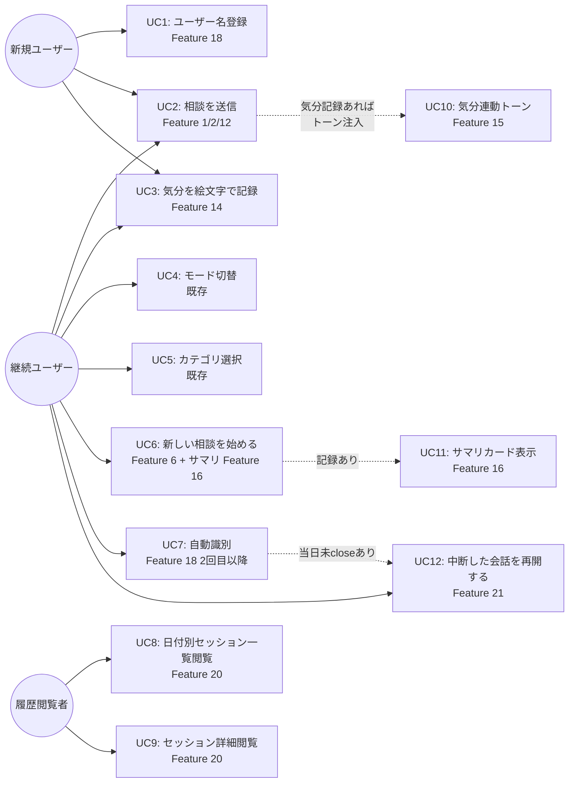
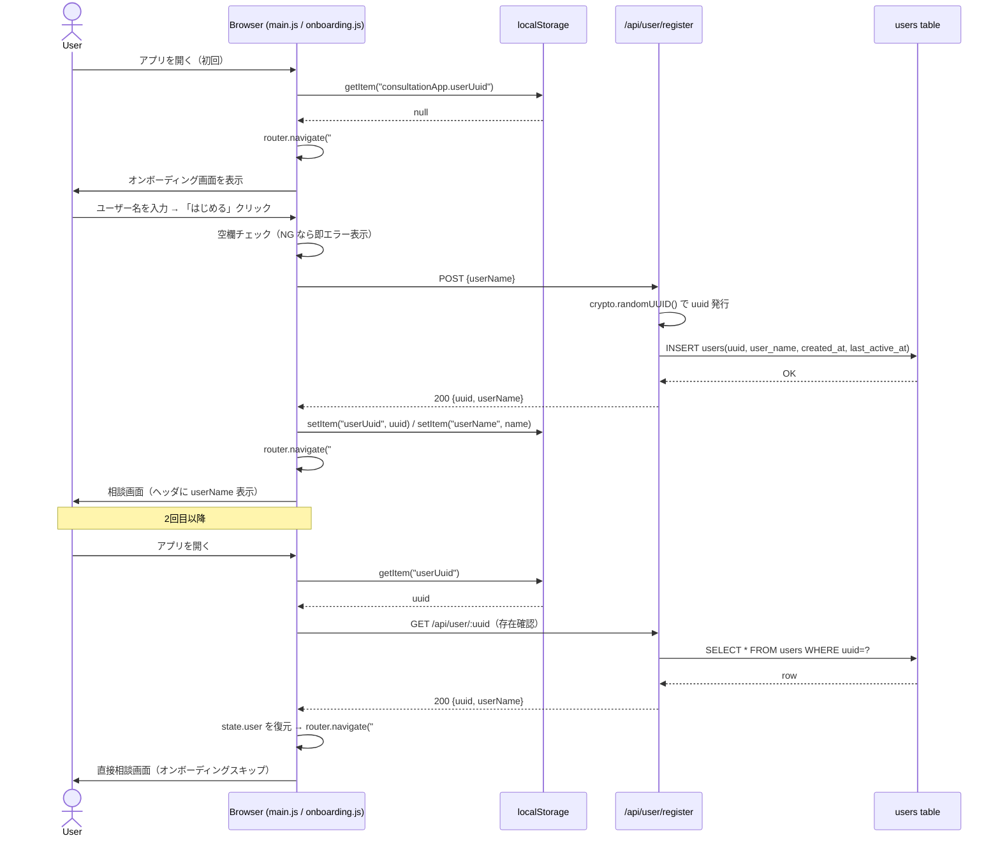
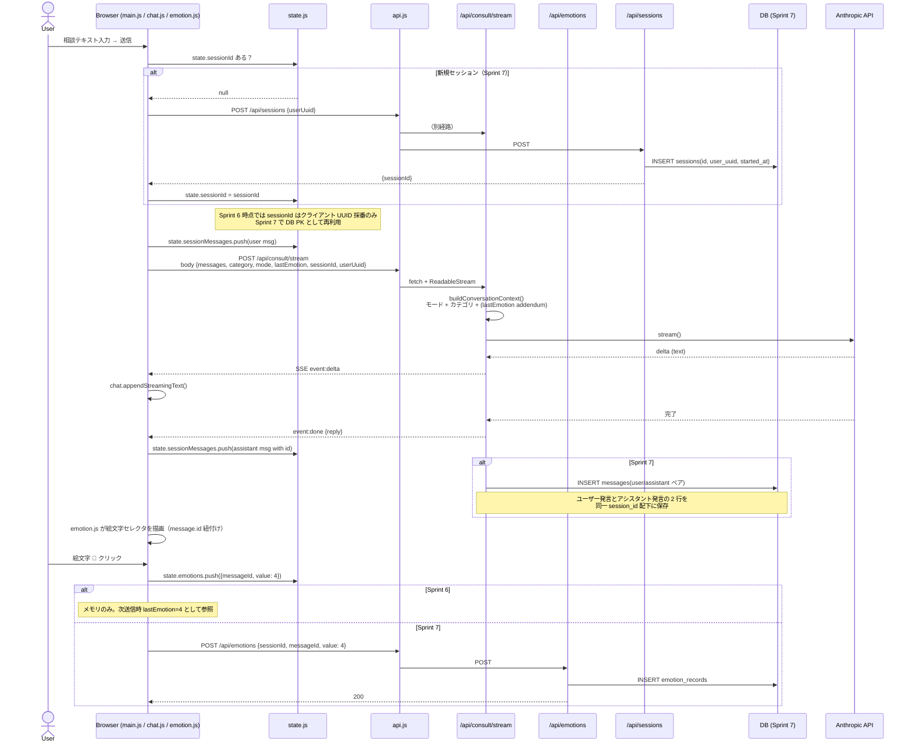
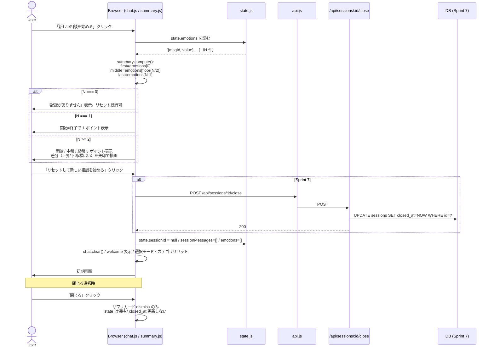
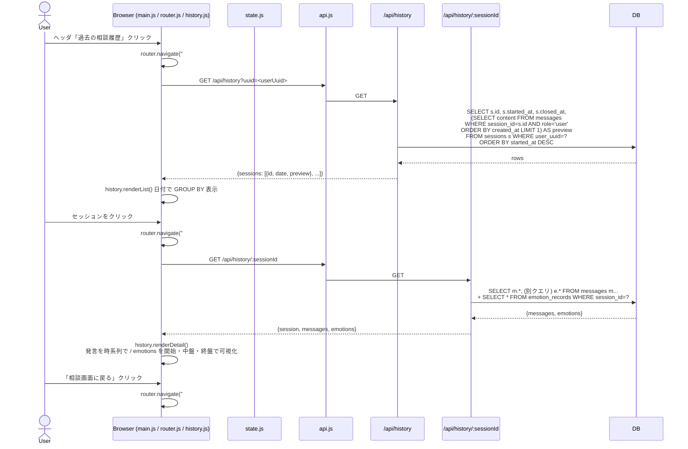
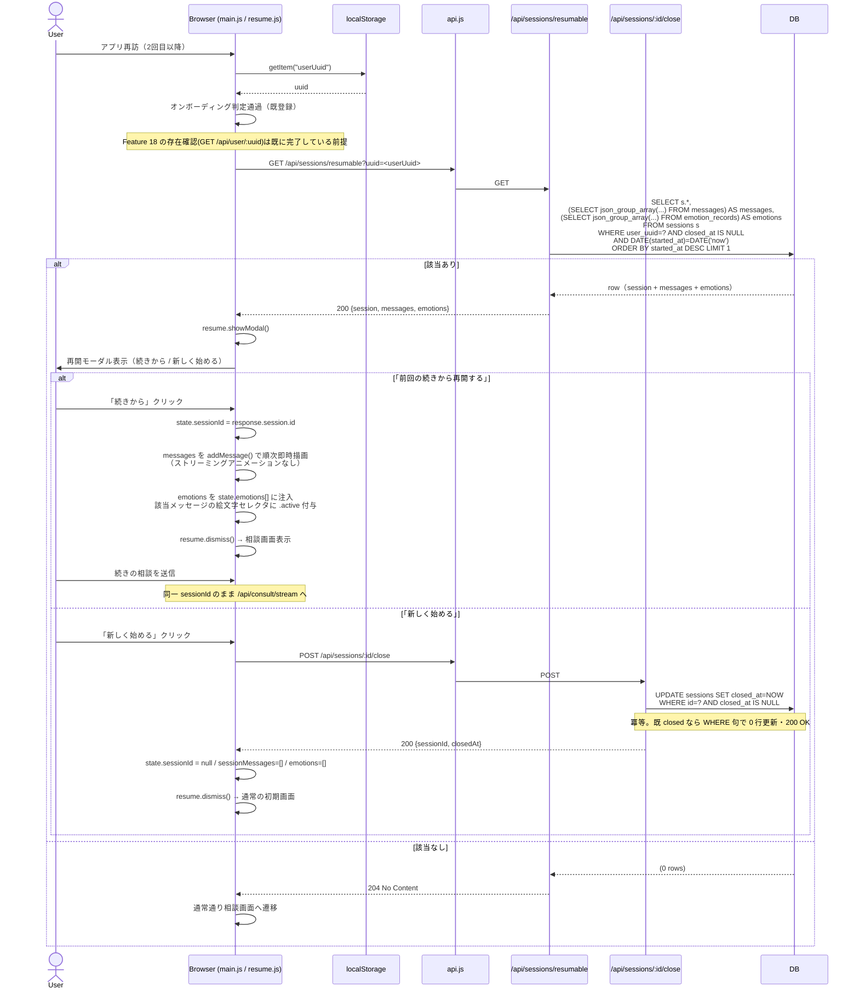
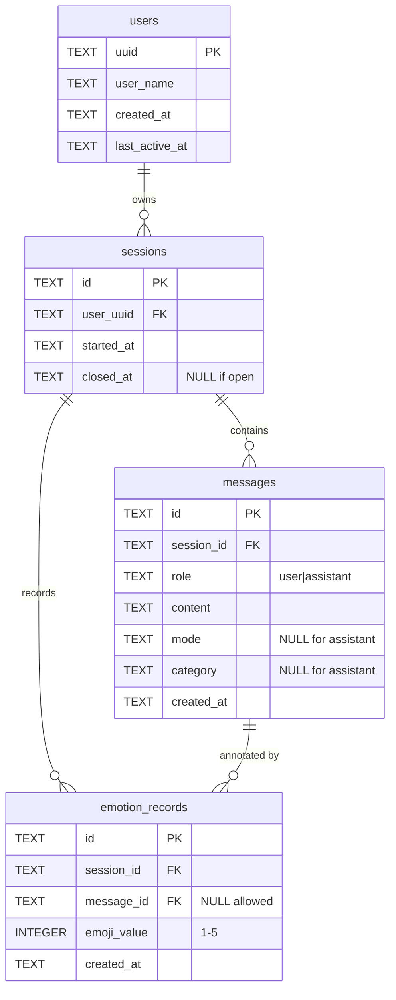

# こころの相談室 詳細設計書（Sprint 6 / Sprint 7）

**バージョン**: v1.1（Feature 21 差分追記）
**作成日**: 2026-04-21（v1.0） / 2026-04-21（v1.1 更新）
**対応SPEC**: `specs/SPEC.md`（Feature 14–16, 18–21 / Sprint 6・Sprint 7）
**前提スプリント**: Sprint 1–5 実装完了（`specs/progress.md` 参照）

本書は Planner が合意した骨子（`C:\Users\takut\.claude\plans\ok-golden-starfish.md` 末尾「Designer 骨子提示（2026-04-21）」）に基づき、Sprint 6（感情トラッカー）および Sprint 7（匿名ユーザー識別 + DB 永続化 + 履歴閲覧 + 会話再開）の詳細設計を定義する。

**v1.1 更新内容**: Sprint 7 に Feature 21（中断した会話の再開プロンプト）を追加。影響章は §3 ユースケース図・§4.5（新規シーケンス）・§5（再開判定クエリ）・§6（新規エンドポイント `GET /api/sessions/resumable` および close 冪等化）・§7.6（新規・再開時の整合性）・§8.2（Sprint 7 実装ガイド）・§9（R8 / R9 追加）・§10（スコープ外 11-13 追加）・付録 A / B。

---

## 1. 技術選定

各項目は最低 2 案を比較検討し、選定根拠を明記する。

### 1.1 データストア（Sprint 7 導入）

| 項目 | 第1候補: better-sqlite3 v11 | 代替案: node:sqlite（Node 22+ 組込） |
|------|-----------------------------|---------------------------------------|
| API 形態 | 同期（`db.prepare().run()`） | 同期（ほぼ同等 API） |
| インストール | `npm i better-sqlite3` 時にネイティブビルド | 追加インストール不要 |
| Windows 対応 | プリビルドバイナリあり（v11） | Node.js 本体にバンドル |
| 成熟度 | デファクト、型定義・サンプル豊富 | 比較的新しい（Node 22 で stable） |
| WAL モード | `db.pragma('journal_mode = WAL')` | 同等サポート |
| 現環境との適合 | Node v24.14.1 で問題なし想定 | Node v22 以降で利用可（本環境は v24） |

**採用**: **better-sqlite3 v11**。成熟度と情報量を優先。

**フォールバック戦略（R1 対策）**: ネイティブビルド失敗時の復旧パスとして `src/db/driver.js` にアダプタ層を設け、`node:sqlite` に差し替え可能な構成にする。呼び出し側（`src/db/repo.js`）は driver のインタフェース（`prepare()` / `exec()` / `pragma()` 相当）にのみ依存する。

```
src/db/
├── driver.js   # require("better-sqlite3") を薄くラップ。失敗時 node:sqlite へ切替可能
├── schema.js   # CREATE TABLE / CREATE INDEX / PRAGMA
└── repo.js     # users/sessions/messages/emotion_records の CRUD 関数群
```

**却下した案**:
- **PostgreSQL / MySQL**: 単一ユーザー端末向けローカル Web アプリに対し過剰。運用コスト増。
- **JSON ファイル直書き**: 並行書き込み時に破損リスク。WAL や原子性保証なし。

### 1.2 UUID 発行

| 項目 | 第1候補: `crypto.randomUUID()` | 代替案: `uuid` パッケージ（v9） |
|------|-------------------------------|--------------------------------|
| 追加依存 | なし（Node 標準） | npm 追加依存 |
| 出力形式 | RFC 4122 v4 | 同等 |
| 衝突確率 | 実用上無視可（2^122 空間） | 同等 |

**採用**: **Node 標準 `crypto.randomUUID()`**。依存削減のため。

### 1.3 フロントエンドモジュール化

| 項目 | 第1候補: ESM 分割（`<script type="module">`） | 代替案: Rollup/Vite バンドラ導入 |
|------|-----------------------------------------------|------------------------------------|
| 依存追加 | なし | devDependencies に大量追加 |
| ビルド手順 | 不要（ブラウザ直読み） | `npm run build` 必要 |
| 開発体験 | ホットリロードなし | HMR あり |
| 本プロジェクト規模 | 適合（10 ファイル程度） | オーバーエンジニアリング |

**採用**: **ESM 分割（バニラ）**。既存「バンドラ不使用」方針を踏襲。段階移行（`main.js` を空殻で置き、Sprint 6 で順次モジュール抜き出し）。

**却下した案**:
- **React / Vue 導入**: 現状 SPA 規模ではオーバー。将来的な選択肢として §10 で言及。

### 1.4 クライアントルーティング（Sprint 7 履歴画面）

| 項目 | 第1候補: ハッシュルーティング | 代替案: History API (pushState) |
|------|------------------------------|----------------------------------|
| URL 例 | `#/history/abc-123` | `/history/abc-123` |
| サーバ変更 | 不要（単一 index.html で足りる） | Express 側で全未知ルートを `index.html` にフォールバックする設定が必要 |
| リロード動作 | そのまま維持 | サーバ側 fallback 忘れると 404 |
| SEO | 弱い | 強い（本プロジェクトでは不要） |

**採用**: **ハッシュルーティング**。Express 側の設定追加を避けて既存 `app.use(express.static)` を変えない。

### 1.5 クライアント識別情報の永続化

| 項目 | 第1候補: localStorage | 代替案1: Cookie | 代替案2: IndexedDB |
|------|----------------------|-----------------|---------------------|
| API | 同期・簡潔 | document.cookie | 非同期 |
| サーバ自動送信 | なし（明示的ヘッダ付与） | あり（毎リクエスト） | なし |
| XSS 時のリスク | 読み取り可（JS 経由） | HttpOnly で守れる | 読み取り可 |
| CSRF 対応 | 不要 | 対策必要 | 不要 |
| 容量 | 約 5MB | 約 4KB | 大容量 |
| 本アプリ用途（UUID + user_name のみ） | 十分 | オーバー | オーバー |

**採用**: **localStorage**。認証情報ではない（匿名 UUID のみ）ため XSS 時のリスクは小さく、CSRF 対策不要の恩恵が大きい。

**キー設計**:
- `consultationApp.userUuid`: サーバ払い出し UUID
- `consultationApp.userName`: 表示用ユーザー名

（既存の `theme` キーは非プレフィックスだが、混在を避けるため本スプリントの新規キーは名前空間つき）

### 1.6 主要ライブラリ（新規追加分のみ）

| 用途 | ライブラリ | 選定理由 |
|------|-----------|---------|
| SQLite ドライバ | better-sqlite3 ^11 | 同期 API で `server.js` の既存構造（async 不要なレポジトリ）を崩さず導入できる。WAL・プリペアードステートメント対応。 |

UUID / ルーティング / モジュール化は依存ゼロで実装する。

---

## 2. アーキテクチャ

### 2.1 Sprint 6 時点の全体構成（DB なし・セッション内メモリ）

```mermaid
graph TB
  subgraph Browser["Browser (public/)"]
    idx[index.html]
    subgraph JS["public/js/*.js (ESM)"]
      main[main.js<br/>エントリ]
      state[state.js<br/>sessionMessages[] / emotions[]]
      apiC[api.js<br/>fetch ラッパ]
      chat[ui/chat.js<br/>addMessage / addStreamingMessage]
      emo[ui/emotion.js<br/>5絵文字セレクタ]
      sum[ui/summary.js<br/>サマリカード]
      shared[ui/shared.js<br/>共通 DOM ヘルパ]
    end
    ls[(localStorage<br/>theme のみ)]
  end

  subgraph Server["server.js (Express 4)"]
    ep_s[POST /api/consult/stream<br/>lastEmotion 受領 → トーン addendum]
    bcc[buildConversationContext<br/>モード + カテゴリ + 気分 addendum]
  end

  ant[(Anthropic API<br/>Claude Sonnet 4)]

  idx --> main
  main --> state
  main --> chat
  main --> emo
  main --> sum
  main --> apiC
  emo --> state
  sum --> state
  apiC -->|POST stream<br/>body.lastEmotion| ep_s
  ep_s --> bcc --> ant
  ant -.->|SSE delta| ep_s
  ep_s -.->|SSE delta| apiC
  apiC -.->|onDelta callback| chat
  chat --> ls
```

Sprint 6 ではサーバ側永続化層は追加しない。`state.sessionMessages[]` / `state.emotions[]` はブラウザメモリのみに保持。

### 2.2 Sprint 7 完了時の全体構成（DB 永続化 + 履歴画面 + オンボーディング）

```mermaid
graph TB
  subgraph Browser["Browser (public/)"]
    idx[index.html]
    subgraph JS["public/js/*.js (ESM)"]
      main[main.js]
      router[router.js<br/>hash → view]
      state[state.js<br/>userUuid / sessionId / 履歴]
      apiC[api.js<br/>x-user-uuid 自動付与]
      chat[ui/chat.js]
      emo[ui/emotion.js]
      sum[ui/summary.js]
      onb[ui/onboarding.js<br/>Sprint 7 新規]
      hist[ui/history.js<br/>Sprint 7 新規]
      shared[ui/shared.js]
    end
    ls[(localStorage<br/>userUuid/userName/theme)]
  end

  subgraph Server["server.js + routes/"]
    bootstrap[server.js<br/>DB 初期化 + orphan close]
    r_user[routes/user.js<br/>POST /register<br/>GET /:uuid]
    r_sess[routes/sessions.js<br/>POST /<br/>POST /:id/close]
    r_emo[routes/emotions.js<br/>POST /]
    r_hist[routes/history.js<br/>GET /<br/>GET /:id]
    r_stream[/api/consult/stream<br/>body: lastEmotion/sessionId/userUuid]
  end

  subgraph DB["src/db/"]
    driver[driver.js<br/>better-sqlite3 / node:sqlite]
    schema[schema.js]
    repo[repo.js<br/>CRUD]
    file[(data/app.db<br/>WAL)]
  end

  ant[(Anthropic API)]

  idx --> main
  main --> router
  router --> onb
  router --> chat
  router --> hist
  router --> sum
  main --> state
  main --> apiC
  apiC -->|x-user-uuid<br/>session body| r_user
  apiC --> r_sess
  apiC --> r_emo
  apiC --> r_hist
  apiC -->|+lastEmotion| r_stream
  r_user --> repo
  r_sess --> repo
  r_emo --> repo
  r_hist --> repo
  r_stream --> repo
  r_stream --> ant
  ant -.->|SSE| r_stream
  r_stream -.->|SSE| apiC
  repo --> driver --> file
  bootstrap --> schema --> driver
  state <--> ls
```

Sprint 7 では以下が追加される:

- `src/db/`（driver / schema / repo）
- `src/routes/`（user / sessions / emotions / history）
- `public/js/router.js`, `public/js/ui/onboarding.js`, `public/js/ui/history.js`
- `data/app.db` 自動生成（`.gitignore` 済）

### 2.3 ディレクトリ構成（Sprint 7 完了時）

```
ConsultationApplication/
├── server.js                  # ルート登録 + DB 起動フック + 既存 /api/consult/stream
├── package.json               # better-sqlite3 追加
├── .env                       # ANTHROPIC_API_KEY
├── .gitignore                 # .env / node_modules / data/app.db*
├── data/
│   ├── .gitignore             # *.db* を無視（R5 対策）
│   └── app.db                 # SQLite ファイル（自動生成）
├── src/
│   ├── db/
│   │   ├── driver.js          # better-sqlite3 ラッパ（node:sqlite フォールバック）
│   │   ├── schema.js          # CREATE TABLE / CREATE INDEX / PRAGMA WAL
│   │   └── repo.js            # users/sessions/messages/emotion_records CRUD
│   └── routes/
│       ├── user.js            # POST /api/user/register, GET /api/user/:uuid
│       ├── sessions.js        # POST /api/sessions, POST /api/sessions/:id/close
│       ├── emotions.js        # POST /api/emotions
│       └── history.js         # GET /api/history, GET /api/history/:sessionId
├── public/
│   ├── index.html             # type="module" 化 + onboarding/history 用コンテナ
│   ├── style.css              # 絵文字セレクタ / サマリカード / オンボ / 履歴 スタイル追加
│   └── js/
│       ├── main.js            # DOMContentLoaded エントリ
│       ├── router.js          # hash ベースルーティング
│       ├── state.js           # 単一ソース state
│       ├── api.js             # fetch ラッパ（x-user-uuid 自動付与）
│       ├── ui/
│       │   ├── chat.js        # addMessage / addStreamingMessage / scrollToBottom
│       │   ├── emotion.js     # 5絵文字セレクタ + click/hover
│       │   ├── summary.js     # 本日の変化サマリカード
│       │   ├── onboarding.js  # 初回画面（Sprint 7）
│       │   ├── history.js     # 履歴一覧 + 詳細（Sprint 7）
│       │   └── shared.js      # 共通 DOM ヘルパ
│       └── theme.js           # 既存テーマ切替ロジック抜き出し
└── specs/
    ├── SPEC.md
    ├── DESIGN.md              # 本ファイル
    ├── progress.md
    └── evaluations/
```

既存 `public/app.js` は Sprint 6 の移行完了をもって削除する（分割完了後、`index.html` からの参照も削除）。

---

## 3. ユースケース図

3 アクター（新規ユーザー / 継続ユーザー / 履歴閲覧者）を描く。なお 3 人とも物理的には同一人物で、「アプリとの接触段階」の違いを表す。



---

## 4. シーケンス図

### 4.1 オンボーディング（Sprint 7 / Feature 18）



R4（UUID 改ざん対策）: `GET /api/user/:uuid` が 404 を返した場合、localStorage をクリアしてオンボーディングに誘導する。

### 4.2 相談送信 + ストリーミング + 絵文字記録（Sprint 6 + Sprint 7）



R3（ストリーミング完了と絵文字表示の race 対策）: `message.state` を `streaming | done | error` の 3 値 FSM で管理。絵文字セレクタの描画は `done` 状態遷移を `state.subscribe()` で検知してから実行する。

### 4.3 リセット + サマリ + セッションクローズ（Sprint 6 Feature 16 + Sprint 7）



R6（中盤定義ぶれ対策）: 中盤 = 記録配列 N 件のうち `floor(N/2)` 番目（0 始まり）。N=4 なら index=2、N=5 なら index=2。

### 4.4 履歴閲覧（Sprint 7 / Feature 20）



### 4.5 再訪時の再開プロンプト（Sprint 7 / Feature 21）

起動時のオンボーディング判定の**直後**に、当日未 close セッションの存否を確認し、存在する場合のみ再開モーダルを表示する。前日以前の未 close セッションは server 起動時に自動 close 済み（§7.7 起動シーケンスの orphan close ステップ）なので、本判定対象は「当日 (`DATE(started_at) = DATE('now')`) かつ `closed_at IS NULL`」に自然に絞られる。



**起動シーケンス内の位置付け**（`public/js/main.js`）:

```
1. localStorage から userUuid 取得
2. userUuid が null → #/onboarding へ
3. userUuid あり → GET /api/user/:uuid（R4 対策：404 なら localStorage クリア → #/onboarding）
4. ユーザー識別成立 → GET /api/sessions/resumable
   - 200 → 再開モーダル表示 → ユーザー選択で分岐
   - 204 → 通常の相談画面（#/）
```

---

## 5. データモデル（Sprint 7 導入）

### 5.1 ER 図



SQLite のため全ての UUID / 日時は TEXT（ISO 8601、UTC）。`emoji_value` のみ INTEGER で CHECK 制約をかける。

### 5.2 スキーマ詳細

#### users

| フィールド | 型 | 制約 | 説明 |
|-----------|-----|------|------|
| uuid | TEXT | PRIMARY KEY | crypto.randomUUID()（v4）。サーバ払い出し |
| user_name | TEXT | NOT NULL, CHECK(length(user_name) BETWEEN 1 AND 50) | 表示名。匿名識別用 |
| created_at | TEXT | NOT NULL, DEFAULT (strftime('%Y-%m-%dT%H:%M:%fZ', 'now')) | ISO 8601 UTC |
| last_active_at | TEXT | NOT NULL | 既存ユーザー GET ヒット時に更新 |

#### sessions

| フィールド | 型 | 制約 | 説明 |
|-----------|-----|------|------|
| id | TEXT | PRIMARY KEY | クライアント採番 UUID。Sprint 6 段階から同じ採番方法 |
| user_uuid | TEXT | NOT NULL, REFERENCES users(uuid) ON DELETE CASCADE | 所有者 |
| started_at | TEXT | NOT NULL | セッション開始日時 |
| closed_at | TEXT | NULL | 「リセット」またはサーバ起動時 orphan close で埋まる |

#### messages

| フィールド | 型 | 制約 | 説明 |
|-----------|-----|------|------|
| id | TEXT | PRIMARY KEY | クライアント採番 UUID（Sprint 6 から採番） |
| session_id | TEXT | NOT NULL, REFERENCES sessions(id) ON DELETE CASCADE | 所属セッション |
| role | TEXT | NOT NULL, CHECK(role IN ('user','assistant')) | 発言者 |
| content | TEXT | NOT NULL | 発言本文 |
| mode | TEXT | NULL | user 行のみに記録（選択モード） |
| category | TEXT | NULL | user 行のみに記録（選択カテゴリ） |
| created_at | TEXT | NOT NULL | 受信確定時刻（assistant は done 受信時） |

#### emotion_records

| フィールド | 型 | 制約 | 説明 |
|-----------|-----|------|------|
| id | TEXT | PRIMARY KEY | UUID |
| session_id | TEXT | NOT NULL, REFERENCES sessions(id) ON DELETE CASCADE | 所属セッション |
| message_id | TEXT | NULL, REFERENCES messages(id) ON DELETE SET NULL | 対応する AI 回答（SPEC「対応AI回答への紐付け」）。レアケースでメッセージ削除に耐える |
| emoji_value | INTEGER | NOT NULL, CHECK(emoji_value BETWEEN 1 AND 5) | 1=😢 2=😟 3=😐 4=🙂 5=😊 |
| created_at | TEXT | NOT NULL | 記録時刻 |

同一 `message_id` に対して複数レコードが入り得る（ユーザーが絵文字を変更した場合、**常に最新行を採用**する運用。UPSERT ではなく追記で履歴性を保つ）。表示時は `ORDER BY created_at DESC LIMIT 1`。

### 5.3 インデックス

```sql
CREATE INDEX idx_sessions_user_started ON sessions(user_uuid, started_at DESC);
CREATE INDEX idx_messages_session_created ON messages(session_id, created_at);
CREATE INDEX idx_emotion_session_created ON emotion_records(session_id, created_at);
```

- `idx_sessions_user_started`: 履歴一覧画面の「ユーザー別・新しい順」クエリを O(log N) に
- `idx_messages_session_created`: セッション詳細で時系列読み出し
- `idx_emotion_session_created`: サマリカードの「最初/中盤/最終」計算

**Feature 21 再開判定クエリとインデックス利用**:

```sql
-- 当日未closeの最新セッション1件を取得（Feature 21）
SELECT id, started_at
FROM sessions
WHERE user_uuid = ?
  AND closed_at IS NULL
  AND DATE(started_at) = DATE('now')
ORDER BY started_at DESC
LIMIT 1;
```

`idx_sessions_user_started(user_uuid, started_at DESC)` により `user_uuid` の等価 + `started_at DESC` のカバリング走査で高速化される。`closed_at IS NULL` と `DATE(started_at) = DATE('now')` は走査済み行に対する残余フィルタとして評価されるが、当該ユーザーの行数はせいぜい日あたり数件〜数十件のオーダーのため追加インデックスは不要。**本 Feature 21 用の専用インデックスは新設しない**（既存 `idx_sessions_user_started` で十分）。

該当セッションが見つかった後、`getResumableSession()` 内で同一トランザクション中に以下を追加実行:

```sql
-- messages（時系列）
SELECT id, role, content, mode, category, created_at
FROM messages
WHERE session_id = ?
ORDER BY created_at ASC;

-- emotion_records（絵文字復元用、最新行のみで十分だが実装簡素化のため全行取得してクライアントで最新採用）
SELECT id, message_id, emoji_value, created_at
FROM emotion_records
WHERE session_id = ?
ORDER BY created_at ASC;
```

`idx_messages_session_created` / `idx_emotion_session_created` が効くため追加インデックス不要。

### 5.4 PRAGMA / 初期化

```sql
PRAGMA journal_mode = WAL;       -- マルチタブ対策（R と R）
PRAGMA foreign_keys = ON;        -- FK 制約有効化（better-sqlite3 は既定 OFF）
PRAGMA synchronous = NORMAL;     -- WAL モード下の実用既定
```

---

## 6. API 設計

### 6.1 エンドポイント一覧

| メソッド | パス | 用途 | 認証 | Sprint |
|---------|------|------|------|--------|
| POST | `/api/user/register` | user_name 受領 → UUID 払い出し → users INSERT | なし | 7 |
| GET | `/api/user/:uuid` | 2 回目以降の識別確認（404 なら localStorage 破棄） | なし | 7 |
| POST | `/api/sessions` | 新規セッション作成（初回相談送信時） | x-user-uuid | 7 |
| POST | `/api/sessions/:id/close` | サマリ表示後のクローズ（**冪等**: 既 closed でも 200） | x-user-uuid | 7 |
| GET | `/api/sessions/resumable?uuid=...` | 当日未 close の最新セッションを 1 件返す（Feature 21） | x-user-uuid | 7 |
| POST | `/api/emotions` | 絵文字記録保存 | x-user-uuid | 7 |
| GET | `/api/history?uuid=...` | 日付別セッション一覧 | x-user-uuid | 7 |
| GET | `/api/history/:sessionId` | セッション詳細（messages + emotions） | x-user-uuid | 7 |
| POST | `/api/consult/stream` | 既存。body に lastEmotion / sessionId / userUuid を追加受領 | x-user-uuid | 6 (lastEmotion), 7 (sessionId / userUuid) |
| POST | `/api/consult` | 既存。Sprint 5 で回帰用残置。本スプリントで拡張しない | なし | - |

**認証注記**: 本アプリは匿名識別のみであり、認証は行わない。`x-user-uuid` ヘッダは「自分の UUID を申告する」ための伝達であり、サーバはヘッダ値の存在と users テーブル内一致だけを確認する。偽装に対する防御はスコープ外（SPEC「認証はスコープ外」）。

**userUuid の二重経路**: `/api/consult/stream` のみ body にも `userUuid` を受ける（SSE リクエストでヘッダを変えにくい運用の受け皿）。サーバ側は**ヘッダ優先、body フォールバック**で解決する。

### 6.2 リクエスト / レスポンス型定義（TypeScript 風・参考）

```typescript
// 共通
type Uuid = string; // crypto.randomUUID() v4

interface ApiError { error: string; }

// ---------- User ----------
// POST /api/user/register
interface RegisterReq { userName: string; }
interface RegisterRes { uuid: Uuid; userName: string; }

// GET /api/user/:uuid
// path param: uuid
type GetUserRes = { uuid: Uuid; userName: string; lastActiveAt: string } | ApiError;

// ---------- Sessions ----------
// POST /api/sessions
// Header: x-user-uuid
interface CreateSessionReq { clientSessionId?: Uuid; } // Sprint 6→7 互換のため、クライアント既採番 ID 持ち込み可
interface CreateSessionRes { sessionId: Uuid; startedAt: string; }

// POST /api/sessions/:id/close
// 冪等。既に closed_at が入っていても 200 OK を返し、closed_at は既存値を維持する
interface CloseSessionRes { sessionId: Uuid; closedAt: string; alreadyClosed?: boolean; }

// GET /api/sessions/resumable?uuid=<userUuid>
// Header: x-user-uuid
// 200: 復元対象あり（当日未 close セッションの最新 1 件 + messages + emotions）
// 204: 該当なし（前日以前のみ、または全て closed、または当日未送信）
type ResumableSessionResponse = {
  session: { id: Uuid; started_at: string };
  messages: Array<{
    id: Uuid;
    role: "user" | "assistant";
    content: string;
    mode: string | null;
    category: string | null;
    created_at: string;
  }>;
  emotions: Array<{
    id: Uuid;
    message_id: Uuid | null;
    emoji_value: 1 | 2 | 3 | 4 | 5;
    created_at: string;
  }>;
} | null; // 204 の場合クライアント側で null として扱う

// ---------- Emotions ----------
// POST /api/emotions
// Header: x-user-uuid
interface SaveEmotionReq {
  sessionId: Uuid;
  messageId: Uuid | null;
  emojiValue: 1 | 2 | 3 | 4 | 5;
}
interface SaveEmotionRes { id: Uuid; createdAt: string; }

// ---------- History ----------
// GET /api/history?uuid=...
// Header: x-user-uuid
interface HistoryListItem {
  sessionId: Uuid;
  startedAt: string;
  closedAt: string | null;
  preview: string; // 先頭のユーザー発言 (最大 50 文字)
}
interface HistoryListRes { sessions: HistoryListItem[]; }

// GET /api/history/:sessionId
// Header: x-user-uuid
interface HistoryDetailMessage {
  id: Uuid;
  role: "user" | "assistant";
  content: string;
  mode: string | null;
  category: string | null;
  createdAt: string;
}
interface HistoryDetailEmotion {
  id: Uuid;
  messageId: Uuid | null;
  emojiValue: 1|2|3|4|5;
  createdAt: string;
}
interface HistoryDetailRes {
  session: { id: Uuid; startedAt: string; closedAt: string | null };
  messages: HistoryDetailMessage[];
  emotions: HistoryDetailEmotion[];
}

// ---------- Consult (既存拡張) ----------
// POST /api/consult/stream
interface ConsultStreamReq {
  messages: Array<{ role: "user" | "assistant"; content: string }>;
  category?: string | null;
  mode?: "default" | "empathy" | "solution";
  // Sprint 6 追加
  lastEmotion?: 1 | 2 | 3 | 4 | 5 | null;
  // Sprint 7 追加（ヘッダ x-user-uuid が優先だが body 経由も許容）
  sessionId?: Uuid;
  userUuid?: Uuid;
}
// Response: text/event-stream
//   event: delta / data: {text: string}
//   event: done  / data: {reply: string, assistantMessageId: Uuid}  ← Sprint 7 で message_id を返却
//   event: error / data: {error: string}
```

### 6.3 Sprint 6 時点の `/api/consult/stream` リクエスト拡張

Sprint 6 では DB が無いため、サーバ側は `lastEmotion` のみ参照して `buildConversationContext` に渡す。`sessionId` / `userUuid` は「body に含まれていれば無視」で後方互換を保つ（Sprint 7 で実際に使う）。

### 6.4 ルーティング分割（Sprint 7）

既存 `server.js` から相談系以外を `src/routes/` に切り出す。

```javascript
// server.js（擬似構造）
app.use("/api/user", require("./src/routes/user"));
app.use("/api/sessions", require("./src/routes/sessions"));
app.use("/api/emotions", require("./src/routes/emotions"));
app.use("/api/history", require("./src/routes/history"));
// /api/consult と /api/consult/stream は server.js に残置（既存の SSE ロジックを壊さないため）
```

---

## 7. 処理方針

### 7.1 エラーハンドリング

| 境界 | 方針 |
|------|------|
| サーバー全体 | Express の同期エラーは try/catch、非同期は各ルータ内で try/catch → `res.status(4xx\|5xx).json({ error })` |
| DB 系エラー | `repo.js` 内で catch → Error を再 throw（独自メッセージ付与） → ルータで 500 返却 |
| SSE ストリーミング中のエラー | 既存設計継続。ヘッダ送信後は `event: error` で通知、`res.end()` を finally で必ず呼ぶ |
| 永続化失敗（Feature 19 受け入れ基準） | 画面の相談体験は継続。ユーザーには「記録の保存に失敗しました」トーストを出すが、メッセージ表示自体は消さない |
| クライアント fetch エラー | `api.js` が統一 catch → 上位 UI モジュールに `{ok:false, error}` として返す |
| ルーティングエラー | 存在しないハッシュは `router.js` で `#/` にフォールバック |

### 7.2 バリデーション

| 箇所 | 内容 |
|------|------|
| ユーザー名入力 | 1〜50 文字・前後空白 trim・空禁止（クライアント + サーバ両方） |
| emojiValue | 整数 1〜5 のみ。それ以外は 400 |
| messages 配列 | `role in {user, assistant}` / `content: string, not empty` |
| sessionId / userUuid | UUID v4 形式（簡易 regex）。DB 参照でも存在確認 |
| category / mode | 既存定義値のみ許容（enum チェック） |

### 7.3 非同期処理

- **SSE（ストリーミング）**: 既存採用済み。Sprint 6/7 で変更なし。body にフィールド追加のみ
- **DB アクセス**: better-sqlite3 は同期 API のため Express ハンドラ内で直接呼ぶ（別スレッドプール不要）
- **クライアント fetch**: 既存 AbortController パターン（`OVERALL_TIMEOUT_MS` / `IDLE_TIMEOUT_MS`）を維持

### 7.4 セキュリティ

| 項目 | 方針 |
|------|------|
| 認証 | 匿名識別のみ。パスワード・メール・トークンは扱わない（SPEC スコープ外） |
| ユーザー分離 | 履歴 API は `x-user-uuid` とクエリ `uuid` の一致を確認。不一致は 403 |
| 入力サニタイゼーション | `textContent` のみで DOM 組み立て（`innerHTML` で生文字列を流し込まない）。SQL は 100% プリペアードステートメント（`db.prepare().run(params)`） |
| 秘密情報 | `.env` のみ（既存踏襲）。DB ファイル `data/app.db` は git ignore |
| CORS | 単一オリジン前提のため追加設定なし（既存と同じ） |
| レート制限 | スコープ外（ローカル単一ユーザー前提） |

### 7.5 ロギング / 監視

- **起動時**: `Server running at http://localhost:PORT`（既存踏襲）、加えて `DB initialized: data/app.db (WAL)` の 1 行
- **通常リクエスト**: ログなし（Feature 11 クリーンアップ方針踏襲）
- **エラー時**: `console.error` に `err.message` のみ（スタックは抑制、既存踏襲）
- **DB マイグレーション**: 起動時 orphan close 処理は `Closed N orphan sessions` を stderr ではなく stdout に 1 行（運用情報）

### 7.6 再開時の整合性（Sprint 7 / Feature 21）

**再開モーダル「前回の続きから再開する」選択時の復元手順**:

1. **sessionId 差し替え**: Sprint 6 で `state.sessionId` はクライアント採番だが、再開時はサーバ DB から受領した `response.session.id` で `state.sessionId` を**完全に上書き**する。以降の `/api/consult/stream` はこの sessionId を body に詰めて送り、messages は同一セッションとして追記される。
2. **メッセージ描画**: `response.messages` を `created_at ASC` で並べ、`ui/chat.js:addMessage(content, role)` を**ストリーミングアニメーションなしで順次即時呼び出し**。タイピングアニメーションは新しいやり取り（次回送信）時のみに適用する。ストリーミング風再生は §4.4 の履歴詳細画面と同じく**行わない**。
3. **感情復元**:
   - `response.emotions` を `message_id` でグルーピングし、各 `message_id` について `created_at DESC` の最上位行 1 件を**最新採用**する（§5.2 emotion_records の運用方針と同じ）。
   - 採用された `emoji_value` を `state.emotions[]` に注入し、対応する AI 回答直下の絵文字セレクタで該当ボタンに `.active` クラスを付与する。
   - `message_id` が NULL の emotion_records（保険的に想定）はスキップ。
4. **モード/カテゴリの復元**: 各 user メッセージの `mode` / `category` はそのまま state 側の履歴として保持するが、**現在の選択 UI（モード切替・カテゴリセレクタ）は再開時にはリセット状態**とする（ユーザーが新しい送信前に再選択可能）。これにより再開後の意思決定を過去選択に拘束しない。
5. **ウェルカムメッセージ**: 再開時は表示しない（既存メッセージが存在するため）。`ui/chat.js:showWelcomeMessage()` を呼び出す分岐はスキップする。

**「新しく始める」選択時**:

1. `POST /api/sessions/:id/close` を**冪等呼び出し**（既 closed でも 200 OK を受け取る）。
2. サーバ側ハンドラは `UPDATE sessions SET closed_at=strftime(...) WHERE id=? AND user_uuid=? AND closed_at IS NULL` を実行し、`changes()` が 0 でも `alreadyClosed: true` を付けて 200 を返す（R8 対策）。
3. クライアントは `state` を初期化し通常の新規セッション画面を表示。次の初回相談送信時に `POST /api/sessions` で新規 sessionId を採番する。

### 7.7 起動シーケンス（server.js）

```
1. dotenv.config()
2. db/driver.js: open data/app.db → PRAGMA WAL / foreign_keys / synchronous
3. db/schema.js: CREATE TABLE IF NOT EXISTS × 4 / CREATE INDEX IF NOT EXISTS × 3
4. UPDATE sessions SET closed_at=strftime(...) WHERE closed_at IS NULL
   AND date(started_at) < date('now')  ← 前日以前の orphan を自動 close
5. require routes/* → app.use(...)
6. app.listen(PORT)
```

orphan close の対象日境界は UTC 起点。サマータイム等の複雑性はスコープ外。

---

## 8. Sprint 別 実装ガイド

### 8.1 Sprint 6: 感情トラッカー（セッション内体験）

**対応 Feature**: F14 / F15 / F16 / F17（回帰）

**Generator が最初に読むべき章**: §2.1（アーキテクチャ Sprint 6）→ §4.2（相談送信+絵文字シーケンス）→ §4.3（リセット+サマリ）→ §7.1〜7.3（処理方針）→ §9（リスク R2 / R3 / R7）

**重点技術**:
- ESM 分割（`public/js/main.js` を新規追加し `index.html` の `<script src="app.js">` を `<script type="module" src="/js/main.js">` に置換）
- 感情 → トーン addendum 注入（`buildConversationContext()` 末尾に append）
- 単一ソース state（`public/js/state.js` に `{ userUuid: null（Sprint 7 で埋める）, sessionId, sessionMessages, emotions, lastEmotion }` を集約）

**先行準備**:
1. Sprint 5 の `public/app.js` を **全文バックアップ**（`public/app.js.sprint5.bak`）し、回帰比較の基礎にする
2. 既存関数 `addMessage` / `addStreamingMessage` / `scrollToBottom` / `setLoading` / `showWelcomeMessage` / `updateCharCount` / `updateNewConsultationButton` を `public/js/ui/chat.js` と `public/js/ui/shared.js` に**コピー移植**（ロジック改変なし）
3. Sprint 6 完了時点では `index.html` の `<script src="app.js">` を `<script type="module" src="/js/main.js">` に切り替え、`public/app.js` は削除する

**メッセージ ID 採番**（Sprint 7 互換）:
- ユーザー発言: 送信直前に `crypto.randomUUID()` を採番し `state.sessionMessages` に push。
- AI 発言: `event: done` を受信した時点で `crypto.randomUUID()` を採番し push。絵文字セレクタはこの ID に紐付ける。
- Sprint 7 でサーバ側が `done` レスポンスに `assistantMessageId` を含めるようになった際は、クライアントが採番した ID を**そのままサーバに渡して記録**することで、Sprint 6 の絵文字紐付けデータとの互換性を保つ。

**感情 → トーン addendum 実装**（`server.js`）:

既存 `buildConversationContext(req)` 末尾に以下を追加:

```javascript
const TONE_ADDENDUM = {
  1: "\n\n補足: ユーザーが直近に記録した気分は「とてもつらい😢」です。モードの指示を踏まえた上で、特に強い共感と傾聴を重視し、「つらかったですね」「その気持ちを受け止めます」等の受容表現を中心に据えてください。解決策の提示は控えめにしてください。",
  2: "\n\n補足: ユーザーが直近に記録した気分は「不安😟」です。モードの指示を踏まえた上で、断定や強い助言を避け、選択肢を並べて一緒に考える姿勢で寄り添ってください。",
  3: null, // 中立は addendum なし（既存モード設定のみ）
  4: "\n\n補足: ユーザーが直近に記録した気分は「前向き🙂」です。モードの指示を踏まえた上で、「その調子です」「一緒に次の一歩を考えましょう」等の後押し表現を織り込んでください。",
  5: "\n\n補足: ユーザーが直近に記録した気分は「とても前向き😊」です。モードの指示を踏まえた上で、建設的で行動指向の提案を前面に出し、次の具体的な一歩に繋がる言葉を選んでください。",
};

const { lastEmotion } = req.body;
const addendum = lastEmotion && TONE_ADDENDUM[lastEmotion];
if (addendum) systemPrompt += addendum;
```

**R7 への配慮**: addendum 文言は必ず「モードの指示を踏まえた上で」で始める。これによりユーザーが「モード=解決 × 気分=😢」と選んでも、解決モードが消えず「解決モードのまま強めに共感側にシフト」する挙動になる。

**注意点**:
- Sprint 5 の SSE ロジック（`req.on("close")` 使用禁止 / `res.on("close")` / `AbortController` / `safeWrite` / `finally res.end()` / ping コメント）は**絶対に崩さない**。再発防止のため Sprint 5 不合格対応（progress.md 末尾）を必読
- 既存 `conversationHistory` は `state.sessionMessages` に rename。`messages` 配列として Claude API に渡す形式は変えない
- `isStreaming` フラグの扱いを `state.js` に集約。絵文字セレクタは `message.state === "done"` の subscribe で描画
- サマリカードは「モーダル」ではなく既存画面にオーバーレイする `<dialog>` または `.overlay` div を使用。`role="dialog"` + `aria-modal="true"` で A11y 対応

**Sprint 6 で DB に触らない理由**:
Sprint 6 は SPEC で「本スプリントは、セッション内で完結する感情トラッカー体験を成立させることを目的とし、DB永続化には踏み込まない」と明記されている。Sprint 7 で同じデータ構造を DB に写像するため、`state.sessionMessages` / `state.emotions` の形は Sprint 7 スキーマと揃える（`{id, role, content, mode, category, createdAt}` / `{id, messageId, emojiValue, createdAt}`）。

### 8.2 Sprint 7: 匿名ユーザー識別 + DB 永続化 + 履歴閲覧 + 会話再開

**対応 Feature**: F18 / F19 / F20 / F21

**Generator が最初に読むべき章**: §1.1（DB 技術選定・フォールバック）→ §2.2（Sprint 7 アーキテクチャ）→ §5（データモデル全体）→ §4.1（オンボーディング）→ §4.4（履歴閲覧）→ §4.5（Feature 21 再開プロンプト）→ §6（API 設計）→ §7.4〜7.7（セキュリティ・再開整合性・起動シーケンス）→ §9（R1 / R4 / R5 / R8 / R9）

**重点技術**:
- better-sqlite3 同期 API + プリペアードステートメント
- `src/db/driver.js` による抽象化（better-sqlite3 失敗時 `node:sqlite` へ切替）
- ハッシュルーティング（`router.js` が `hashchange` イベントを購読、状態 → view の単純マップ）
- `api.js` の `x-user-uuid` ヘッダ自動付与（`localStorage` から毎回読み出し）

**先行準備**:
1. `npm i better-sqlite3@^11` 実行後に `node -e "require('better-sqlite3')('/tmp/x.db')"` でビルド成功を確認（R1 早期検知）
2. `data/` ディレクトリを作り `data/.gitignore` に `*.db*` `*.sqlite*` を記載（R5 対策）
3. Sprint 6 で作った `state.sessionId` / `message.id` のクライアント UUID 採番がそのまま DB PK として流用できることを確認
4. `public/js/api.js` に既存 fetch 呼び出しを集約する（既存 `fetch("/api/consult/stream")` を `api.consultStream(payload)` に置換）

**実装ファイル（新規）**:
- `src/db/driver.js` / `schema.js` / `repo.js`
- `src/routes/user.js` / `sessions.js` / `emotions.js` / `history.js`
- `public/js/router.js` / `public/js/api.js`（Sprint 6 時点でスタブを置き Sprint 7 で本実装）
- `public/js/ui/onboarding.js` / `public/js/ui/history.js`
- **Feature 21 新規**: `public/js/ui/resume.js`（再開モーダル UI：表示／「続きから」／「新しく始める」の 3 ハンドラを公開）

**実装ファイル（拡張）**:
- `server.js`: DB 初期化、orphan close、ルート登録、`/api/consult/stream` に `sessionId` / `userUuid` 受領と messages INSERT
- `public/index.html`: ヘッダに「過去の相談履歴」リンク追加、オンボーディング／履歴画面コンテナ追加、**Feature 21 用の再開モーダルコンテナ（`<dialog id="resume-modal">` 相当）**追加
- `package.json`: `better-sqlite3` 追加

**Feature 21 実装要素**（**依存**: Feature 18（UUID 識別）+ Feature 19（DB スキーマ + messages / emotion_records の読み出し）。Feature 21 単体での先行実装は不可）:
- `src/db/repo.js` に `getResumableSession(userUuid)` 関数を追加。内部で §5.3 のクエリを発行し、該当あれば `{session, messages, emotions}` の集約オブジェクトを、なければ `null` を返す
- `src/routes/sessions.js` に `GET /resumable` ハンドラ追加。`repo.getResumableSession()` が null なら 204、それ以外は 200 + JSON
- `src/routes/sessions.js` の `POST /:id/close` ハンドラを**冪等化**。`WHERE id=? AND user_uuid=? AND closed_at IS NULL` で UPDATE し、`changes()===0` なら既存 `closed_at` を SELECT して `{sessionId, closedAt, alreadyClosed:true}` を返す（R8 対策）
- `public/js/main.js` の起動シーケンスを以下の順に固定:
  1. localStorage から userUuid 取得
  2. userUuid null → `router.navigate("#/onboarding")`
  3. userUuid あり → `GET /api/user/:uuid` で存在確認（404 なら localStorage クリア → オンボへ）
  4. 存在確認 OK → `GET /api/sessions/resumable`
  5. 200（復元対象あり） → `ui/resume.js:showModal(payload)` 呼び出し
  6. 204（なし） → 通常の相談画面へ
- `public/js/ui/resume.js` は §7.6 の復元手順に従い state 差し替え・メッセージ即時描画・絵文字 `.active` 付与を実施。**ストリーミングアニメーションは使わない**（`addMessage()` 直呼び出し）

**注意点**:
- **ユーザー分離の守り**: `GET /api/history/:sessionId` および `GET /api/sessions/resumable` は必ず `x-user-uuid` と一致する user_uuid の sessions のみ返す。repo 層で `WHERE user_uuid=?` として強制
- **R4（localStorage 改ざん）**: 起動時 `GET /api/user/:uuid` で 404 の場合は `localStorage.clear()` → オンボーディング誘導
- **`/api/consult/stream` の DB 書き込みタイミング**:
  - ユーザー発言: リクエスト受領直後に INSERT
  - アシスタント発言: `stream.finalMessage()` 確定後、`event: done` を書く**前に** INSERT し、`done` の data に `assistantMessageId` を含めて返す
  - DB 書き込み失敗時: SSE は継続し、`done` に `persisted: false` を付けて通知。クライアントは UX を壊さず「記録の保存に失敗しました」トーストを出す（Feature 19 受け入れ基準）
- **`POST /api/sessions` の二段構え**: クライアントが既に `state.sessionId` を採番している場合は body に持ち込む。サーバは `INSERT OR IGNORE` で同じ ID での再送を吸収
- **履歴閲覧中の書き込み禁止**: `#/history` 配下では入力フォームを `display: none` に。誤送信防止
- **マルチタブ**: 各タブが独立 `sessionId` を持つため別セッションとして記録される（SPEC でも「複数端末同期はスコープ外」）。WAL モードで並行 INSERT は安全
- **Feature 21 × 初回訪問**: オンボーディング未完了時は再開判定をスキップする（上記起動シーケンスの手順 2 で `#/onboarding` に分岐して終わり、`GET /resumable` は呼ばない）。SPEC F21「初回訪問（オンボーディング未完了）の場合は、本モーダルは表示されない（オンボーディング優先）」に対応

---

## 9. 想定リスクと対策

骨子で合意済みの R1〜R7 を拡張し、Feature 21 追加に伴い R8 / R9 を追補する。

| ID | リスク | 影響度 | 発生確率 | 対応 Sprint | 対策 |
|----|--------|--------|----------|-------------|------|
| R1 | better-sqlite3 の Windows ネイティブビルド失敗 | 高（DB 起動不能） | 中 | 7 | `src/db/driver.js` で `node:sqlite` へフォールバック可能な抽象化。`npm i` 直後にスモークテスト。失敗時は README に回避手順を明記 |
| R2 | ESM 移行で既存機能回帰（Feature 17 未達） | 高（Sprint 5 までの全機能退行） | 中 | 6 | 分割前に `public/app.js.sprint5.bak` 保存。Sprint 5 Playwright シナリオ（ストリーミング表示・テーマ切替・モード/カテゴリ・文字数）を Sprint 6 回帰パスに含める。**移植時にロジック改変を禁止** |
| R3 | ストリーミング完了と絵文字表示の race | 中（絵文字が早出/遅出） | 中 | 6 | `message.state: "streaming" \| "done"` FSM を state.js に定義。`ui/emotion.js` は `state.subscribe()` で `done` 遷移を検知してから描画 |
| R4 | UUID 衝突 / localStorage 改ざん | 中（他人データ参照 or 認識失敗） | 低 | 7 | サーバ側 `GET /api/user/:uuid` で存在確認 → 404 なら localStorage クリア → オンボへ。UUID v4 衝突は 2^122 で実用上無視可 |
| R5 | `data/app.db` の git 誤コミット | 中（秘匿情報は無いが履歴肥大） | 低 | 7 | `data/.gitignore` に `*.db*` `*.sqlite*` `*.db-journal` `*.db-wal` `*.db-shm` を明示。`.gitignore` の `data/` も検討 |
| R6 | サマリ中盤定義のぶれ | 低（Evaluator 判定差異） | 中 | 6 | 本書 §4.3 / §8.1 に `floor(N/2)` を明文化。`ui/summary.js` の同定義をコメントで併記 |
| R7 | 気分トーン addendum がモード指示を「上書き」と誤認される | 中（Evaluator 混乱） | 中 | 6 | addendum 冒頭を「モードの指示を踏まえた上で」に固定。Evaluator シナリオに「モード=解決 × 気分=😢 → 解決プロセスの中で共感表現が増えることを確認」を追加 |
| R8 | マルチタブで同時に「新しく始める」を押すと古いセッションを二重 close しようとする | 低（エラートースト誤表示） | 中 | 7 | `POST /api/sessions/:id/close` を**冪等化**: `WHERE id=? AND user_uuid=? AND closed_at IS NULL` で UPDATE し、`changes()===0` なら既存 `closed_at` を SELECT して `{alreadyClosed:true}` で 200 OK を返す。クライアントは `alreadyClosed` を受け取ってもエラー扱いしない |
| R9 | 再開モーダル表示中に別タブで相談送信されると、復元データが古くなる | 低（表示直後に最新ではない内容が見える） | 低 | 7 | 「前回の続きから再開する」選択時点で**再度 `GET /api/sessions/resumable` を呼び直して最新化**してから描画する方針を採る（推奨）。実装負荷が重い場合は初回 GET の結果をそのまま使用しても可（その場合は本リスクを明示的に受容し、次送信時に DB 側の messages とマージ整合することで最終的な整合性を保つ） |

---

## 10. スコープ外の技術判断

以下は本 DESIGN.md では意図的に決定しない。将来スプリント・将来リリースで再検討する。

1. **React / Vue / Svelte 等のフレームワーク導入**
   - 本スプリントはバニラ ESM で成立する。画面数が 5 を超えた時点で再検討する
2. **IndexedDB 化**
   - 現状 localStorage は UUID + userName のみで容量を食わない。将来オフライン対応や下書き保存を入れる場合に再検討
3. **History API + Express fallback**
   - URL 美観を追求する必要が出たら `app.get("*", (req, res) => res.sendFile("index.html"))` に移行
4. **複数端末間でのデータ同期**
   - SPEC スコープ外。認証が必要になるため、アプリの匿名性ポリシーと両立するか別途設計が必要
5. **本番運用向け DB（PostgreSQL 等）**
   - 単一端末ローカルアプリのため SQLite で十分。サーバホスティング化したら検討
6. **レート制限 / WAF**
   - ローカル単一ユーザー前提
7. **多言語対応（i18n）**
   - SPEC スコープ外（日本語のみ）
8. **Playwright 自動テストの CI 化**
   - 現状は Evaluator 手動実行。CI は Sprint 完了後の改善として別プランで検討
9. **サーバ側の user_uuid 署名検証**
   - 匿名識別ポリシー上、認証トークンは導入しない。他人の UUID を入れれば閲覧できてしまう設計は SPEC で受容されている
10. **相談履歴のエクスポート（CSV/PDF）/ 編集 / 削除**
    - SPEC で明示的にスコープ外
11. **前日以前のセッションからの会話再開**（Feature 21 境界）
    - SPEC 非機能要件「再訪時の会話継続は当日のみを対象とする」および スコープ外「前日以前のセッションからの会話再開」に対応。前日以前の未 close セッションは起動時の orphan close（§7.7）で `closed_at` を埋め、閲覧は Feature 20 の履歴画面のみで提供する
12. **複数候補セッションのピッカー表示**（Feature 21 境界）
    - 当日未 close セッションが複数存在する場合でも、最新 `started_at` 1 件のみを再開候補としてモーダルに提示する。それ以外はユーザーからは見えず、次回起動時までそのまま残る（「新しく始める」選択後に再度 `GET /resumable` すると次の候補が出る可能性はあるが、本スプリントでは一度に 1 件ずつ処理する UI のみ提供）
13. **再開セッションでの過去発言の編集・削除**
    - Feature 21 の再開は**追記のみ**。復元表示された過去の user / assistant メッセージは読み取り専用で、編集・削除 UI は提供しない（SPEC スコープ外「過去の相談・気分記録の編集・削除機能」と整合）

---

## 付録 A: Sprint 間の互換マトリクス

| データ | Sprint 6 での持ち方 | Sprint 7 での持ち方 | 互換の要点 |
|--------|---------------------|---------------------|------------|
| userUuid | 不在（`state.userUuid = null`） | localStorage + DB | Sprint 6 で null のまま書く設計にしておけば Sprint 7 で差分なく埋まる |
| sessionId | クライアント UUID 採番・メモリのみ | 同じ UUID を DB PK に流用 | Sprint 6 採番アルゴリズム（`crypto.randomUUID()`）を Sprint 7 でも使用 |
| message.id | クライアント UUID 採番・メモリのみ | 同じ UUID を DB PK に流用 | 同上 |
| emotion.messageId | message.id と同じ文字列 | FK として参照 | 同上 |
| lastEmotion | state に保持 → 送信時 body に詰める | 同じ経路（追加変更なし） | Sprint 6 からサーバ側が body 経由で受けるため Sprint 7 で再設計不要 |
| 再開フロー（F21） | 該当なし（Sprint 6 はブラウザリロードで state 全損） | `GET /api/sessions/resumable` → モーダル → 状態復元 / 新規開始 | **Sprint 6 のクライアント構造から何も壊さない**。Sprint 6 の `state.sessionId` / `message.id` / `state.emotions[]` 形状・`addMessage()` / 絵文字セレクタ `.active` 付与のいずれもそのまま再利用。resume.js は新規ファイルとして追加するのみで、Sprint 6 の他モジュール（chat.js / emotion.js / summary.js / main.js のメッセージ送信フロー）は一切改変しない |

## 付録 B: Evaluator 検証観点の追補

Sprint 6（DESIGN.md 追加観点）:
- モード=解決 × 気分=😢 の組合せで、解決プロセスを保ったまま共感表現が増えることを確認（R7 対策）
- サマリカード中盤が N=5 件記録時に index=2（3 件目）を参照していることを確認（R6 対策）
- ESM 移行後の Sprint 5 回帰（テーマ切替・ストリーミング・文字数・新相談）を全て実施（R2 対策）

Sprint 7（DESIGN.md 追加観点）:
- `data/app.db` が存在しない状態から `npm start` で自動生成されることを確認
- localStorage を手動改ざん（別 UUID に書き換え）→ リロード → オンボへ誘導されることを確認（R4 対策）
- 2 タブ同時送信で別 sessionId として DB に並行書き込みされることを確認（WAL モード動作確認）
- 履歴一覧のセッション順序が `started_at DESC`
- 履歴詳細画面でストリーミング風再生はせず「既にある全文」を一度に表示（相談画面とは別の描画フロー）

Sprint 7 Feature 21（再開プロンプト）追加観点:
- 相談送信 → ブラウザリロード → 再開モーダル表示 → 「続きから」選択 → 過去発言と感情記録（絵文字 `.active`）が復元されることを確認
- 「続きから」復元後に新規相談を送信 → DB 上で同一 `session_id` に追記されることを確認
- 「新しく始める」選択 → 前セッションが closed され、初期状態画面になることを確認
- 当日未 close セッションが存在しない状態（全 close 済 or 前日以前のみ）でリロード → モーダル表示されず通常通り相談画面到達
- 初回訪問（localStorage 空）→ オンボーディング画面が優先され、`GET /resumable` は呼ばれない（Feature 21 SPEC 受け入れ基準）
- `POST /api/sessions/:id/close` 冪等性確認: 同じセッションに対して 2 回連続で close 要求 → どちらも 200 OK（R8 対策）
