# こころの相談室 詳細設計書（Sprint 6 / Sprint 7 / Sprint 8 / Sprint 9）

**バージョン**: v1.3（Sprint 9 / Feature 23 差分追記） [更新: Sprint 9 相談テンプレート 2026-05-13]
**作成日**: 2026-04-21（v1.0） / 2026-04-21（v1.1 更新） / 2026-05-11（v1.2 更新） / 2026-05-13（v1.3 更新）
**対応SPEC**: `specs/SPEC.md`（Feature 14–16, 18–23 / Sprint 6・Sprint 7・Sprint 8・Sprint 9）
**前提スプリント**: Sprint 1–5 実装完了（`specs/progress.md` 参照）

本書は Planner が合意した骨子（`C:\Users\takut\.claude\plans\ok-golden-starfish.md` 末尾「Designer 骨子提示（2026-04-21）」）に基づき、Sprint 6（感情トラッカー）および Sprint 7（匿名ユーザー識別 + DB 永続化 + 履歴閲覧 + 会話再開）の詳細設計を定義する。v1.2 で Sprint 8（日替わりの一言メッセージ）を追補した。v1.3 で Sprint 9（相談テンプレート）を追補する。

**v1.1 更新内容**: Sprint 7 に Feature 21（中断した会話の再開プロンプト）を追加。影響章は §3 ユースケース図・§4.5（新規シーケンス）・§5（再開判定クエリ）・§6（新規エンドポイント `GET /api/sessions/resumable` および close 冪等化）・§7.6（新規・再開時の整合性）・§8.2（Sprint 7 実装ガイド）・§9（R8 / R9 追加）・§10（スコープ外 11-13 追加）・付録 A / B。

**v1.2 更新内容**: Sprint 8 / Feature 22（日替わりの一言メッセージ）を追加。既存 §1〜§10 および付録 A / B は**一切改変せず**、本書末尾に以下を追補した:
- §1.7 日替わりメッセージの技術選定（辞書格納方式・算出方式・表示位置の 3 軸比較）
- §2.3 ディレクトリ構成への追記（`public/js/dailyMessage.js`, `public/js/data/dailyMessages.js`）
- §4.6 日替わりメッセージ表示シーケンス（bootstrap 初期表示 / performReset の 2 本）
- §7.8 日替わりメッセージの処理方針（DOM 構造・関数シグネチャ・呼び出し点正規化表・季節判定境界）
- §8.3 Sprint 8 実装ガイド（Feature 22）
- §9 リスク表に R10（曜日 off-by-one）/ R11（タイムゾーン依存）追加
- §10 スコープ外に項目 14〜18 追加（時刻帯出し分け・多言語・カスタマイズ・お気に入り・管理 UI）
- 付録 C: Sprint 8 受け入れ基準マッピングと Evaluator 検証手順サンプル

**v1.3 更新内容** [追加: Sprint 9 相談テンプレート 2026-05-13]: Sprint 9 / Feature 23（相談テンプレート - 穴埋め形式の最初の一歩）を追加。既存 §1〜§10 および付録 A〜C は**一切改変せず**、以下を追補した:
- §1.8 テンプレート技術選定（UI 形式・辞書保持・プレースホルダー表現・衝突時 UI の 4 軸比較）
- §2.3 ディレクトリ構成への Sprint 9 追加 3 ファイル追記
- §4.7 相談テンプレート挿入シーケンス（空欄時挿入 / 既入力時挿入 / キーボード操作の 3 本）
- §7.9 相談テンプレートの処理方針（純粋関数化・DOM 直書きと input 発火・カテゴリ非干渉・ストリーミング中防止）
- §8.4 Sprint 9 実装ガイド（タスク分解 6 ステップ）
- §9 リスク表に R12（input イベント未発火）/ R13（カテゴリ誤連動）/ R14（IME 干渉）/ R15（Sprint 6 絵文字 DOM 干渉）/ R16（テーマコントラスト不足）追加
- 付録 D: Sprint 9 受け入れ基準 20 項目マッピングと設計担保箇所

---

## 1. 技術選定

各項目は最低 2 案を比較検討し、選定根拠を明記する。

### 1.1 データストア（Sprint 7 導入）

| 項目 | 第1候補: better-sqlite3 v11 | 代替案: node:sqlite（Node 22+ 組込） |
|------|-----------------------------|---------------------------------------|
| API 形態 | 同期（`db.prepare().run()`） | 同期（ほぼ同等 API） |
| インストール | `npm i better-sqlite3` 時にネイティブビルド | 追加インストール不要 |
| Windows 対応 | プリビルドバイナリあり（v11） | Node.js 本体にバンドル |
| 成熟度 | デファクト、型定義・サンプル豊富 | 比較的新しい（Node 22 で stable） |
| WAL モード | `db.pragma('journal_mode = WAL')` | 同等サポート |
| 現環境との適合 | Node v24.14.1 で問題なし想定 | Node v22 以降で利用可（本環境は v24） |

**採用**: **better-sqlite3 v11**。成熟度と情報量を優先。

**フォールバック戦略（R1 対策）**: ネイティブビルド失敗時の復旧パスとして `src/db/driver.js` にアダプタ層を設け、`node:sqlite` に差し替え可能な構成にする。呼び出し側（`src/db/repo.js`）は driver のインタフェース（`prepare()` / `exec()` / `pragma()` 相当）にのみ依存する。

```
src/db/
├── driver.js   # require("better-sqlite3") を薄くラップ。失敗時 node:sqlite へ切替可能
├── schema.js   # CREATE TABLE / CREATE INDEX / PRAGMA
└── repo.js     # users/sessions/messages/emotion_records の CRUD 関数群
```

**却下した案**:
- **PostgreSQL / MySQL**: 単一ユーザー端末向けローカル Web アプリに対し過剰。運用コスト増。
- **JSON ファイル直書き**: 並行書き込み時に破損リスク。WAL や原子性保証なし。

### 1.2 UUID 発行

| 項目 | 第1候補: `crypto.randomUUID()` | 代替案: `uuid` パッケージ（v9） |
|------|-------------------------------|--------------------------------|
| 追加依存 | なし（Node 標準） | npm 追加依存 |
| 出力形式 | RFC 4122 v4 | 同等 |
| 衝突確率 | 実用上無視可（2^122 空間） | 同等 |

**採用**: **Node 標準 `crypto.randomUUID()`**。依存削減のため。

### 1.3 フロントエンドモジュール化

| 項目 | 第1候補: ESM 分割（`<script type="module">`） | 代替案: Rollup/Vite バンドラ導入 |
|------|-----------------------------------------------|------------------------------------|
| 依存追加 | なし | devDependencies に大量追加 |
| ビルド手順 | 不要（ブラウザ直読み） | `npm run build` 必要 |
| 開発体験 | ホットリロードなし | HMR あり |
| 本プロジェクト規模 | 適合（10 ファイル程度） | オーバーエンジニアリング |

**採用**: **ESM 分割（バニラ）**。既存「バンドラ不使用」方針を踏襲。段階移行（`main.js` を空殻で置き、Sprint 6 で順次モジュール抜き出し）。

**却下した案**:
- **React / Vue 導入**: 現状 SPA 規模ではオーバー。将来的な選択肢として §10 で言及。

### 1.4 クライアントルーティング（Sprint 7 履歴画面）

| 項目 | 第1候補: ハッシュルーティング | 代替案: History API (pushState) |
|------|------------------------------|----------------------------------|
| URL 例 | `#/history/abc-123` | `/history/abc-123` |
| サーバ変更 | 不要（単一 index.html で足りる） | Express 側で全未知ルートを `index.html` にフォールバックする設定が必要 |
| リロード動作 | そのまま維持 | サーバ側 fallback 忘れると 404 |
| SEO | 弱い | 強い（本プロジェクトでは不要） |

**採用**: **ハッシュルーティング**。Express 側の設定追加を避けて既存 `app.use(express.static)` を変えない。

### 1.5 クライアント識別情報の永続化

| 項目 | 第1候補: localStorage | 代替案1: Cookie | 代替案2: IndexedDB |
|------|----------------------|-----------------|---------------------|
| API | 同期・簡潔 | document.cookie | 非同期 |
| サーバ自動送信 | なし（明示的ヘッダ付与） | あり（毎リクエスト） | なし |
| XSS 時のリスク | 読み取り可（JS 経由） | HttpOnly で守れる | 読み取り可 |
| CSRF 対応 | 不要 | 対策必要 | 不要 |
| 容量 | 約 5MB | 約 4KB | 大容量 |
| 本アプリ用途（UUID + user_name のみ） | 十分 | オーバー | オーバー |

**採用**: **localStorage**。認証情報ではない（匿名 UUID のみ）ため XSS 時のリスクは小さく、CSRF 対策不要の恩恵が大きい。

**キー設計**:
- `consultationApp.userUuid`: サーバ払い出し UUID
- `consultationApp.userName`: 表示用ユーザー名

（既存の `theme` キーは非プレフィックスだが、混在を避けるため本スプリントの新規キーは名前空間つき）

### 1.6 主要ライブラリ（新規追加分のみ）

| 用途 | ライブラリ | 選定理由 |
|------|-----------|---------|
| SQLite ドライバ | better-sqlite3 ^11 | 同期 API で `server.js` の既存構造（async 不要なレポジトリ）を崩さず導入できる。WAL・プリペアードステートメント対応。 |

UUID / ルーティング / モジュール化は依存ゼロで実装する。

---

### 1.7 日替わりメッセージの辞書格納方式と日付算出方式（Sprint 8 / Feature 22 導入）

**辞書格納方式の比較**

| 候補 | 概要 | 採否 | 理由 |
|------|------|------|------|
| (A) ES Module 内 const オブジェクト | `public/js/data/dailyMessages.js` に `export const MESSAGES = { spring: [...7], summer: [...], ... }` を定義 | **採用** | サーバ通信不要・ビルド不要・即時参照。Sprint 7 の ESM 化済み構成にそのまま追加できる。Evaluator が DevTools で読み出しやすい |
| (B) JSON ファイル + `fetch()` | `public/data/daily-messages.json` を起動時 `fetch` で読む | 不採用 | F22 非機能要件「サーバ通信を伴わない／オフラインでも動作」に反する余地（同一オリジンでも `file://` 系・サーバ停止時の挙動が不安定）。1KB 程度の辞書を非同期化する利点なし |
| (C) DB へ移行 | `daily_messages` テーブルに格納 | 不採用 | F22 スコープ外「メッセージ文言の DB 保存・DB からの読み出し」に明示的に反する |

**日付算出方式の比較**

| 候補 | 概要 | 採否 | 理由 |
|------|------|------|------|
| (A) 曜日 × 季節の 2D テーブル | `MESSAGES[season][weekdayIndex]` で 28 パターン | **採用** | SPEC F22「曜日×季節で決まる、最低 28 パターン」を素直に表現。決定性・テスト容易性が高い |
| (B) 日付ハッシュ + プール | `hash(YYYY-MM-DD) % N` でランダム選出 | 不採用 | SPEC「曜日と季節をそれぞれ変えると別のメッセージが表示される」を満たすには曜日と季節の独立性を保つ必要があり、ハッシュでは検証困難 |
| (C) 通算日 % 28 | 一周 28 日のローテーション | 不採用 | 曜日・季節とメッセージの意味的対応がぶれる（月曜なのに金曜文言が出る等） |

**季節境界**

日本の一般的な区分を採用する:

| 季節 | 月 | `Date.getMonth()` (0-11) |
|------|-----|---|
| 春 (spring) | 3〜5月 | 2, 3, 4 |
| 夏 (summer) | 6〜8月 | 5, 6, 7 |
| 秋 (autumn) | 9〜11月 | 8, 9, 10 |
| 冬 (winter) | 12〜2月 | 11, 0, 1 |

**曜日インデックス規約**

JavaScript の `Date.getDay()` の戻り値（**0=日, 1=月, 2=火, 3=水, 4=木, 5=金, 6=土**）をそのまま配列インデックスに使う。`dailyMessages.js` ファイル先頭にこの規約をコメントで必ず記載すること（R10 オフバイワン回避）。

**辞書サイズ**: 4 季節 × 7 曜日 = 28 パターン（SPEC 最低要件と一致）。各パターンは 30〜50 文字程度の日本語文言 1 本。

---

### 1.8 相談テンプレートの UI 形式・辞書保持・プレースホルダー・衝突 UI（Sprint 9 / Feature 23 導入） [追加: Sprint 9 相談テンプレート 2026-05-13]

Feature 23（相談テンプレート）について、各論点で 2 案以上を比較検討した結果を以下に示す。

#### 1.8.1 テンプレート選択 UI 形式

| 候補 | 概要 | 採否 | 理由 |
|------|------|------|------|
| (A) チップ群（横並びボタン） | `.input-area` 内 `.category-section` 直下に `<div class="template-section">` を置き、5 個の `<button class="template-button">` を横並びに並べる | **採用** | 常時可視で「白紙テキストエリアへの心理的ハードル」軽減効果が最大（SPEC 目的に直結）。既存 `.category-buttons` パターン踏襲で学習コストゼロ。Tab フォーカス順序も自然 |
| (B) ドロップダウン（`<select>`） | プルダウンから 1 個選ぶ | 不採用 | クリック→展開→選択の 3 ステップが必要。テンプレートのテーマがプルダウンを開くまで見えず「最初の一歩を後押し」する目的に対し心理ハードルが残る |
| (C) アコーディオン式トグルパネル | 「相談テンプレートを見る」ボタンで展開 | 不採用 | 1 アクション余分。プロアクティブな提案性が弱い。SPEC 受入基準「相談テンプレート選択 UI が常時または明示的なトグルで表示される」のうち「常時」の方が体験として強い |

#### 1.8.2 テンプレート辞書の保持場所

| 候補 | 概要 | 採否 | 理由 |
|------|------|------|------|
| (A) ESM 定数ファイル `public/js/data/templates.js` | `export const TEMPLATES = [{ id, label, body, placeholder: {start, end}, recommendedCategory }, ...]` | **採用** | Sprint 8 の `data/dailyMessages.js` と同流儀。サーバ通信不要・オフライン動作。Evaluator が DevTools の `import()` で辞書直読み可能で網羅検証しやすい |
| (B) JSON ファイル + `fetch()` | `public/data/templates.json` を起動時 `fetch` で読み込む | 不採用 | SPEC 非機能要件「クライアントローカルに静的に持ち、サーバ通信を伴わずに即時挿入できる（オフラインでも動作する）」に直接抵触する余地（同一オリジンでも `file://` 系・サーバ停止時の挙動が不安定）。5 件程度の辞書を非同期化する利点なし |
| (C) HTML data 属性に直書き | `<button data-template-body="...">` に本文を埋め込む | 不採用 | `placeholder.start/end` のような構造化メタを HTML 属性に直書きすると JS 側でパースが必要になる。エスケープ事故のリスク。辞書を JS 側に持つ案 (A) が単純で堅牢 |

#### 1.8.3 穴埋めプレースホルダー表現

| 候補 | 概要 | 採否 | 理由 |
|------|------|------|------|
| (A) `___` リテラル残置 + `setSelectionRange(start, end)` で範囲選択 | 本文中の `___` をそのまま value に含め、挿入直後に `input.focus()` → `input.setSelectionRange(start, end)` で穴埋め部を選択状態にする | **採用** | 次の入力で自動上書きされる（textarea ネイティブ挙動）。value に `___` が残るため Evaluator が `expect(input).toContainText("___")` で検証可能。SPEC 受入基準「穴埋め部分は…視覚的に区別できる表現…で残す」「該当範囲を選択状態にする」を同時に満たす |
| (B) HTML 内 `<span class="placeholder">___</span>` 風のリッチ表現 | プレースホルダー部を装飾要素として描画 | 不採用 | `<textarea>` は HTML マークアップを保持できない（プレーンテキストのみ）。`contenteditable` 化が必要で、これは IME・既存文字数カウンタ・送信ロジックすべての書き換えを伴い既存機能の破壊リスクが極めて高い |
| (C) placeholder 属性に挿入 | `input.placeholder = "..."` に文面を入れる | 不採用 | `placeholder` 属性は value が空のときのみ表示される。ユーザーが何か入力すれば消えるため「テンプレを入れた」体験にならない。Evaluator の `expect(input).toHaveValue(...)` も成立しない |

**プレースホルダー範囲の計算**:

`placeholder.start / end` は実本文に対する文字インデックスで保持する。`__validate()` 関数で起動時に `body.slice(start, end) === "___"` を全件アサートし、辞書ミスをロードタイミングで即時検出する（Generator が辞書を編集したときの自己保護）。

Designer 側で SPEC 提示の 5 文面に対し再計算した結果は以下:

| id | body | start | end | `body.slice(start, end)` 検証 |
|----|------|-------|-----|-----------------------------|
| workplace | 職場の人間関係で悩んでいます。具体的には___ | 20 | 23 | `"___"` ✓ |
| family | 家族とのことで気持ちが落ち着きません。特に___ | 21 | 24 | `"___"` ✓ |
| career | これからの進路について迷っています。今気になっているのは___ | 28 | 31 | `"___"` ✓ |
| health | 最近、体や心の調子が気になっています。具体的には___ | 24 | 27 | `"___"` ✓ |
| vague | うまく言葉にできないのですが、なんとなく___が気になっています | 20 | 23 | `"___"` ✓ |

**Generator 注意**: プラン文書（`frolicking-hugging-cerf.md`）の workplace=18/21, family=22/25 は計算ミス。本書 §1.8.3 の値（workplace=20/23, family=21/24）を採用する。**実装時は `__validate()` が必ず通る値を入れること**。

#### 1.8.4 既入力との衝突時 UI

| 候補 | 概要 | 採否 | 理由 |
|------|------|------|------|
| (A) カスタムモーダル（既存 `.summary-modal` / `.resume-modal` 流儀踏襲） | `<div id="template-confirm-modal" class="template-confirm-modal" hidden>` を `<body>` 末尾に置き、「現在の入力を破棄してテンプレートに置き換えますか？」と「キャンセル」「置き換える」の 2 ボタンを表示 | **採用** | Sprint 6 / Sprint 7 で確立した既存モーダル UI 流儀を踏襲。テーマ CSS 変数で自動的に全 5 テーマ整合。`role="dialog" aria-modal="true"` + フォーカストラップで A11y 要件を満たす |
| (B) `window.confirm()` | ブラウザ標準ダイアログ | 不採用 | テーマと無関係に OS デフォルト見た目になりアプリの世界観を壊す。Playwright での自動テストでは `page.on("dialog", ...)` ハンドリングが必要で、SPEC 受入基準「Evaluator が…シナリオを Playwright 操作で再現・検証できる」のテスト工数が増える |
| (C) インライン警告バナー | 入力欄上に「現在の入力を破棄しますか？ [置き換え] [キャンセル]」を表示 | 不採用 | レイアウトが動的に変化し、絵文字セレクタ・文字数カウンタとの DOM 干渉リスク（R15）が出る。モーダルなら完全に分離できる |

**モーダルの最小構造**:

```html
<!-- public/index.html <body> 末尾近く -->
<div id="template-confirm-modal" class="template-confirm-modal" hidden
     role="dialog" aria-modal="true" aria-labelledby="template-confirm-title">
  <div class="template-confirm-modal-backdrop"></div>
  <div class="template-confirm-modal-content">
    <h3 id="template-confirm-title">入力内容を置き換えますか？</h3>
    <p>現在入力中の内容は失われます。テンプレートで置き換えてもよろしいですか？</p>
    <div class="template-confirm-modal-actions">
      <button type="button" data-action="cancel">キャンセル</button>
      <button type="button" data-action="confirm">置き換える</button>
    </div>
  </div>
</div>
```

`templateConfirm.js` の `confirm()` は `Promise<boolean>` を返す（true=置換、false=キャンセル）。Escape キー / 背景クリック / 「キャンセル」ボタンはすべて `resolve(false)` に集約する。

#### 1.8.5 推奨カテゴリ提案 UI

| 候補 | 概要 | 採否 | 理由 |
|------|------|------|------|
| (A) UI を入れない（データ層に `recommendedCategory` のみ保持） | 辞書に `recommendedCategory: "人間関係"` 等を含めるが、選択時の自動提案表示は実装しない | **採用** | SPEC で「提案 UI の有無と形は Designer の責務」「強制選択はしない、ユーザーが無視しても送信に支障がない」と明記され、受入基準 20 項目にも提案 UI は含まれない。Sprint 9 の複雑度を最小化し、将来拡張余地（データはあるので UI 追加だけで済む）を残す |
| (B) テンプレート選択時に該当カテゴリボタンをハイライト | `.category-button.recommended` を一時的に追加 | 不採用 | SPEC 「カテゴリは自動で確定されることはない」「テンプレート選択によって解除されない」の境界が曖昧になる。Sprint 9 では非干渉を厳格にする方が安全（R13 抑止） |
| (C) ツールチップで「『人間関係』カテゴリと組み合わせるのがおすすめです」と表示 | テンプレートボタンの hover/focus 時に表示 | 不採用 | カテゴリ非干渉原則を守るのと UI 押しつけがましさのトレードオフ。Sprint 9 では (A) で十分 |

---

## 2. アーキテクチャ

### 2.1 Sprint 6 時点の全体構成（DB なし・セッション内メモリ）

```mermaid
graph TB
  subgraph Browser["Browser (public/)"]
    idx[index.html]
    subgraph JS["public/js/*.js (ESM)"]
      main[main.js<br/>エントリ]
      state[state.js<br/>sessionMessages[] / emotions[]]
      apiC[api.js<br/>fetch ラッパ]
      chat[ui/chat.js<br/>addMessage / addStreamingMessage]
      emo[ui/emotion.js<br/>5絵文字セレクタ]
      sum[ui/summary.js<br/>サマリカード]
      shared[ui/shared.js<br/>共通 DOM ヘルパ]
    end
    ls[(localStorage<br/>theme のみ)]
  end

  subgraph Server["server.js (Express 4)"]
    ep_s[POST /api/consult/stream<br/>lastEmotion 受領 → トーン addendum]
    bcc[buildConversationContext<br/>モード + カテゴリ + 気分 addendum]
  end

  ant[(Anthropic API<br/>Claude Sonnet 4)]

  idx --> main
  main --> state
  main --> chat
  main --> emo
  main --> sum
  main --> apiC
  emo --> state
  sum --> state
  apiC -->|POST stream<br/>body.lastEmotion| ep_s
  ep_s --> bcc --> ant
  ant -.->|SSE delta| ep_s
  ep_s -.->|SSE delta| apiC
  apiC -.->|onDelta callback| chat
  chat --> ls
```

Sprint 6 ではサーバ側永続化層は追加しない。`state.sessionMessages[]` / `state.emotions[]` はブラウザメモリのみに保持。

### 2.2 Sprint 7 完了時の全体構成（DB 永続化 + 履歴画面 + オンボーディング）

```mermaid
graph TB
  subgraph Browser["Browser (public/)"]
    idx[index.html]
    subgraph JS["public/js/*.js (ESM)"]
      main[main.js]
      router[router.js<br/>hash → view]
      state[state.js<br/>userUuid / sessionId / 履歴]
      apiC[api.js<br/>x-user-uuid 自動付与]
      chat[ui/chat.js]
      emo[ui/emotion.js]
      sum[ui/summary.js]
      onb[ui/onboarding.js<br/>Sprint 7 新規]
      hist[ui/history.js<br/>Sprint 7 新規]
      shared[ui/shared.js]
    end
    ls[(localStorage<br/>userUuid/userName/theme)]
  end

  subgraph Server["server.js + routes/"]
    bootstrap[server.js<br/>DB 初期化 + orphan close]
    r_user[routes/user.js<br/>POST /register<br/>GET /:uuid]
    r_sess[routes/sessions.js<br/>POST /<br/>POST /:id/close]
    r_emo[routes/emotions.js<br/>POST /]
    r_hist[routes/history.js<br/>GET /<br/>GET /:id]
    r_stream[/api/consult/stream<br/>body: lastEmotion/sessionId/userUuid]
  end

  subgraph DB["src/db/"]
    driver[driver.js<br/>better-sqlite3 / node:sqlite]
    schema[schema.js]
    repo[repo.js<br/>CRUD]
    file[(data/app.db<br/>WAL)]
  end

  ant[(Anthropic API)]

  idx --> main
  main --> router
  router --> onb
  router --> chat
  router --> hist
  router --> sum
  main --> state
  main --> apiC
  apiC -->|x-user-uuid<br/>session body| r_user
  apiC --> r_sess
  apiC --> r_emo
  apiC --> r_hist
  apiC -->|+lastEmotion| r_stream
  r_user --> repo
  r_sess --> repo
  r_emo --> repo
  r_hist --> repo
  r_stream --> repo
  r_stream --> ant
  ant -.->|SSE| r_stream
  r_stream -.->|SSE| apiC
  repo --> driver --> file
  bootstrap --> schema --> driver
  state <--> ls
```

Sprint 7 では以下が追加される:

- `src/db/`（driver / schema / repo）
- `src/routes/`（user / sessions / emotions / history）
- `public/js/router.js`, `public/js/ui/onboarding.js`, `public/js/ui/history.js`
- `data/app.db` 自動生成（`.gitignore` 済）

### 2.3 ディレクトリ構成（Sprint 7 完了時 → Sprint 8 追加 ★印 → Sprint 9 追加 ☆印） [更新: Sprint 9 相談テンプレート 2026-05-13]

```
ConsultationApplication/
├── server.js                  # ルート登録 + DB 起動フック + 既存 /api/consult/stream
├── package.json               # better-sqlite3 追加
├── .env                       # ANTHROPIC_API_KEY
├── .gitignore                 # .env / node_modules / data/app.db*
├── data/
│   ├── .gitignore             # *.db* を無視（R5 対策）
│   └── app.db                 # SQLite ファイル（自動生成）
├── src/
│   ├── db/
│   │   ├── driver.js          # better-sqlite3 ラッパ（node:sqlite フォールバック）
│   │   ├── schema.js          # CREATE TABLE / CREATE INDEX / PRAGMA WAL
│   │   └── repo.js            # users/sessions/messages/emotion_records CRUD
│   └── routes/
│       ├── user.js            # POST /api/user/register, GET /api/user/:uuid
│       ├── sessions.js        # POST /api/sessions, POST /api/sessions/:id/close
│       ├── emotions.js        # POST /api/emotions
│       └── history.js         # GET /api/history, GET /api/history/:sessionId
├── public/
│   ├── index.html             # type="module" 化 + onboarding/history 用コンテナ
│   │                          #   ☆Sprint 9: .template-section / #template-confirm-modal 追加
│   ├── style.css              # 絵文字セレクタ / サマリカード / オンボ / 履歴 / ★日替わりメッセージ
│   │                          #   ☆Sprint 9: .template-section / .template-buttons / .template-button /
│   │                          #            .template-confirm-modal スタイル追加
│   └── js/
│       ├── main.js            # DOMContentLoaded エントリ（★showDailyMessage 呼び出し追加）
│       │                      #   ☆Sprint 9: initTemplates / initTemplateConfirm 呼び出し追加
│       ├── router.js          # hash ベースルーティング
│       ├── state.js           # 単一ソース state
│       ├── api.js             # fetch ラッパ（x-user-uuid 自動付与）
│       ├── dailyMessage.js    # ★Sprint 8 新規: 日付 → メッセージ算出（純粋関数）
│       ├── data/
│       │   ├── dailyMessages.js  # ★Sprint 8 新規: 28 パターンの辞書 + ラベル定数
│       │   └── templates.js      # ☆Sprint 9 新規: テンプレ辞書 + getTemplateById + __validate()
│       ├── ui/
│       │   ├── chat.js        # addMessage / addStreamingMessage / scrollToBottom
│       │   │                  #   ★Sprint 8: showDailyMessage / removeDailyMessage を追加 export
│       │   ├── emotion.js     # 5絵文字セレクタ + click/hover
│       │   ├── summary.js     # 本日の変化サマリカード
│       │   ├── onboarding.js  # 初回画面（Sprint 7）
│       │   ├── history.js     # 履歴一覧 + 詳細（Sprint 7）
│       │   ├── templates.js   # ☆Sprint 9 新規: initTemplates / insertTemplate（純粋ロジック + DOM 配線）
│       │   ├── templateConfirm.js # ☆Sprint 9 新規: 上書き確認モーダル（confirm(): Promise<boolean>）
│       │   └── shared.js      # 共通 DOM ヘルパ
│       └── theme.js           # 既存テーマ切替ロジック抜き出し
└── specs/
    ├── SPEC.md
    ├── DESIGN.md              # 本ファイル
    ├── progress.md
    └── evaluations/
```

既存 `public/app.js` は Sprint 6 の移行完了をもって削除する（分割完了後、`index.html` からの参照も削除）。

Sprint 8 追加分（★印）は新規ファイル 2 個（`dailyMessage.js`, `data/dailyMessages.js`）と既存 3 ファイル（`main.js`, `ui/chat.js`, `style.css`）への追記のみ。サーバ側ファイル（`server.js`, `src/db/*`, `src/routes/*`）は一切変更しない。

**Sprint 9 追加分**（☆印）[追加: Sprint 9 相談テンプレート 2026-05-13]: 新規ファイル 3 個（`data/templates.js`, `ui/templates.js`, `ui/templateConfirm.js`）と既存 3 ファイル（`index.html`, `main.js`, `style.css`）への追記のみ。サーバ側ファイル（`server.js`, `src/db/*`, `src/routes/*`）・DB スキーマ・既存 ESM モジュール（`state.js` / `api.js` / `ui/chat.js` / `ui/emotion.js` / `ui/summary.js` / `dailyMessage.js` 等）は一切変更しない。F23 はクライアント完結・既存非破壊の追加機能である。

---

## 3. ユースケース図

3 アクター（新規ユーザー / 継続ユーザー / 履歴閲覧者）を描く。なお 3 人とも物理的には同一人物で、「アプリとの接触段階」の違いを表す。

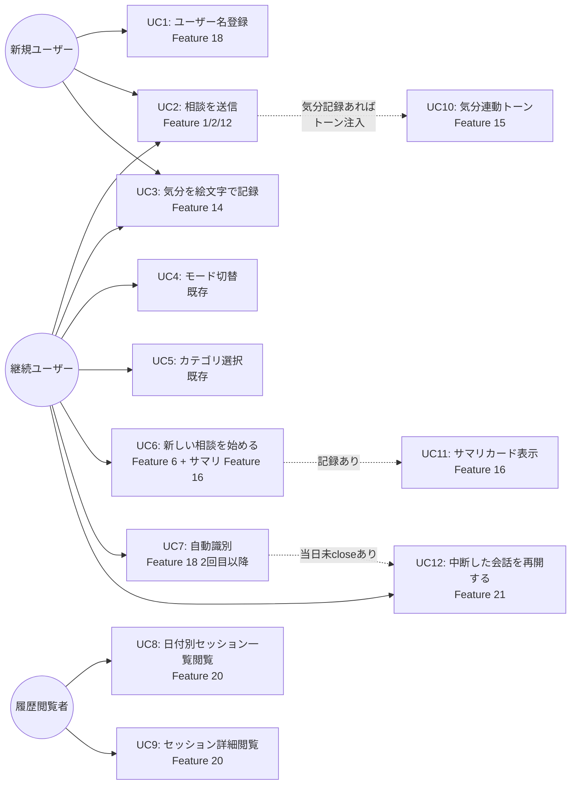
```mermaid
graph LR
  newUser((新規ユーザー))
  contUser((継続ユーザー))
  histUser((履歴閲覧者))

  newUser --> UC1[UC1: ユーザー名登録<br/>Feature 18]
  newUser --> UC2[UC2: 相談を送信<br/>Feature 1/2/12]
  newUser --> UC3[UC3: 気分を絵文字で記録<br/>Feature 14]

  contUser --> UC2
  contUser --> UC3
  contUser --> UC4[UC4: モード切替<br/>既存]
  contUser --> UC5[UC5: カテゴリ選択<br/>既存]
  contUser --> UC6[UC6: 新しい相談を始める<br/>Feature 6 + サマリ Feature 16]
  contUser --> UC7[UC7: 自動識別<br/>Feature 18 2回目以降]
  contUser --> UC12[UC12: 中断した会話を再開する<br/>Feature 21]

  histUser --> UC8[UC8: 日付別セッション一覧閲覧<br/>Feature 20]
  histUser --> UC9[UC9: セッション詳細閲覧<br/>Feature 20]

  UC2 -.->|気分記録あれば<br/>トーン注入| UC10[UC10: 気分連動トーン<br/>Feature 15]
  UC6 -.->|記録あり| UC11[UC11: サマリカード表示<br/>Feature 16]
  UC7 -.->|当日未closeあり| UC12
```

---

## 4. シーケンス図

### 4.1 オンボーディング（Sprint 7 / Feature 18）

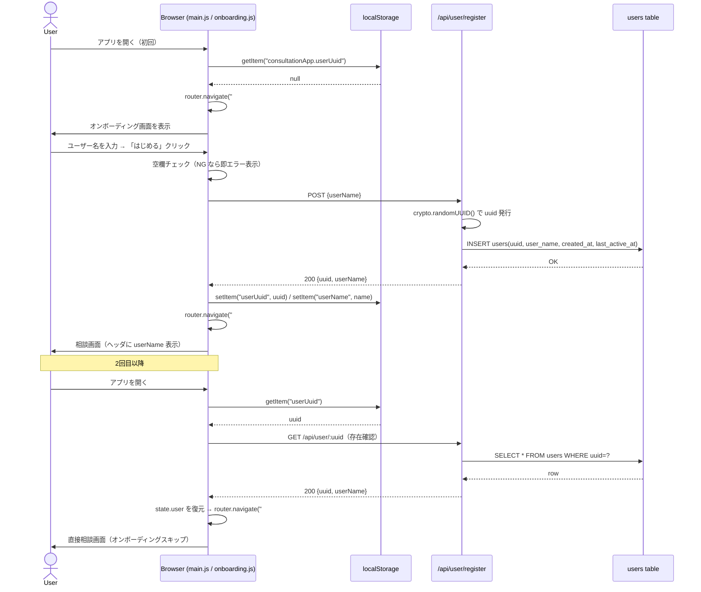
```mermaid
sequenceDiagram
  actor U as User
  participant B as Browser (main.js / onboarding.js)
  participant LS as localStorage
  participant API as /api/user/register
  participant DB as users table

  U->>B: アプリを開く（初回）
  B->>LS: getItem("consultationApp.userUuid")
  LS-->>B: null
  B->>B: router.navigate("#/onboarding")
  B->>U: オンボーディング画面を表示
  U->>B: ユーザー名を入力 → 「はじめる」クリック
  B->>B: 空欄チェック（NG なら即エラー表示）
  B->>API: POST {userName}
  API->>API: crypto.randomUUID() で uuid 発行
  API->>DB: INSERT users(uuid, user_name, created_at, last_active_at)
  DB-->>API: OK
  API-->>B: 200 {uuid, userName}
  B->>LS: setItem("userUuid", uuid) / setItem("userName", name)
  B->>B: router.navigate("#/")
  B->>U: 相談画面（ヘッダに userName 表示）

  Note over U,B: 2回目以降
  U->>B: アプリを開く
  B->>LS: getItem("userUuid")
  LS-->>B: uuid
  B->>API: GET /api/user/:uuid（存在確認）
  API->>DB: SELECT * FROM users WHERE uuid=?
  DB-->>API: row
  API-->>B: 200 {uuid, userName}
  B->>B: state.user を復元 → router.navigate("#/")
  B->>U: 直接相談画面（オンボーディングスキップ）
```

R4（UUID 改ざん対策）: `GET /api/user/:uuid` が 404 を返した場合、localStorage をクリアしてオンボーディングに誘導する。

### 4.2 相談送信 + ストリーミング + 絵文字記録（Sprint 6 + Sprint 7）

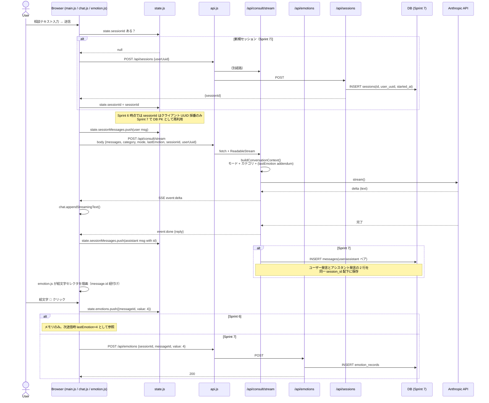
```mermaid
sequenceDiagram
  actor U as User
  participant B as Browser (main.js / chat.js / emotion.js)
  participant S as state.js
  participant API as api.js
  participant SV as /api/consult/stream
  participant EM as /api/emotions
  participant SE as /api/sessions
  participant DB as DB (Sprint 7)
  participant AN as Anthropic API

  U->>B: 相談テキスト入力 → 送信
  B->>S: state.sessionId ある？
  alt 新規セッション（Sprint 7）
    S-->>B: null
    B->>API: POST /api/sessions {userUuid}
    API->>SV: （別経路）
    API->>SE: POST
    SE->>DB: INSERT sessions(id, user_uuid, started_at)
    SE-->>B: {sessionId}
    B->>S: state.sessionId = sessionId
  end
  Note over S: Sprint 6 時点では sessionId はクライアント UUID 採番のみ<br/>Sprint 7 で DB PK として再利用
  B->>S: state.sessionMessages.push(user msg)
  B->>API: POST /api/consult/stream<br/>body {messages, category, mode, lastEmotion, sessionId, userUuid}
  API->>SV: fetch + ReadableStream
  SV->>SV: buildConversationContext()<br/>モード + カテゴリ + (lastEmotion addendum)
  SV->>AN: stream()
  AN-->>SV: delta (text)
  SV-->>B: SSE event:delta
  B->>B: chat.appendStreamingText()
  AN-->>SV: 完了
  SV-->>B: event:done {reply}
  B->>S: state.sessionMessages.push(assistant msg with id)
  alt Sprint 7
    SV->>DB: INSERT messages(user/assistant ペア)
    Note over SV,DB: ユーザー発言とアシスタント発言の 2 行を<br/>同一 session_id 配下に保存
  end
  B->>B: emotion.js が絵文字セレクタを描画（message.id 紐付け）
  U->>B: 絵文字 🙂 クリック
  B->>S: state.emotions.push({messageId, value: 4})
  alt Sprint 6
    Note over B: メモリのみ。次送信時 lastEmotion=4 として参照
  else Sprint 7
    B->>API: POST /api/emotions {sessionId, messageId, value: 4}
    API->>EM: POST
    EM->>DB: INSERT emotion_records
    EM-->>B: 200
  end
```

R3（ストリーミング完了と絵文字表示の race 対策）: `message.state` を `streaming | done | error` の 3 値 FSM で管理。絵文字セレクタの描画は `done` 状態遷移を `state.subscribe()` で検知してから実行する。

### 4.3 リセット + サマリ + セッションクローズ（Sprint 6 Feature 16 + Sprint 7）

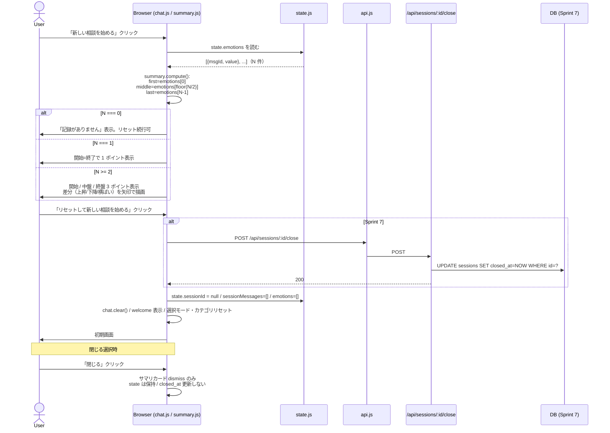
```mermaid
sequenceDiagram
  actor U as User
  participant B as Browser (chat.js / summary.js)
  participant S as state.js
  participant API as api.js
  participant SE as /api/sessions/:id/close
  participant DB as DB (Sprint 7)

  U->>B: 「新しい相談を始める」クリック
  B->>S: state.emotions を読む
  S-->>B: [{msgId, value}, ...]（N 件）
  B->>B: summary.compute():<br/>first=emotions[0]<br/>middle=emotions[floor(N/2)]<br/>last=emotions[N-1]
  alt N === 0
    B->>U: 「記録がありません」表示。リセット続行可
  else N === 1
    B->>U: 開始=終了で 1 ポイント表示
  else N >= 2
    B->>U: 開始 / 中盤 / 終盤 3 ポイント表示<br/>差分（上昇/下降/横ばい）を矢印で描画
  end
  U->>B: 「リセットして新しい相談を始める」クリック
  alt Sprint 7
    B->>API: POST /api/sessions/:id/close
    API->>SE: POST
    SE->>DB: UPDATE sessions SET closed_at=NOW WHERE id=?
    SE-->>B: 200
  end
  B->>S: state.sessionId = null / sessionMessages=[] / emotions=[]
  B->>B: chat.clear() / welcome 表示 / 選択モード・カテゴリリセット
  B->>U: 初期画面

  Note over U,B: 閉じる選択時
  U->>B: 「閉じる」クリック
  B->>B: サマリカード dismiss のみ<br/>state は保持 / closed_at 更新しない
```

R6（中盤定義ぶれ対策）: 中盤 = 記録配列 N 件のうち `floor(N/2)` 番目（0 始まり）。N=4 なら index=2、N=5 なら index=2。

### 4.4 履歴閲覧（Sprint 7 / Feature 20）

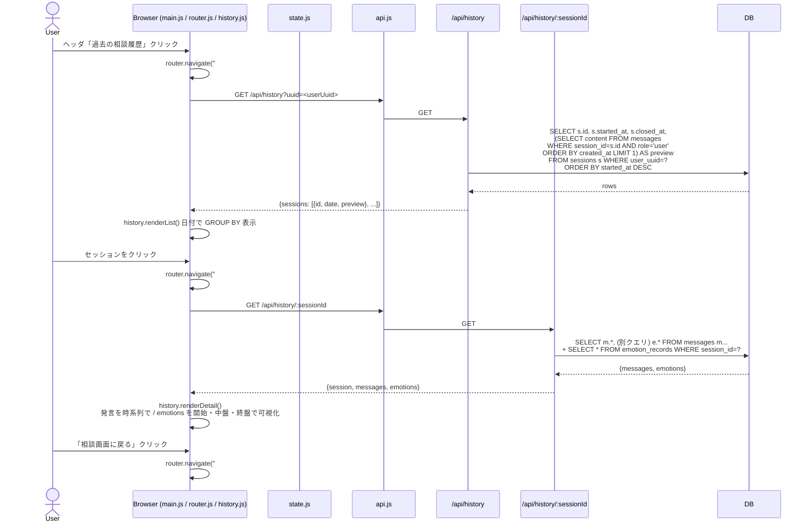
```mermaid
sequenceDiagram
  actor U as User
  participant B as Browser (main.js / router.js / history.js)
  participant S as state.js
  participant API as api.js
  participant H1 as /api/history
  participant H2 as /api/history/:sessionId
  participant DB as DB

  U->>B: ヘッダ「過去の相談履歴」クリック
  B->>B: router.navigate("#/history")
  B->>API: GET /api/history?uuid=<userUuid>
  API->>H1: GET
  H1->>DB: SELECT s.id, s.started_at, s.closed_at,<br/>(SELECT content FROM messages<br/>WHERE session_id=s.id AND role='user'<br/>ORDER BY created_at LIMIT 1) AS preview<br/>FROM sessions s WHERE user_uuid=?<br/>ORDER BY started_at DESC
  DB-->>H1: rows
  H1-->>B: {sessions: [{id, date, preview}, ...]}
  B->>B: history.renderList() 日付で GROUP BY 表示
  U->>B: セッションをクリック
  B->>B: router.navigate("#/history/:id")
  B->>API: GET /api/history/:sessionId
  API->>H2: GET
  H2->>DB: SELECT m.*, (別クエリ) e.* FROM messages m...<br/>+ SELECT * FROM emotion_records WHERE session_id=?
  DB-->>H2: {messages, emotions}
  H2-->>B: {session, messages, emotions}
  B->>B: history.renderDetail()<br/>発言を時系列で / emotions を開始・中盤・終盤で可視化
  U->>B: 「相談画面に戻る」クリック
  B->>B: router.navigate("#/")
```

### 4.5 再訪時の再開プロンプト（Sprint 7 / Feature 21）

起動時のオンボーディング判定の**直後**に、当日未 close セッションの存否を確認し、存在する場合のみ再開モーダルを表示する。前日以前の未 close セッションは server 起動時に自動 close 済み（§7.7 起動シーケンスの orphan close ステップ）なので、本判定対象は「当日 (`DATE(started_at) = DATE('now')`) かつ `closed_at IS NULL`」に自然に絞られる。

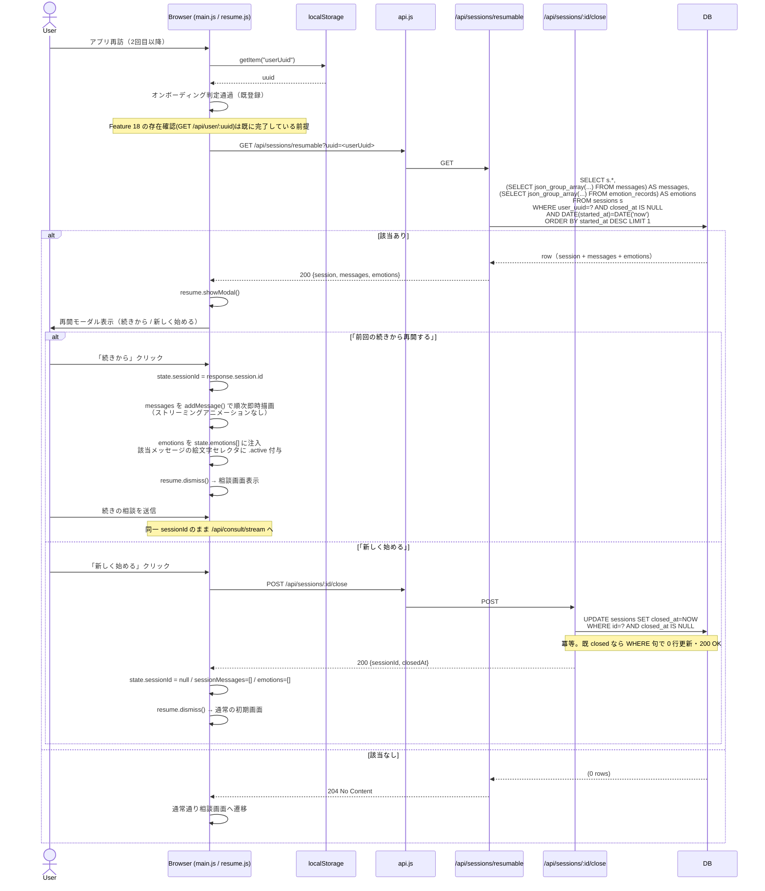
```mermaid
sequenceDiagram
  actor U as User
  participant B as Browser (main.js / resume.js)
  participant LS as localStorage
  participant API as api.js
  participant R as /api/sessions/resumable
  participant CL as /api/sessions/:id/close
  participant DB as DB

  U->>B: アプリ再訪（2回目以降）
  B->>LS: getItem("userUuid")
  LS-->>B: uuid
  B->>B: オンボーディング判定通過（既登録）
  Note over B: Feature 18 の存在確認(GET /api/user/:uuid)は既に完了している前提
  B->>API: GET /api/sessions/resumable?uuid=<userUuid>
  API->>R: GET
  R->>DB: SELECT s.*,<br/>(SELECT json_group_array(...) FROM messages) AS messages,<br/>(SELECT json_group_array(...) FROM emotion_records) AS emotions<br/>FROM sessions s<br/>WHERE user_uuid=? AND closed_at IS NULL<br/>AND DATE(started_at)=DATE('now')<br/>ORDER BY started_at DESC LIMIT 1
  alt 該当あり
    DB-->>R: row（session + messages + emotions）
    R-->>B: 200 {session, messages, emotions}
    B->>B: resume.showModal()
    B->>U: 再開モーダル表示（続きから / 新しく始める）
    alt 「前回の続きから再開する」
      U->>B: 「続きから」クリック
      B->>B: state.sessionId = response.session.id
      B->>B: messages を addMessage() で順次即時描画<br/>（ストリーミングアニメーションなし）
      B->>B: emotions を state.emotions[] に注入<br/>該当メッセージの絵文字セレクタに .active 付与
      B->>B: resume.dismiss() → 相談画面表示
      U->>B: 続きの相談を送信
      Note over B: 同一 sessionId のまま /api/consult/stream へ
    else 「新しく始める」
      U->>B: 「新しく始める」クリック
      B->>API: POST /api/sessions/:id/close
      API->>CL: POST
      CL->>DB: UPDATE sessions SET closed_at=NOW<br/>WHERE id=? AND closed_at IS NULL
      Note over CL,DB: 冪等。既 closed なら WHERE 句で 0 行更新・200 OK
      CL-->>B: 200 {sessionId, closedAt}
      B->>B: state.sessionId = null / sessionMessages=[] / emotions=[]
      B->>B: resume.dismiss() → 通常の初期画面
    end
  else 該当なし
    DB-->>R: (0 rows)
    R-->>B: 204 No Content
    B->>B: 通常通り相談画面へ遷移
  end
```

**起動シーケンス内の位置付け**（`public/js/main.js`）:

```
1. localStorage から userUuid 取得
2. userUuid が null → #/onboarding へ
3. userUuid あり → GET /api/user/:uuid（R4 対策：404 なら localStorage クリア → #/onboarding）
4. ユーザー識別成立 → GET /api/sessions/resumable
   - 200 → 再開モーダル表示 → ユーザー選択で分岐
   - 204 → 通常の相談画面（#/）
```

---

### 4.6 日替わりの一言メッセージ（Sprint 8 / Feature 22）

#### 4.6.1 bootstrap 初期表示（再開モーダル非該当ケース）

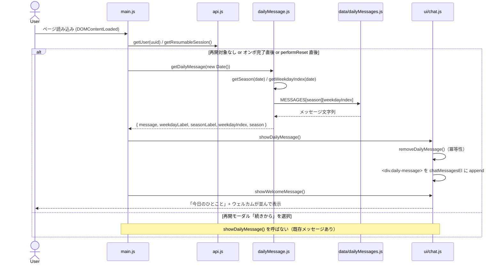
```mermaid
sequenceDiagram
  actor U as User
  participant M as main.js
  participant API as api.js
  participant DM as dailyMessage.js
  participant DICT as data/dailyMessages.js
  participant CH as ui/chat.js

  U->>M: ページ読み込み (DOMContentLoaded)
  M->>API: getUser(uuid) / getResumableSession()
  alt 再開対象なし or オンボ完了直後 or performReset 直後
    M->>DM: getDailyMessage(new Date())
    DM->>DM: getSeason(date) / getWeekdayIndex(date)
    DM->>DICT: MESSAGES[season][weekdayIndex]
    DICT-->>DM: メッセージ文字列
    DM-->>M: { message, weekdayLabel, seasonLabel, weekdayIndex, season }
    M->>CH: showDailyMessage()
    CH->>CH: removeDailyMessage()（冪等性）
    CH->>CH: <div.daily-message> を chatMessagesEl に append
    M->>CH: showWelcomeMessage()
    CH-->>U: 「今日のひとこと」+ ウェルカムが並んで表示
  else 再開モーダル「続きから」を選択
    Note over M,CH: showDailyMessage() を呼ばない（既存メッセージあり）
  end
```

**実装上のポイント**:
- `showDailyMessage()` は呼び出し順として `showWelcomeMessage()` の**直前**に置く。これは DOM 上で「今日のひとこと」がウェルカムより上に並ぶことを意味する
- `showDailyMessage()` 内部で `removeDailyMessage()` を最初に呼び、同一日に複数回呼ばれても重複描画しない（R10 / 冪等性）
- 「再開モーダル『続きから』」のパスでは `showDailyMessage()` を呼ばない。これは SPEC「中断した会話の再開」の体験を壊さないため（既存メッセージの上にひとことを差し込むと文脈が割れる）

#### 4.6.2 performReset → 再表示

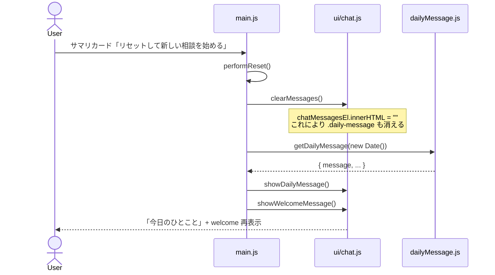
```mermaid
sequenceDiagram
  actor U as User
  participant M as main.js
  participant CH as ui/chat.js
  participant DM as dailyMessage.js

  U->>M: サマリカード「リセットして新しい相談を始める」
  M->>M: performReset()
  M->>CH: clearMessages()
  Note over CH: chatMessagesEl.innerHTML = ""<br/>これにより .daily-message も消える
  M->>DM: getDailyMessage(new Date())
  DM-->>M: { message, ... }
  M->>CH: showDailyMessage()
  M->>CH: showWelcomeMessage()
  CH-->>U: 「今日のひとこと」+ welcome 再表示
```

**実装上のポイント**:
- `clearMessages()` は `chatMessagesEl.innerHTML = ""` で全消去するため、`.daily-message` も自動的に消える。明示的な `removeDailyMessage()` 呼び出しは不要（だが `showDailyMessage()` 内部で冪等化されているので二重呼び出しでも安全）
- SPEC F22 受け入れ基準「『新しい相談を始める』ボタンによるリセット後、ウェルカムメッセージと『今日のひとこと』がともに再表示される」に対応

#### 4.6.3 呼び出し点マトリクス

| # | 呼び出し点 | `showWelcomeMessage` | `showDailyMessage`（直前に挿入） | 根拠 |
|---|-----------|--------------------|--------------------------------|------|
| 1 | `bootstrap()` 末尾（オンボ済 + 再開対象なし） | 既存あり | **追加** | チャット初期表示時の併置（SPEC F22） |
| 2 | オンボーディング `onComplete` 後 | 既存あり | **追加** | 初回利用直後も即時表示 |
| 3 | 再開モーダル `onFreshStart` 後 | 既存あり | **追加** | 「新しく始める」選択は実質的に新規セッション開始 |
| 4 | `performReset()` 内 | 既存あり | **追加** | SPEC F22「リセット後の再表示」明示 |
| 5 | 再開モーダル `onResume` 後 | なし | **追加しない** | 過去メッセージ復元の文脈を割らない（4.6.1 参照） |

### 4.7 相談テンプレート挿入（Sprint 9 / Feature 23） [追加: Sprint 9 相談テンプレート 2026-05-13]

#### 4.7.1 空欄時のテンプレート挿入（衝突確認なし）

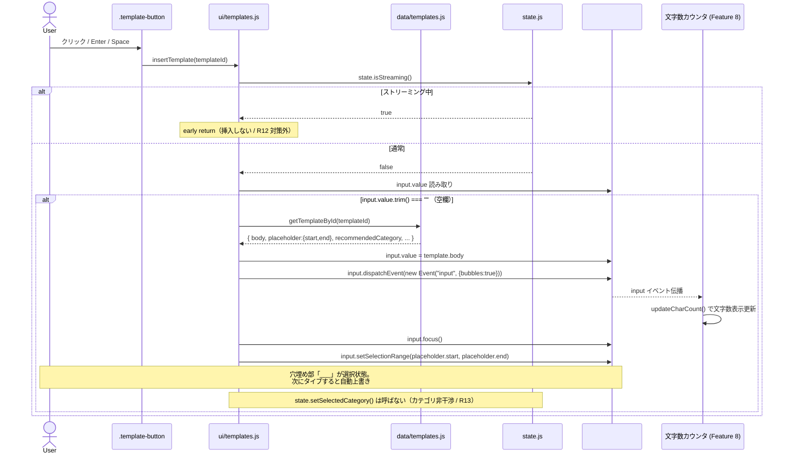
```mermaid
sequenceDiagram
  actor U as User
  participant B as .template-button
  participant T as ui/templates.js
  participant DICT as data/templates.js
  participant S as state.js
  participant IN as #message-input (textarea)
  participant CC as 文字数カウンタ (Feature 8)

  U->>B: クリック / Enter / Space
  B->>T: insertTemplate(templateId)
  T->>S: state.isStreaming()
  alt ストリーミング中
    S-->>T: true
    Note over T: early return（挿入しない / R12 対策外）
  else 通常
    S-->>T: false
    T->>IN: input.value 読み取り
    alt input.value.trim() === "" （空欄）
      T->>DICT: getTemplateById(templateId)
      DICT-->>T: { body, placeholder:{start,end}, recommendedCategory, ... }
      T->>IN: input.value = template.body
      T->>IN: input.dispatchEvent(new Event("input", {bubbles:true}))
      IN-->>CC: input イベント伝播
      CC->>CC: updateCharCount() で文字数表示更新
      T->>IN: input.focus()
      T->>IN: input.setSelectionRange(placeholder.start, placeholder.end)
      Note over IN,U: 穴埋め部「___」が選択状態。<br/>次にタイプすると自動上書き
      Note over T,S: state.setSelectedCategory() は呼ばない（カテゴリ非干渉 / R13）
    end
  end
```

**実装上のポイント**:
- `input.value =` の代入だけでは `input` イベントは自動発火しない。明示的に `dispatchEvent(new Event("input", {bubbles:true}))` を呼ぶことで Sprint 1〜2 で実装済みの文字数カウンタ（Feature 8）と「送信ボタン活性化（Feature 1）」を同時に正しく連動させる（R12 対策）
- `setSelectionRange(start, end)` は textarea に `focus()` が当たっている前提なので、必ず `focus()` を先に呼ぶ
- `state.setSelectedCategory()` を一切呼ばないことで「テンプレートを選んでもカテゴリは自動選択されない」SPEC 受入基準を担保（§7.9.3）
- 既存の選択カテゴリ（`state.selectedCategory`）にも触れないため「カテゴリを先に選択していてからテンプレートを挿入しても既選択カテゴリは維持される」SPEC 受入基準を同時担保

#### 4.7.2 既入力時のテンプレート挿入（確認モーダル経由）

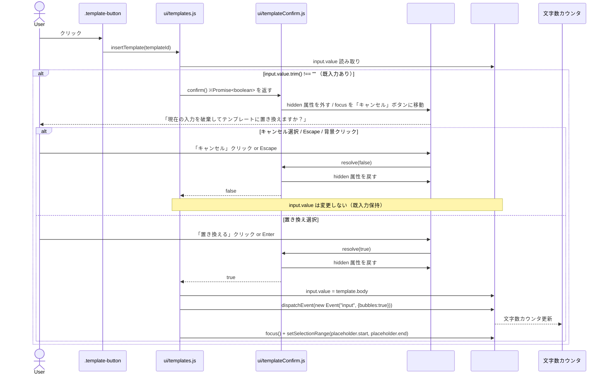
```mermaid
sequenceDiagram
  actor U as User
  participant B as .template-button
  participant T as ui/templates.js
  participant TC as ui/templateConfirm.js
  participant MODAL as #template-confirm-modal
  participant IN as #message-input
  participant CC as 文字数カウンタ

  U->>B: クリック
  B->>T: insertTemplate(templateId)
  T->>IN: input.value 読み取り
  alt input.value.trim() !== "" （既入力あり）
    T->>TC: confirm()  ※Promise<boolean> を返す
    TC->>MODAL: hidden 属性を外す / focus を「キャンセル」ボタンに移動
    MODAL-->>U: 「現在の入力を破棄してテンプレートに置き換えますか？」
    alt キャンセル選択 / Escape / 背景クリック
      U->>MODAL: 「キャンセル」クリック or Escape
      MODAL->>TC: resolve(false)
      TC->>MODAL: hidden 属性を戻す
      TC-->>T: false
      Note over T,IN: input.value は変更しない（既入力保持）
    else 置き換え選択
      U->>MODAL: 「置き換える」クリック or Enter
      MODAL->>TC: resolve(true)
      TC->>MODAL: hidden 属性を戻す
      TC-->>T: true
      T->>IN: input.value = template.body
      T->>IN: dispatchEvent(new Event("input", {bubbles:true}))
      IN-->>CC: 文字数カウンタ更新
      T->>IN: focus() + setSelectionRange(placeholder.start, placeholder.end)
    end
  end
```

**実装上のポイント**:
- `templateConfirm.js` の `confirm()` は単一の Promise を返し、解決ルートを 1 箇所に集約する。これにより「キャンセル」「置き換える」「Escape」「背景クリック」のすべてが同じ後処理（モーダル非表示・フォーカス復元）を共有する
- モーダル表示中は背景の操作を抑制するためフォーカストラップを実装する（モーダル内 Tab 循環）
- 「キャンセル」選択時は `input.value` を一切変更しない。`input` イベント発火もしないので文字数カウンタは現状維持

#### 4.7.3 キーボード操作によるテンプレート挿入（A11y）

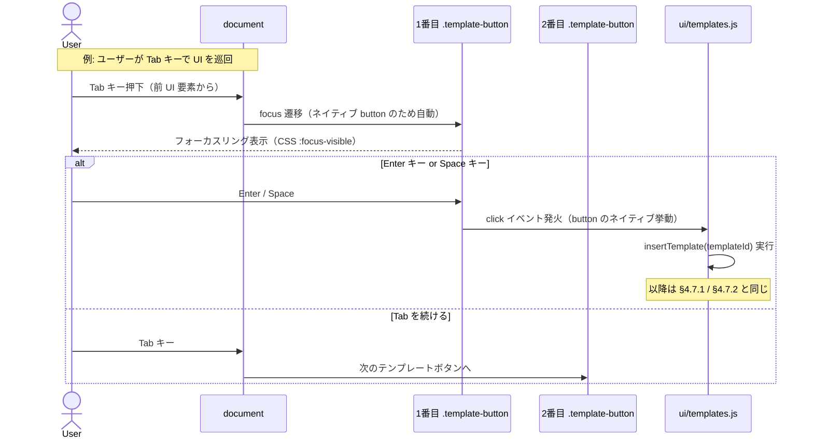
```mermaid
sequenceDiagram
  actor U as User
  participant DOC as document
  participant B1 as 1番目 .template-button
  participant B2 as 2番目 .template-button
  participant T as ui/templates.js

  Note over U,DOC: 例: ユーザーが Tab キーで UI を巡回
  U->>DOC: Tab キー押下（前 UI 要素から）
  DOC->>B1: focus 遷移（ネイティブ button のため自動）
  B1-->>U: フォーカスリング表示（CSS :focus-visible）
  alt Enter キー or Space キー
    U->>B1: Enter / Space
    B1->>T: click イベント発火（button のネイティブ挙動）
    T->>T: insertTemplate(templateId) 実行
    Note over T: 以降は §4.7.1 / §4.7.2 と同じ
  else Tab を続ける
    U->>DOC: Tab キー
    DOC->>B2: 次のテンプレートボタンへ
  end
```

**実装上のポイント**:
- `<button type="button">` を使うことで、Enter / Space で click イベントが発火する**ブラウザネイティブ挙動**をそのまま利用する。JavaScript で keydown ハンドラを書かない（書くと IME 入力中の挙動と競合するリスク / R14）
- ラッパ要素に `role="group" aria-label="相談テンプレート選択"` を付け、スクリーンリーダーがグループとして読み上げる
- フォーカスリング: 既存 CSS の `:focus-visible` スタイルを `.template-button` にも適用し、キーボードユーザーに視覚フィードバックを返す
- 挿入後の `input.focus()` でフォーカスは textarea に移る。これは「追加のクリックなしに穴埋め部分にテキスト入力を開始できる」SPEC 受入基準に対応

---

## 5. データモデル（Sprint 7 導入）

### 5.1 ER 図

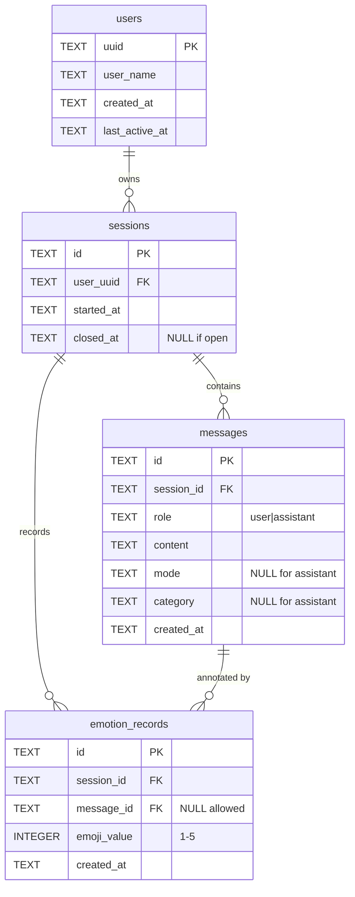
```mermaid
erDiagram
  users ||--o{ sessions : "owns"
  sessions ||--o{ messages : "contains"
  sessions ||--o{ emotion_records : "records"
  messages ||--o{ emotion_records : "annotated by"

  users {
    TEXT uuid PK
    TEXT user_name
    TEXT created_at
    TEXT last_active_at
  }
  sessions {
    TEXT id PK
    TEXT user_uuid FK
    TEXT started_at
    TEXT closed_at "NULL if open"
  }
  messages {
    TEXT id PK
    TEXT session_id FK
    TEXT role "user|assistant"
    TEXT content
    TEXT mode "NULL for assistant"
    TEXT category "NULL for assistant"
    TEXT created_at
  }
  emotion_records {
    TEXT id PK
    TEXT session_id FK
    TEXT message_id FK "NULL allowed"
    INTEGER emoji_value "1-5"
    TEXT created_at
  }
```

SQLite のため全ての UUID / 日時は TEXT（ISO 8601、UTC）。`emoji_value` のみ INTEGER で CHECK 制約をかける。

### 5.2 スキーマ詳細

#### users

| フィールド | 型 | 制約 | 説明 |
|-----------|-----|------|------|
| uuid | TEXT | PRIMARY KEY | crypto.randomUUID()（v4）。サーバ払い出し |
| user_name | TEXT | NOT NULL, CHECK(length(user_name) BETWEEN 1 AND 50) | 表示名。匿名識別用 |
| created_at | TEXT | NOT NULL, DEFAULT (strftime('%Y-%m-%dT%H:%M:%fZ', 'now')) | ISO 8601 UTC |
| last_active_at | TEXT | NOT NULL | 既存ユーザー GET ヒット時に更新 |

#### sessions

| フィールド | 型 | 制約 | 説明 |
|-----------|-----|------|------|
| id | TEXT | PRIMARY KEY | クライアント採番 UUID。Sprint 6 段階から同じ採番方法 |
| user_uuid | TEXT | NOT NULL, REFERENCES users(uuid) ON DELETE CASCADE | 所有者 |
| started_at | TEXT | NOT NULL | セッション開始日時 |
| closed_at | TEXT | NULL | 「リセット」またはサーバ起動時 orphan close で埋まる |

#### messages

| フィールド | 型 | 制約 | 説明 |
|-----------|-----|------|------|
| id | TEXT | PRIMARY KEY | クライアント採番 UUID（Sprint 6 から採番） |
| session_id | TEXT | NOT NULL, REFERENCES sessions(id) ON DELETE CASCADE | 所属セッション |
| role | TEXT | NOT NULL, CHECK(role IN ('user','assistant')) | 発言者 |
| content | TEXT | NOT NULL | 発言本文 |
| mode | TEXT | NULL | user 行のみに記録（選択モード） |
| category | TEXT | NULL | user 行のみに記録（選択カテゴリ） |
| created_at | TEXT | NOT NULL | 受信確定時刻（assistant は done 受信時） |

#### emotion_records

| フィールド | 型 | 制約 | 説明 |
|-----------|-----|------|------|
| id | TEXT | PRIMARY KEY | UUID |
| session_id | TEXT | NOT NULL, REFERENCES sessions(id) ON DELETE CASCADE | 所属セッション |
| message_id | TEXT | NULL, REFERENCES messages(id) ON DELETE SET NULL | 対応する AI 回答（SPEC「対応AI回答への紐付け」）。レアケースでメッセージ削除に耐える |
| emoji_value | INTEGER | NOT NULL, CHECK(emoji_value BETWEEN 1 AND 5) | 1=😢 2=😟 3=😐 4=🙂 5=😊 |
| created_at | TEXT | NOT NULL | 記録時刻 |

同一 `message_id` に対して複数レコードが入り得る（ユーザーが絵文字を変更した場合、**常に最新行を採用**する運用。UPSERT ではなく追記で履歴性を保つ）。表示時は `ORDER BY created_at DESC LIMIT 1`。

### 5.3 インデックス

```sql
CREATE INDEX idx_sessions_user_started ON sessions(user_uuid, started_at DESC);
CREATE INDEX idx_messages_session_created ON messages(session_id, created_at);
CREATE INDEX idx_emotion_session_created ON emotion_records(session_id, created_at);
```

- `idx_sessions_user_started`: 履歴一覧画面の「ユーザー別・新しい順」クエリを O(log N) に
- `idx_messages_session_created`: セッション詳細で時系列読み出し
- `idx_emotion_session_created`: サマリカードの「最初/中盤/最終」計算

**Feature 21 再開判定クエリとインデックス利用**:

```sql
-- 当日未closeの最新セッション1件を取得（Feature 21）
SELECT id, started_at
FROM sessions
WHERE user_uuid = ?
  AND closed_at IS NULL
  AND DATE(started_at) = DATE('now')
ORDER BY started_at DESC
LIMIT 1;
```

`idx_sessions_user_started(user_uuid, started_at DESC)` により `user_uuid` の等価 + `started_at DESC` のカバリング走査で高速化される。`closed_at IS NULL` と `DATE(started_at) = DATE('now')` は走査済み行に対する残余フィルタとして評価されるが、当該ユーザーの行数はせいぜい日あたり数件〜数十件のオーダーのため追加インデックスは不要。**本 Feature 21 用の専用インデックスは新設しない**（既存 `idx_sessions_user_started` で十分）。

該当セッションが見つかった後、`getResumableSession()` 内で同一トランザクション中に以下を追加実行:

```sql
-- messages（時系列）
SELECT id, role, content, mode, category, created_at
FROM messages
WHERE session_id = ?
ORDER BY created_at ASC;

-- emotion_records（絵文字復元用、最新行のみで十分だが実装簡素化のため全行取得してクライアントで最新採用）
SELECT id, message_id, emoji_value, created_at
FROM emotion_records
WHERE session_id = ?
ORDER BY created_at ASC;
```

`idx_messages_session_created` / `idx_emotion_session_created` が効くため追加インデックス不要。

### 5.4 PRAGMA / 初期化

```sql
PRAGMA journal_mode = WAL;       -- マルチタブ対策（R と R）
PRAGMA foreign_keys = ON;        -- FK 制約有効化（better-sqlite3 は既定 OFF）
PRAGMA synchronous = NORMAL;     -- WAL モード下の実用既定
```

---

## 6. API 設計

### 6.1 エンドポイント一覧

| メソッド | パス | 用途 | 認証 | Sprint |
|---------|------|------|------|--------|
| POST | `/api/user/register` | user_name 受領 → UUID 払い出し → users INSERT | なし | 7 |
| GET | `/api/user/:uuid` | 2 回目以降の識別確認（404 なら localStorage 破棄） | なし | 7 |
| POST | `/api/sessions` | 新規セッション作成（初回相談送信時） | x-user-uuid | 7 |
| POST | `/api/sessions/:id/close` | サマリ表示後のクローズ（**冪等**: 既 closed でも 200） | x-user-uuid | 7 |
| GET | `/api/sessions/resumable?uuid=...` | 当日未 close の最新セッションを 1 件返す（Feature 21） | x-user-uuid | 7 |
| POST | `/api/emotions` | 絵文字記録保存 | x-user-uuid | 7 |
| GET | `/api/history?uuid=...` | 日付別セッション一覧 | x-user-uuid | 7 |
| GET | `/api/history/:sessionId` | セッション詳細（messages + emotions） | x-user-uuid | 7 |
| POST | `/api/consult/stream` | 既存。body に lastEmotion / sessionId / userUuid を追加受領 | x-user-uuid | 6 (lastEmotion), 7 (sessionId / userUuid) |
| POST | `/api/consult` | 既存。Sprint 5 で回帰用残置。本スプリントで拡張しない | なし | - |

**認証注記**: 本アプリは匿名識別のみであり、認証は行わない。`x-user-uuid` ヘッダは「自分の UUID を申告する」ための伝達であり、サーバはヘッダ値の存在と users テーブル内一致だけを確認する。偽装に対する防御はスコープ外（SPEC「認証はスコープ外」）。

**userUuid の二重経路**: `/api/consult/stream` のみ body にも `userUuid` を受ける（SSE リクエストでヘッダを変えにくい運用の受け皿）。サーバ側は**ヘッダ優先、body フォールバック**で解決する。

### 6.2 リクエスト / レスポンス型定義（TypeScript 風・参考）

```typescript
// 共通
type Uuid = string; // crypto.randomUUID() v4

interface ApiError { error: string; }

// ---------- User ----------
// POST /api/user/register
interface RegisterReq { userName: string; }
interface RegisterRes { uuid: Uuid; userName: string; }

// GET /api/user/:uuid
// path param: uuid
type GetUserRes = { uuid: Uuid; userName: string; lastActiveAt: string } | ApiError;

// ---------- Sessions ----------
// POST /api/sessions
// Header: x-user-uuid
interface CreateSessionReq { clientSessionId?: Uuid; } // Sprint 6→7 互換のため、クライアント既採番 ID 持ち込み可
interface CreateSessionRes { sessionId: Uuid; startedAt: string; }

// POST /api/sessions/:id/close
// 冪等。既に closed_at が入っていても 200 OK を返し、closed_at は既存値を維持する
interface CloseSessionRes { sessionId: Uuid; closedAt: string; alreadyClosed?: boolean; }

// GET /api/sessions/resumable?uuid=<userUuid>
// Header: x-user-uuid
// 200: 復元対象あり（当日未 close セッションの最新 1 件 + messages + emotions）
// 204: 該当なし（前日以前のみ、または全て closed、または当日未送信）
type ResumableSessionResponse = {
  session: { id: Uuid; started_at: string };
  messages: Array<{
    id: Uuid;
    role: "user" | "assistant";
    content: string;
    mode: string | null;
    category: string | null;
    created_at: string;
  }>;
  emotions: Array<{
    id: Uuid;
    message_id: Uuid | null;
    emoji_value: 1 | 2 | 3 | 4 | 5;
    created_at: string;
  }>;
} | null; // 204 の場合クライアント側で null として扱う

// ---------- Emotions ----------
// POST /api/emotions
// Header: x-user-uuid
interface SaveEmotionReq {
  sessionId: Uuid;
  messageId: Uuid | null;
  emojiValue: 1 | 2 | 3 | 4 | 5;
}
interface SaveEmotionRes { id: Uuid; createdAt: string; }

// ---------- History ----------
// GET /api/history?uuid=...
// Header: x-user-uuid
interface HistoryListItem {
  sessionId: Uuid;
  startedAt: string;
  closedAt: string | null;
  preview: string; // 先頭のユーザー発言 (最大 50 文字)
}
interface HistoryListRes { sessions: HistoryListItem[]; }

// GET /api/history/:sessionId
// Header: x-user-uuid
interface HistoryDetailMessage {
  id: Uuid;
  role: "user" | "assistant";
  content: string;
  mode: string | null;
  category: string | null;
  createdAt: string;
}
interface HistoryDetailEmotion {
  id: Uuid;
  messageId: Uuid | null;
  emojiValue: 1|2|3|4|5;
  createdAt: string;
}
interface HistoryDetailRes {
  session: { id: Uuid; startedAt: string; closedAt: string | null };
  messages: HistoryDetailMessage[];
  emotions: HistoryDetailEmotion[];
}

// ---------- Consult (既存拡張) ----------
// POST /api/consult/stream
interface ConsultStreamReq {
  messages: Array<{ role: "user" | "assistant"; content: string }>;
  category?: string | null;
  mode?: "default" | "empathy" | "solution";
  // Sprint 6 追加
  lastEmotion?: 1 | 2 | 3 | 4 | 5 | null;
  // Sprint 7 追加（ヘッダ x-user-uuid が優先だが body 経由も許容）
  sessionId?: Uuid;
  userUuid?: Uuid;
}
// Response: text/event-stream
//   event: delta / data: {text: string}
//   event: done  / data: {reply: string, assistantMessageId: Uuid}  ← Sprint 7 で message_id を返却
//   event: error / data: {error: string}
```

### 6.3 Sprint 6 時点の `/api/consult/stream` リクエスト拡張

Sprint 6 では DB が無いため、サーバ側は `lastEmotion` のみ参照して `buildConversationContext` に渡す。`sessionId` / `userUuid` は「body に含まれていれば無視」で後方互換を保つ（Sprint 7 で実際に使う）。

### 6.4 ルーティング分割（Sprint 7）

既存 `server.js` から相談系以外を `src/routes/` に切り出す。

```javascript
// server.js（擬似構造）
app.use("/api/user", require("./src/routes/user"));
app.use("/api/sessions", require("./src/routes/sessions"));
app.use("/api/emotions", require("./src/routes/emotions"));
app.use("/api/history", require("./src/routes/history"));
// /api/consult と /api/consult/stream は server.js に残置（既存の SSE ロジックを壊さないため）
```

---

## 7. 処理方針

### 7.1 エラーハンドリング

| 境界 | 方針 |
|------|------|
| サーバー全体 | Express の同期エラーは try/catch、非同期は各ルータ内で try/catch → `res.status(4xx\|5xx).json({ error })` |
| DB 系エラー | `repo.js` 内で catch → Error を再 throw（独自メッセージ付与） → ルータで 500 返却 |
| SSE ストリーミング中のエラー | 既存設計継続。ヘッダ送信後は `event: error` で通知、`res.end()` を finally で必ず呼ぶ |
| 永続化失敗（Feature 19 受け入れ基準） | 画面の相談体験は継続。ユーザーには「記録の保存に失敗しました」トーストを出すが、メッセージ表示自体は消さない |
| クライアント fetch エラー | `api.js` が統一 catch → 上位 UI モジュールに `{ok:false, error}` として返す |
| ルーティングエラー | 存在しないハッシュは `router.js` で `#/` にフォールバック |

### 7.2 バリデーション

| 箇所 | 内容 |
|------|------|
| ユーザー名入力 | 1〜50 文字・前後空白 trim・空禁止（クライアント + サーバ両方） |
| emojiValue | 整数 1〜5 のみ。それ以外は 400 |
| messages 配列 | `role in {user, assistant}` / `content: string, not empty` |
| sessionId / userUuid | UUID v4 形式（簡易 regex）。DB 参照でも存在確認 |
| category / mode | 既存定義値のみ許容（enum チェック） |

### 7.3 非同期処理

- **SSE（ストリーミング）**: 既存採用済み。Sprint 6/7 で変更なし。body にフィールド追加のみ
- **DB アクセス**: better-sqlite3 は同期 API のため Express ハンドラ内で直接呼ぶ（別スレッドプール不要）
- **クライアント fetch**: 既存 AbortController パターン（`OVERALL_TIMEOUT_MS` / `IDLE_TIMEOUT_MS`）を維持

### 7.4 セキュリティ

| 項目 | 方針 |
|------|------|
| 認証 | 匿名識別のみ。パスワード・メール・トークンは扱わない（SPEC スコープ外） |
| ユーザー分離 | 履歴 API は `x-user-uuid` とクエリ `uuid` の一致を確認。不一致は 403 |
| 入力サニタイゼーション | `textContent` のみで DOM 組み立て（`innerHTML` で生文字列を流し込まない）。SQL は 100% プリペアードステートメント（`db.prepare().run(params)`） |
| 秘密情報 | `.env` のみ（既存踏襲）。DB ファイル `data/app.db` は git ignore |
| CORS | 単一オリジン前提のため追加設定なし（既存と同じ） |
| レート制限 | スコープ外（ローカル単一ユーザー前提） |

### 7.5 ロギング / 監視

- **起動時**: `Server running at http://localhost:PORT`（既存踏襲）、加えて `DB initialized: data/app.db (WAL)` の 1 行
- **通常リクエスト**: ログなし（Feature 11 クリーンアップ方針踏襲）
- **エラー時**: `console.error` に `err.message` のみ（スタックは抑制、既存踏襲）
- **DB マイグレーション**: 起動時 orphan close 処理は `Closed N orphan sessions` を stderr ではなく stdout に 1 行（運用情報）

### 7.6 再開時の整合性（Sprint 7 / Feature 21）

**再開モーダル「前回の続きから再開する」選択時の復元手順**:

1. **sessionId 差し替え**: Sprint 6 で `state.sessionId` はクライアント採番だが、再開時はサーバ DB から受領した `response.session.id` で `state.sessionId` を**完全に上書き**する。以降の `/api/consult/stream` はこの sessionId を body に詰めて送り、messages は同一セッションとして追記される。
2. **メッセージ描画**: `response.messages` を `created_at ASC` で並べ、`ui/chat.js:addMessage(content, role)` を**ストリーミングアニメーションなしで順次即時呼び出し**。タイピングアニメーションは新しいやり取り（次回送信）時のみに適用する。ストリーミング風再生は §4.4 の履歴詳細画面と同じく**行わない**。
3. **感情復元**:
   - `response.emotions` を `message_id` でグルーピングし、各 `message_id` について `created_at DESC` の最上位行 1 件を**最新採用**する（§5.2 emotion_records の運用方針と同じ）。
   - 採用された `emoji_value` を `state.emotions[]` に注入し、対応する AI 回答直下の絵文字セレクタで該当ボタンに `.active` クラスを付与する。
   - `message_id` が NULL の emotion_records（保険的に想定）はスキップ。
4. **モード/カテゴリの復元**: 各 user メッセージの `mode` / `category` はそのまま state 側の履歴として保持するが、**現在の選択 UI（モード切替・カテゴリセレクタ）は再開時にはリセット状態**とする（ユーザーが新しい送信前に再選択可能）。これにより再開後の意思決定を過去選択に拘束しない。
5. **ウェルカムメッセージ**: 再開時は表示しない（既存メッセージが存在するため）。`ui/chat.js:showWelcomeMessage()` を呼び出す分岐はスキップする。

**「新しく始める」選択時**:

1. `POST /api/sessions/:id/close` を**冪等呼び出し**（既 closed でも 200 OK を受け取る）。
2. サーバ側ハンドラは `UPDATE sessions SET closed_at=strftime(...) WHERE id=? AND user_uuid=? AND closed_at IS NULL` を実行し、`changes()` が 0 でも `alreadyClosed: true` を付けて 200 を返す（R8 対策）。
3. クライアントは `state` を初期化し通常の新規セッション画面を表示。次の初回相談送信時に `POST /api/sessions` で新規 sessionId を採番する。

### 7.7 起動シーケンス（server.js）

```
1. dotenv.config()
2. db/driver.js: open data/app.db → PRAGMA WAL / foreign_keys / synchronous
3. db/schema.js: CREATE TABLE IF NOT EXISTS × 4 / CREATE INDEX IF NOT EXISTS × 3
4. UPDATE sessions SET closed_at=strftime(...) WHERE closed_at IS NULL
   AND date(started_at) < date('now')  ← 前日以前の orphan を自動 close
5. require routes/* → app.use(...)
6. app.listen(PORT)
```

orphan close の対象日境界は UTC 起点。サマータイム等の複雑性はスコープ外。

### 7.8 日替わりメッセージの処理方針（Sprint 8 / Feature 22）

#### 7.8.1 純粋関数化と Date 注入

`dailyMessage.js` の主要関数は**全て純粋関数**として実装し、外部状態（current date, locale 等）を参照しない:

```javascript
// public/js/dailyMessage.js（実装イメージ。Generator が確定）
import { MESSAGES, WEEKDAY_LABELS, SEASON_LABELS } from "./data/dailyMessages.js";

export function getSeason(date) { /* month → "spring" | "summer" | "autumn" | "winter" */ }
export function getWeekdayIndex(date) { return date.getDay(); } // 0=Sun..6=Sat
export function getDailyMessage(date = new Date()) {
  const season = getSeason(date);
  const weekdayIndex = getWeekdayIndex(date);
  return {
    message: MESSAGES[season][weekdayIndex],
    weekdayLabel: WEEKDAY_LABELS[weekdayIndex],
    seasonLabel: SEASON_LABELS[season],
    weekdayIndex,
    season,
  };
}
```

**Date 注入の理由**: Evaluator が Playwright の `page.clock.install({ time: "2026-03-02T10:00:00" })` で日付を固定して曜日×季節の網羅検証を行えるようにする（SPEC F22 受け入れ基準「ブラウザの Date を…日付に固定した状態でアプリを開いたとき」を直接サポート）。

#### 7.8.2 決定性 / 冪等性

- 同一日内の複数回リロード・複数回呼び出しで**同一メッセージ**が返ることを保証する（SPEC F22 受け入れ基準）。乱数・タイムスタンプ等の非決定要素を一切使わない
- `showDailyMessage()` は内部で先頭に `removeDailyMessage()` を呼び、何度呼んでも DOM 上は 1 要素のみ存在することを保証する

#### 7.8.3 エラーハンドリング

- `getDailyMessage()` は理論上 `MESSAGES[season][weekdayIndex]` が必ず存在するため例外を投げない。それでも防御的に「辞書欠損 → デフォルト文言『今日もおつかれさまです。』を返す」フォールバックを `dailyMessage.js` 内に持つ
- 万一 DOM 操作で `chatMessagesEl` が未取得（id 変更等）の場合は `console.warn` のみで処理を黙って中断する。ウェルカム表示の阻害を絶対に起こさない（既存機能の非破壊優先）

#### 7.8.4 タイムゾーン

- `new Date()` および `Date.getDay()` / `Date.getMonth()` は**クライアント端末のローカルタイムゾーン**で評価される（JavaScript 標準動作）
- これは「日本の利用者は日本時間で曜日・季節が決まる」「海外利用者はその端末の現地時間で決まる」という素直な挙動と一致する
- サーバ時刻・UTC への変換は行わない（R11 で明示的に受容）

#### 7.8.5 既存機能との関係

- ウェルカムメッセージ（Feature 7）は**完全非破壊**。`chat.js` 内の `showWelcomeMessage()` 既存関数のシグネチャ・本体は一切変更しない
- 新規 export として `showDailyMessage()` / `removeDailyMessage()` を `chat.js` に追加するのみ
- main.js の既存呼び出し点 4 箇所に対し `showDailyMessage()` を **直前に追加** する形でのみ介入する。既存の呼び出し順や引数は変更しない

#### 7.8.6 CSS 方針

- 既存テーマ変数のみ使用: `var(--color-ai-bubble)`, `var(--color-ink-faint)`, `var(--color-accent)`, `var(--color-text)`, `var(--color-text-light)`
- 新規 CSS 変数を一切追加しない（全テーマ default / ocean / forest / night / sakura で自動的に整合）
- ラベル「今日のひとこと」を視覚的にウェルカムと区別するため、左ボーダーまたは小さなアイコン的装飾でアクセントを付ける（最終的なビジュアルは Generator 判断、ただし上記変数のみ使用）

### 7.9 相談テンプレートの処理方針（Sprint 9 / Feature 23） [追加: Sprint 9 相談テンプレート 2026-05-13]

#### 7.9.1 純粋関数化（テンプレ辞書はステートレス）

`public/js/data/templates.js` および `public/js/ui/templates.js` の主要関数は**辞書参照部分を純粋関数として実装し**、外部状態（DOM・state・localStorage 等）を参照しない:

```javascript
// public/js/data/templates.js（実装イメージ。Generator が確定）
export const TEMPLATES = [
  { id: "workplace", label: "職場の人間関係",   body: "職場の人間関係で悩んでいます。具体的には___",        placeholder: { start: 20, end: 23 }, recommendedCategory: "人間関係" },
  { id: "family",    label: "家族との関係",     body: "家族とのことで気持ちが落ち着きません。特に___",      placeholder: { start: 21, end: 24 }, recommendedCategory: "人間関係" },
  { id: "career",    label: "進路・キャリア",   body: "これからの進路について迷っています。今気になっているのは___", placeholder: { start: 28, end: 31 }, recommendedCategory: "仕事" },
  { id: "health",    label: "健康・体調の不安", body: "最近、体や心の調子が気になっています。具体的には___",  placeholder: { start: 24, end: 27 }, recommendedCategory: "健康" },
  { id: "vague",     label: "漠然とした不安",   body: "うまく言葉にできないのですが、なんとなく___が気になっています", placeholder: { start: 20, end: 23 }, recommendedCategory: null },
];

export function getTemplateById(id) {
  return TEMPLATES.find((t) => t.id === id) ?? null;
}

// 起動時 1 回のみ呼び、辞書ミスを早期検出する自己保護
export function __validate() {
  for (const t of TEMPLATES) {
    if (t.body.slice(t.placeholder.start, t.placeholder.end) !== "___") {
      throw new Error(`[templates] placeholder mismatch: id=${t.id}`);
    }
  }
  return true;
}
```

**純粋性の根拠**:
- `getTemplateById()` は引数 `id` のみに依存し副作用なし
- `__validate()` は読み取りのみ、失敗時は throw（Generator/Evaluator が辞書編集ミスを起動時に即検知）
- `TEMPLATES` は `export const` で再代入不能。実装中の偶発的な書き換え事故を防ぐ

#### 7.9.2 DOM 直書きと `input` イベント発火による既存カウンタ連動

`ui/templates.js:insertTemplate(templateId)` は以下の順序を厳守する:

```javascript
// 実装イメージ（Generator が確定）
export function insertTemplate(templateId, { input, confirmFn = confirmReplace } = {}) {
  if (state.isStreaming()) return; // §7.9.4

  const template = getTemplateById(templateId);
  if (!template) return; // R12 派生: 不明 ID は黙って無視

  const hasContent = input.value.trim().length > 0;
  if (hasContent) {
    const ok = await confirmFn();
    if (!ok) return;
  }

  // 順序が重要:
  input.value = template.body;
  input.dispatchEvent(new Event("input", { bubbles: true })); // 文字数カウンタ / 送信ボタン活性化
  input.focus();
  input.setSelectionRange(template.placeholder.start, template.placeholder.end);
}
```

**順序の理由**:
1. `value =` 代入: textarea の中身を書き換える
2. `dispatchEvent("input")`: 既存リスナ（`updateCharCount` / `updateSendButton` 等）を起動。**この発火を忘れると文字数カウンタが古い値のままになる回帰（R12）**
3. `focus()`: textarea にフォーカスを当てる（`setSelectionRange` の前提）
4. `setSelectionRange(start, end)`: 穴埋め部 `___` を選択状態にする。次のキー入力で自動上書きされる

**回帰防止**: 既存 `chat.js` の `clearMessages()` / `addMessage()` 等の関数シグネチャ・本体を一切変更しない。`templates.js` は既存 DOM (`#message-input`) を直接参照するのみで、既存モジュールへの import 関係を増やさない（疎結合）。

#### 7.9.3 カテゴリ非干渉の保証

SPEC F23 受入基準「テンプレートを選んでもカテゴリ選択が自動で確定されることはない」「カテゴリを先に選択していてからテンプレートを挿入しても既選択カテゴリは維持される」を厳格に担保するため、`ui/templates.js` 内で**以下の関数・操作を一切呼ばない**:

| 禁止操作 | 理由 |
|---------|------|
| `state.setSelectedCategory(...)` | カテゴリ自動確定の誘発 |
| `state.selectedCategory = ...` | 同上（直接書き換えも禁止） |
| `.category-button` への `.active` クラス付与・解除 | UI 上のカテゴリ表示を変える |
| `.category-button.click()` のプログラム発火 | クリックイベント連鎖でカテゴリ確定 |

`recommendedCategory` フィールドは辞書に保持するが、Sprint 9 では**読み出さない**（将来拡張用の冬眠データ）。これにより R13（カテゴリ誤連動）を構造的に排除する。

Evaluator 検証: テンプレートクリック後に `document.querySelector(".category-button.active")` の有無 / `state.selectedCategory` の値が変化していないことを Playwright で確認する。

#### 7.9.4 ストリーミング中の挿入防止

AI 回答ストリーミング中（`state.isStreaming() === true`）にテンプレートが挿入されると、以下の問題が発生し得る:

- ユーザー入力欄に途中で別文字列が入り、ユーザーが書きかけのテキストが消える
- ストリーミング側の `addStreamingMessage()` の DOM 更新と、テンプレート挿入の `input.value = ...` が同一スレッドで競合する（実害は薄いが UX が混乱する）

対策: `insertTemplate()` の冒頭で `state.isStreaming()` をチェックし、true なら **何もせず early return**。ユーザーへのトースト等は出さない（控えめな抑止）。テンプレートボタンを `disabled` 化する案もあったが、ストリーミング期間が一般に短く視覚的なちらつきの方が大きいため、ロジック側 early return のみとする。

ストリーミング完了後（`event: done`）に再度ボタンをクリックすれば通常通り挿入できる。

#### 7.9.5 IME 入力中の挙動（R14）

ユーザーが日本語 IME で文字を変換中（`compositionstart` 〜 `compositionend` の間）にテンプレートボタンをクリックすると:

- フォーカスは textarea から template-button に移る → IME の変換中候補は確定／キャンセルされる（ブラウザ既定挙動）
- `input.value = template.body` が IME 変換を上書き

これを抑止するために `compositionstart` 中はボタンを `disabled` 化する案もあるが、実装複雑度に対し発生頻度が低い（ユーザーは普通 IME 確定後にボタンを押す）。**Sprint 9 では受容する**。R14 で受容根拠を明示。

#### 7.9.6 エラーハンドリング

- `getTemplateById(unknownId)` は `null` を返す。`insertTemplate()` は null なら黙って return（既存 input.value は変更しない）
- `#message-input` 要素が DOM に存在しない場合（routing 切替直後等）は `console.warn` のみで黙って中断（チャット相談画面の破壊を絶対に起こさない / `dailyMessage.js` の方針と同じ）
- 確認モーダル `#template-confirm-modal` が DOM に存在しない場合は、`confirm()` 内で `console.warn` 後に `Promise.resolve(false)` を返し、テンプレ挿入をキャンセル扱いにする（フェイルセーフ：既入力を勝手に消さない）

#### 7.9.7 CSS 方針（テーマ整合）

- 既存テーマ変数のみ使用: `var(--color-accent)`, `var(--color-bg)`, `var(--color-text)`, `var(--color-text-light)`, `var(--color-border)`, `var(--color-ai-bubble)` 等
- 新規 CSS 変数を一切追加しない（全テーマ default / ocean / forest / night / sakura で自動的に整合）
- `.template-button` の hover / focus / active 状態を既存 `.category-button` と同等の見た目に揃え、視覚的一貫性を保つ
- 全 5 テーマで `.template-button` の文字色／背景色のコントラスト比が WCAG AA（4.5:1）を満たすことを Evaluator が目視 + 自動ツールで確認する（R16）

---

## 8. Sprint 別 実装ガイド

### 8.1 Sprint 6: 感情トラッカー（セッション内体験）

**対応 Feature**: F14 / F15 / F16 / F17（回帰）

**Generator が最初に読むべき章**: §2.1（アーキテクチャ Sprint 6）→ §4.2（相談送信+絵文字シーケンス）→ §4.3（リセット+サマリ）→ §7.1〜7.3（処理方針）→ §9（リスク R2 / R3 / R7）

**重点技術**:
- ESM 分割（`public/js/main.js` を新規追加し `index.html` の `<script src="app.js">` を `<script type="module" src="/js/main.js">` に置換）
- 感情 → トーン addendum 注入（`buildConversationContext()` 末尾に append）
- 単一ソース state（`public/js/state.js` に `{ userUuid: null（Sprint 7 で埋める）, sessionId, sessionMessages, emotions, lastEmotion }` を集約）

**先行準備**:
1. Sprint 5 の `public/app.js` を **全文バックアップ**（`public/app.js.sprint5.bak`）し、回帰比較の基礎にする
2. 既存関数 `addMessage` / `addStreamingMessage` / `scrollToBottom` / `setLoading` / `showWelcomeMessage` / `updateCharCount` / `updateNewConsultationButton` を `public/js/ui/chat.js` と `public/js/ui/shared.js` に**コピー移植**（ロジック改変なし）
3. Sprint 6 完了時点では `index.html` の `<script src="app.js">` を `<script type="module" src="/js/main.js">` に切り替え、`public/app.js` は削除する

**メッセージ ID 採番**（Sprint 7 互換）:
- ユーザー発言: 送信直前に `crypto.randomUUID()` を採番し `state.sessionMessages` に push。
- AI 発言: `event: done` を受信した時点で `crypto.randomUUID()` を採番し push。絵文字セレクタはこの ID に紐付ける。
- Sprint 7 でサーバ側が `done` レスポンスに `assistantMessageId` を含めるようになった際は、クライアントが採番した ID を**そのままサーバに渡して記録**することで、Sprint 6 の絵文字紐付けデータとの互換性を保つ。

**感情 → トーン addendum 実装**（`server.js`）:

既存 `buildConversationContext(req)` 末尾に以下を追加:

```javascript
const TONE_ADDENDUM = {
  1: "\n\n補足: ユーザーが直近に記録した気分は「とてもつらい😢」です。モードの指示を踏まえた上で、特に強い共感と傾聴を重視し、「つらかったですね」「その気持ちを受け止めます」等の受容表現を中心に据えてください。解決策の提示は控えめにしてください。",
  2: "\n\n補足: ユーザーが直近に記録した気分は「不安😟」です。モードの指示を踏まえた上で、断定や強い助言を避け、選択肢を並べて一緒に考える姿勢で寄り添ってください。",
  3: null, // 中立は addendum なし（既存モード設定のみ）
  4: "\n\n補足: ユーザーが直近に記録した気分は「前向き🙂」です。モードの指示を踏まえた上で、「その調子です」「一緒に次の一歩を考えましょう」等の後押し表現を織り込んでください。",
  5: "\n\n補足: ユーザーが直近に記録した気分は「とても前向き😊」です。モードの指示を踏まえた上で、建設的で行動指向の提案を前面に出し、次の具体的な一歩に繋がる言葉を選んでください。",
};

const { lastEmotion } = req.body;
const addendum = lastEmotion && TONE_ADDENDUM[lastEmotion];
if (addendum) systemPrompt += addendum;
```

**R7 への配慮**: addendum 文言は必ず「モードの指示を踏まえた上で」で始める。これによりユーザーが「モード=解決 × 気分=😢」と選んでも、解決モードが消えず「解決モードのまま強めに共感側にシフト」する挙動になる。

**注意点**:
- Sprint 5 の SSE ロジック（`req.on("close")` 使用禁止 / `res.on("close")` / `AbortController` / `safeWrite` / `finally res.end()` / ping コメント）は**絶対に崩さない**。再発防止のため Sprint 5 不合格対応（progress.md 末尾）を必読
- 既存 `conversationHistory` は `state.sessionMessages` に rename。`messages` 配列として Claude API に渡す形式は変えない
- `isStreaming` フラグの扱いを `state.js` に集約。絵文字セレクタは `message.state === "done"` の subscribe で描画
- サマリカードは「モーダル」ではなく既存画面にオーバーレイする `<dialog>` または `.overlay` div を使用。`role="dialog"` + `aria-modal="true"` で A11y 対応

**Sprint 6 で DB に触らない理由**:
Sprint 6 は SPEC で「本スプリントは、セッション内で完結する感情トラッカー体験を成立させることを目的とし、DB永続化には踏み込まない」と明記されている。Sprint 7 で同じデータ構造を DB に写像するため、`state.sessionMessages` / `state.emotions` の形は Sprint 7 スキーマと揃える（`{id, role, content, mode, category, createdAt}` / `{id, messageId, emojiValue, createdAt}`）。

### 8.2 Sprint 7: 匿名ユーザー識別 + DB 永続化 + 履歴閲覧 + 会話再開

**対応 Feature**: F18 / F19 / F20 / F21

**Generator が最初に読むべき章**: §1.1（DB 技術選定・フォールバック）→ §2.2（Sprint 7 アーキテクチャ）→ §5（データモデル全体）→ §4.1（オンボーディング）→ §4.4（履歴閲覧）→ §4.5（Feature 21 再開プロンプト）→ §6（API 設計）→ §7.4〜7.7（セキュリティ・再開整合性・起動シーケンス）→ §9（R1 / R4 / R5 / R8 / R9）

**重点技術**:
- better-sqlite3 同期 API + プリペアードステートメント
- `src/db/driver.js` による抽象化（better-sqlite3 失敗時 `node:sqlite` へ切替）
- ハッシュルーティング（`router.js` が `hashchange` イベントを購読、状態 → view の単純マップ）
- `api.js` の `x-user-uuid` ヘッダ自動付与（`localStorage` から毎回読み出し）

**先行準備**:
1. `npm i better-sqlite3@^11` 実行後に `node -e "require('better-sqlite3')('/tmp/x.db')"` でビルド成功を確認（R1 早期検知）
2. `data/` ディレクトリを作り `data/.gitignore` に `*.db*` `*.sqlite*` を記載（R5 対策）
3. Sprint 6 で作った `state.sessionId` / `message.id` のクライアント UUID 採番がそのまま DB PK として流用できることを確認
4. `public/js/api.js` に既存 fetch 呼び出しを集約する（既存 `fetch("/api/consult/stream")` を `api.consultStream(payload)` に置換）

**実装ファイル（新規）**:
- `src/db/driver.js` / `schema.js` / `repo.js`
- `src/routes/user.js` / `sessions.js` / `emotions.js` / `history.js`
- `public/js/router.js` / `public/js/api.js`（Sprint 6 時点でスタブを置き Sprint 7 で本実装）
- `public/js/ui/onboarding.js` / `public/js/ui/history.js`
- **Feature 21 新規**: `public/js/ui/resume.js`（再開モーダル UI：表示／「続きから」／「新しく始める」の 3 ハンドラを公開）

**実装ファイル（拡張）**:
- `server.js`: DB 初期化、orphan close、ルート登録、`/api/consult/stream` に `sessionId` / `userUuid` 受領と messages INSERT
- `public/index.html`: ヘッダに「過去の相談履歴」リンク追加、オンボーディング／履歴画面コンテナ追加、**Feature 21 用の再開モーダルコンテナ（`<dialog id="resume-modal">` 相当）**追加
- `package.json`: `better-sqlite3` 追加

**Feature 21 実装要素**（**依存**: Feature 18（UUID 識別）+ Feature 19（DB スキーマ + messages / emotion_records の読み出し）。Feature 21 単体での先行実装は不可）:
- `src/db/repo.js` に `getResumableSession(userUuid)` 関数を追加。内部で §5.3 のクエリを発行し、該当あれば `{session, messages, emotions}` の集約オブジェクトを、なければ `null` を返す
- `src/routes/sessions.js` に `GET /resumable` ハンドラ追加。`repo.getResumableSession()` が null なら 204、それ以外は 200 + JSON
- `src/routes/sessions.js` の `POST /:id/close` ハンドラを**冪等化**。`WHERE id=? AND user_uuid=? AND closed_at IS NULL` で UPDATE し、`changes()===0` なら既存 `closed_at` を SELECT して `{sessionId, closedAt, alreadyClosed:true}` を返す（R8 対策）
- `public/js/main.js` の起動シーケンスを以下の順に固定:
  1. localStorage から userUuid 取得
  2. userUuid null → `router.navigate("#/onboarding")`
  3. userUuid あり → `GET /api/user/:uuid` で存在確認（404 なら localStorage クリア → オンボへ）
  4. 存在確認 OK → `GET /api/sessions/resumable`
  5. 200（復元対象あり） → `ui/resume.js:showModal(payload)` 呼び出し
  6. 204（なし） → 通常の相談画面へ
- `public/js/ui/resume.js` は §7.6 の復元手順に従い state 差し替え・メッセージ即時描画・絵文字 `.active` 付与を実施。**ストリーミングアニメーションは使わない**（`addMessage()` 直呼び出し）

**注意点**:
- **ユーザー分離の守り**: `GET /api/history/:sessionId` および `GET /api/sessions/resumable` は必ず `x-user-uuid` と一致する user_uuid の sessions のみ返す。repo 層で `WHERE user_uuid=?` として強制
- **R4（localStorage 改ざん）**: 起動時 `GET /api/user/:uuid` で 404 の場合は `localStorage.clear()` → オンボーディング誘導
- **`/api/consult/stream` の DB 書き込みタイミング**:
  - ユーザー発言: リクエスト受領直後に INSERT
  - アシスタント発言: `stream.finalMessage()` 確定後、`event: done` を書く**前に** INSERT し、`done` の data に `assistantMessageId` を含めて返す
  - DB 書き込み失敗時: SSE は継続し、`done` に `persisted: false` を付けて通知。クライアントは UX を壊さず「記録の保存に失敗しました」トーストを出す（Feature 19 受け入れ基準）
- **`POST /api/sessions` の二段構え**: クライアントが既に `state.sessionId` を採番している場合は body に持ち込む。サーバは `INSERT OR IGNORE` で同じ ID での再送を吸収
- **履歴閲覧中の書き込み禁止**: `#/history` 配下では入力フォームを `display: none` に。誤送信防止
- **マルチタブ**: 各タブが独立 `sessionId` を持つため別セッションとして記録される（SPEC でも「複数端末同期はスコープ外」）。WAL モードで並行 INSERT は安全
- **Feature 21 × 初回訪問**: オンボーディング未完了時は再開判定をスキップする（上記起動シーケンスの手順 2 で `#/onboarding` に分岐して終わり、`GET /resumable` は呼ばない）。SPEC F21「初回訪問（オンボーディング未完了）の場合は、本モーダルは表示されない（オンボーディング優先）」に対応

---

### 8.3 Sprint 8: 日替わりの一言メッセージ（今日のひとこと）

**対応 Feature**: F22

**重点技術**:
- ES Module 内 const オブジェクトによる辞書格納（`public/js/data/dailyMessages.js`）
- 純粋関数による日付 → メッセージ算出（`public/js/dailyMessage.js`）
- 既存 `ui/chat.js` への非破壊的 export 追加（`showDailyMessage` / `removeDailyMessage`）
- `main.js` の既存 `showWelcomeMessage()` 呼び出し点 4 箇所への直前併置

**新規ファイル**:

```
public/js/
├── data/
│   └── dailyMessages.js     ★新規（28 パターンの辞書 + ラベル定数）
└── dailyMessage.js          ★新規（純粋関数: getDailyMessage / getSeason / getWeekdayIndex）
```

**既存ファイルへの変更**:

| ファイル | 変更種別 | 内容 |
|---------|---------|------|
| `public/js/ui/chat.js` | 追記のみ（既存関数不変） | `showDailyMessage(date?)` / `removeDailyMessage()` を新規 export。既存の `showWelcomeMessage` / `addMessage` / `clearMessages` 等は一切触らない |
| `public/js/main.js` | 追記のみ | `import { showDailyMessage } from "./ui/chat.js"` を追加。既存 `showWelcomeMessage()` 呼び出し 4 箇所の**直前**に `showDailyMessage()` を併置（再開モーダル `onResume` には追加しない） |
| `public/style.css` | 追記のみ | `.daily-message` / `.daily-message-label` / `.daily-message-meta` / `.daily-message-text` セレクタを追加。既存テーマ変数のみ使用（§7.8.6） |

**先行準備**:
1. Sprint 7 完了状態（オンボーディング・DB 永続化・履歴閲覧・再開モーダルが動作）の確認
2. `public/js/main.js` 内で `showWelcomeMessage()` を呼んでいる箇所 4 つを Grep で抽出し、リストアップしてから着手（漏れ防止）
3. 既存テーマ 5 種類（default / ocean / forest / night / sakura）を切り替えて、新しい CSS の見え方をテーマ別に確認する手順を Evaluator に渡す

**DOM 構造（実装ガイド）**:

```html
<div class="daily-message" data-daily-message data-weekday="1" data-season="spring">
  <span class="daily-message-label">今日のひとこと</span>
  <span class="daily-message-meta">月曜日・春</span>
  <span class="daily-message-text">新しい一週間、まずは深呼吸から</span>
</div>
```

- `data-daily-message` 属性は Evaluator の Playwright セレクタ用（`page.locator("[data-daily-message]")`）
- `data-weekday` / `data-season` は曜日×季節網羅テストでの値検証用
- ラベル「今日のひとこと」は固定文字列（多言語対応はスコープ外）

**辞書ファイル仕様**（`public/js/data/dailyMessages.js`）:

```javascript
// public/js/data/dailyMessages.js
// 曜日インデックス規約: Date.getDay() に従う
//   0=Sun (日), 1=Mon (月), 2=Tue (火), 3=Wed (水),
//   4=Thu (木), 5=Fri (金), 6=Sat (土)
// 季節キー: "spring" | "summer" | "autumn" | "winter"

export const MESSAGES = {
  spring: [
    "...（日曜・春）",  // index 0
    "新しい一週間、まずは深呼吸から",  // index 1（月曜・春）
    "...（火曜・春）",  // index 2
    "...（水曜・春）",  // index 3
    "...（木曜・春）",  // index 4
    "...（金曜・春）",  // index 5
    "...（土曜・春）",  // index 6
  ],
  summer: [ /* 7 entries */ ],
  autumn: [ /* 7 entries */ ],
  winter: [
    /* ... */,
    /* ... */,
    /* ... */,
    /* ... */,
    /* ... */,
    "あと一日、自分に『おつかれ』と言ってあげて",  // index 5（金曜・冬）
    /* ... */,
  ],
};

export const WEEKDAY_LABELS = ["日曜日", "月曜日", "火曜日", "水曜日", "木曜日", "金曜日", "土曜日"];
export const SEASON_LABELS = { spring: "春", summer: "夏", autumn: "秋", winter: "冬" };
```

**呼び出し点 4 箇所**（§4.6.3 参照）:

| # | 呼び出し点 | 既存 `showWelcomeMessage` 行 | 追加する行 |
|---|-----------|---------------------------|------------|
| 1 | `bootstrap()` 末尾（オンボ済 + 再開なしの分岐） | `showWelcomeMessage()` | 直前に `showDailyMessage()` |
| 2 | オンボーディング `onComplete` 後 | `showWelcomeMessage()` | 直前に `showDailyMessage()` |
| 3 | 再開モーダル `onFreshStart` 後 | `showWelcomeMessage()` | 直前に `showDailyMessage()` |
| 4 | `performReset()` 内 | `showWelcomeMessage()` | 直前に `showDailyMessage()` |
| 5（追加しない） | 再開モーダル `onResume` 後 | （なし） | 追加しない（§4.6.1 参照） |

**回帰テスト範囲**（Sprint 7 までの機能を破壊していないこと）:
- オンボーディング → 相談画面遷移後、ウェルカムメッセージが従来通り表示される（その上に「今日のひとこと」が並ぶだけ）
- 「新しい相談を始める」→ サマリカード → リセット後、ウェルカム + 今日のひとことが再表示される
- 再開モーダル「続きから」選択後は過去メッセージが復元され、「今日のひとこと」は表示されない
- DB 永続化（messages / emotion_records / sessions テーブル）に**一切の追加列を作らない**。Feature 22 は DB 非関与
- 全テーマ切替で表示崩れなし

**Generator 注意点**:
- 辞書配列のインデックスは `[日, 月, 火, 水, 木, 金, 土]` の**`Date.getDay()` 順**で固定する。`[月, 火, ..., 日]` 順や `[日付の 1〜7]` 順にしない（R10）
- `dailyMessages.js` ファイル冒頭のインデックス規約コメントは**必須**（実装時の自己保護コメント）
- `showDailyMessage()` は内部で先頭に `removeDailyMessage()` を呼び、冪等性を保証する
- すべての日付関連関数は引数で `Date` を受け取れるようにする（Evaluator が `page.clock.install()` で固定日付を注入するため）
- 新規 API エンドポイント・DB スキーマ変更・サーバサイドのコード変更を**一切しない**（F22 スコープ外）
- メッセージ文言は前向き・優しい・押しつけがましくないトーンで統一。命令調・否定表現を避ける（SPEC F22 受け入れ基準）

---

### 8.4 Sprint 9: 相談テンプレート（穴埋め形式の最初の一歩） [追加: Sprint 9 相談テンプレート 2026-05-13]

**対応 Feature**: F23

**Generator が最初に読むべき章**: §1.8（テンプレート技術選定）→ §2.3（ディレクトリ構成 ☆印 Sprint 9 追加分）→ §4.7（シーケンス図 3 本）→ §7.9（処理方針）→ §9（リスク R12〜R16）→ 付録 D（受入基準 20 項目マッピング）

**重点技術**:
- ESM 定数ファイル（`public/js/data/templates.js`）による辞書のクライアントローカル保持
- `setSelectionRange(start, end)` による穴埋め部の範囲選択（textarea ネイティブ挙動）
- `input.dispatchEvent(new Event("input", {bubbles:true}))` による既存文字数カウンタ連動
- 既存 `.summary-modal` / `.resume-modal` 流儀踏襲のカスタムモーダル（`#template-confirm-modal`）

**新規ファイル**:

```
public/js/
├── data/
│   └── templates.js          ☆新規（TEMPLATES 辞書 + getTemplateById + __validate）
└── ui/
    ├── templates.js          ☆新規（initTemplates / insertTemplate）
    └── templateConfirm.js    ☆新規（confirm(): Promise<boolean>）
```

**既存ファイルへの変更**:

| ファイル | 変更種別 | 内容 |
|---------|---------|------|
| `public/index.html` | 追記のみ | `.input-area` 内 `.category-section` 直下に `<div class="template-section" role="group" aria-label="相談テンプレート選択">` 追加（5 個の `<button class="template-button">`）。`<body>` 末尾近くに `<div id="template-confirm-modal" hidden role="dialog" aria-modal="true">` 追加 |
| `public/js/main.js` | 追記のみ | `import { initTemplates } from "./ui/templates.js"` と `import { initTemplateConfirm } from "./ui/templateConfirm.js"` を追加。`bootstrap()` または DOMContentLoaded 内で `initTemplateConfirm()` → `initTemplates()` を呼び出し（順序: モーダル DOM 配線が先） |
| `public/style.css` | 追記のみ | `.template-section` / `.template-buttons` / `.template-button` / `.template-button:hover` / `.template-button:focus-visible` / `.template-confirm-modal` / `.template-confirm-modal-backdrop` / `.template-confirm-modal-content` / `.template-confirm-modal-actions` セレクタを追加。既存テーマ変数のみ使用（§7.9.7） |

**先行準備**:
1. Sprint 8 完了状態（オンボ・DB 永続化・履歴閲覧・再開モーダル・日替わりメッセージが動作）の確認
2. 既存 `public/js/state.js` に `isStreaming()` ゲッタが存在することを確認（Sprint 6 で実装済み）。なければ Designer に差し戻し
3. 既存 `#message-input`（textarea）要素 id を index.html / main.js / chat.js から Grep し確定（Sprint 9 でも同じ id を参照する）
4. 既存 `.category-section` の DOM 構造を確認し、`.template-section` の挿入位置を特定

**タスク分解 6 ステップ**（Generator はこの順序で実装すること）:

#### ステップ 1: データ層（`public/js/data/templates.js`）

- `TEMPLATES` 配列 5 件を §7.9.1 の表通りに定義
- `getTemplateById(id)` 実装
- `__validate()` 実装（全件 `body.slice(start, end) === "___"` をアサート）
- ファイル末尾で `__validate()` を一度だけ呼ぶ（モジュール読み込み時に辞書ミスを即時検出）
- **参照章**: §1.8.2 / §1.8.3 / §7.9.1

#### ステップ 2: HTML 構造と CSS

- `public/index.html` を編集:
  - `.input-area` 内 `.category-section` 直下に `<div class="template-section" role="group" aria-label="相談テンプレート選択">` を追加
  - 内側に `<h3 class="template-section-title">相談テンプレート</h3>` + `<div class="template-buttons">` を配置
  - `<div class="template-buttons">` 内に 5 個の `<button type="button" class="template-button" data-template-id="...">[label]</button>` を辞書順に配置
  - `<body>` 末尾近く（既存 `#summary-modal` / `#resume-modal` の近く）に `#template-confirm-modal` の構造（§1.8.4 参照）を追加
- `public/style.css` に上記表のセレクタ群を追加。既存テーマ変数のみ使用
- **参照章**: §1.8.1 / §1.8.4 / §7.9.7

#### ステップ 3: 確認モーダル（`public/js/ui/templateConfirm.js`）

- `initTemplateConfirm()`: DOM 取得・キャンセルボタン / 置換ボタン / 背景 / Escape のイベントリスナを 1 度だけバインド
- `confirm(): Promise<boolean>`: モーダルを表示 → resolve 待ち → 非表示
- フォーカストラップ実装（Tab で「キャンセル」⇄「置き換える」の循環）
- 表示時はフォーカスを「キャンセル」ボタンに置く（誤って Enter で破壊しないためのデフォルト保守）
- 表示前のフォーカス元（テンプレボタン）を記憶し、閉じたあとに戻す
- **参照章**: §1.8.4 / §4.7.2 / §7.9.6

#### ステップ 4: メインロジック（`public/js/ui/templates.js`）

- `initTemplates({ input })`: `.template-button` 全てに click ハンドラをバインド。`data-template-id` 属性から id を取得
- `insertTemplate(templateId, { input, confirmFn })`: §7.9.2 の順序で実装
  - 冒頭で `state.isStreaming()` チェック → true なら return（§7.9.4）
  - `getTemplateById()` で null なら return
  - 既入力あり → `confirmFn()` で確認 → false なら return
  - `input.value = template.body` → `dispatchEvent("input")` → `focus()` → `setSelectionRange()`
- カテゴリ系の API は**一切呼ばない**（§7.9.3 / R13）
- **参照章**: §4.7.1 / §4.7.2 / §7.9.1〜§7.9.4

#### ステップ 5: 配線（`public/js/main.js`）

- import 追加: `import { initTemplates } from "./ui/templates.js"` および `import { initTemplateConfirm } from "./ui/templateConfirm.js"`
- DOMContentLoaded（または既存 `bootstrap()` 内）の適切な位置で:
  1. `initTemplateConfirm()` を先に呼ぶ（モーダル DOM 配線完了）
  2. `initTemplates({ input: document.getElementById("message-input") })` を呼ぶ
- 既存の `showWelcomeMessage()` / `showDailyMessage()` / オンボ / 再開モーダルの呼び出し順序・条件は**一切変更しない**
- **参照章**: §4.7.1〜§4.7.3

#### ステップ 6: 回帰チェック（実装完了前のセルフチェック）

Generator は実装完了後、`specs/progress.md` 追記前に以下を手動確認すること:

| # | 確認項目 | 期待結果 |
|---|---------|---------|
| 1 | テンプレ未操作で従来通り相談送信できる | OK（Feature 1〜3 / 12 が破壊されていない） |
| 2 | テーマ切替で 5 テーマすべて `.template-button` が視認可能 | OK（コントラスト不足なし / R16） |
| 3 | 「新しい相談を始める」→ リセット後、テンプレートボタンは引き続きクリック可能 | OK（再描画後も配線が生きる場合は不要、HTML 静的配置のため一度バインドで十分） |
| 4 | 履歴詳細画面（`#/history/...`）でテンプレ UI は表示しない／無効化 | OK（履歴 view では `.input-area` 自体が非表示。既存挙動のため追加実装不要） |
| 5 | 入力欄が空欄の状態で連続して別テンプレ → 別テンプレと切り替えても確認モーダルが出ない | OK（毎回 `input.value.trim() === ""` 判定。テンプレ A→B のときは A の本文が入っているため確認モーダルが出ることに注意。**SPEC 受入基準「別のテンプレートをクリックすると入力欄の文面が当該テンプレートに切り替わる」は「既存内容が空欄またはテンプレート本文だけのときは確認なしで切り替え」を意図しているため、`input.value === （直前のテンプレート本文そのまま）` のケースは確認モーダルをスキップするロジックを `insertTemplate()` に追加する**。具体的には「直前に挿入したテンプレ ID」を `state` ではなく `ui/templates.js` のモジュールスコープ変数で保持し、現在の `input.value` が直前テンプレ本文と一致するなら確認モーダルをスキップして即置換する） |
| 6 | キーボードのみで Tab→テンプレボタン→Enter→入力欄に挿入されたか | OK（§4.7.3） |

**ステップ 6 #5 の補足**: SPEC F23 受入基準「別のテンプレート（例:「家族」テンプレート）をクリックすると、入力欄の文面が当該テンプレートに切り替わる」と「既にユーザーが入力欄に手入力している状態でテンプレートを選ぼうとすると、現在の入力を置き換える旨の確認 UI が表示される」を両立するため、`ui/templates.js` のモジュールスコープに `let lastInsertedBody = null` を持ち、`insertTemplate()` で「`input.value === lastInsertedBody`」なら確認モーダルをスキップする。挿入後に `lastInsertedBody = template.body` を更新する。手入力されたら（`input` イベントの value が `lastInsertedBody` から外れる）、次のテンプレクリック時に確認モーダルが正しく出る。

**注意点**:
- 新規 API エンドポイント・DB スキーマ変更・サーバサイドコード変更を**一切しない**（F23 スコープ外）
- `recommendedCategory` フィールドは辞書に保持するが Sprint 9 では UI に使わない（将来拡張用）
- 既存 `state.js` の API（`isStreaming()`）以外には触らない。`state.setSelectedCategory()` 等のカテゴリ系 API は呼ばない（§7.9.3 / R13）
- 既存 `ui/chat.js` / `ui/emotion.js` / `ui/summary.js` / `dailyMessage.js` の関数シグネチャ・本体に一切変更を加えない
- Sprint 5 で確立した SSE / AbortController / safeWrite ロジックには触らない

---

## 9. 想定リスクと対策

骨子で合意済みの R1〜R7 を拡張し、Feature 21 追加に伴い R8 / R9 を、Feature 22 追加に伴い R10 / R11 を、Feature 23 追加に伴い R12〜R16 を追補する。 [更新: Sprint 9 相談テンプレート 2026-05-13]

| ID | リスク | 影響度 | 発生確率 | 対応 Sprint | 対策 |
|----|--------|--------|----------|-------------|------|
| R1 | better-sqlite3 の Windows ネイティブビルド失敗 | 高（DB 起動不能） | 中 | 7 | `src/db/driver.js` で `node:sqlite` へフォールバック可能な抽象化。`npm i` 直後にスモークテスト。失敗時は README に回避手順を明記 |
| R2 | ESM 移行で既存機能回帰（Feature 17 未達） | 高（Sprint 5 までの全機能退行） | 中 | 6 | 分割前に `public/app.js.sprint5.bak` 保存。Sprint 5 Playwright シナリオ（ストリーミング表示・テーマ切替・モード/カテゴリ・文字数）を Sprint 6 回帰パスに含める。**移植時にロジック改変を禁止** |
| R3 | ストリーミング完了と絵文字表示の race | 中（絵文字が早出/遅出） | 中 | 6 | `message.state: "streaming" \| "done"` FSM を state.js に定義。`ui/emotion.js` は `state.subscribe()` で `done` 遷移を検知してから描画 |
| R4 | UUID 衝突 / localStorage 改ざん | 中（他人データ参照 or 認識失敗） | 低 | 7 | サーバ側 `GET /api/user/:uuid` で存在確認 → 404 なら localStorage クリア → オンボへ。UUID v4 衝突は 2^122 で実用上無視可 |
| R5 | `data/app.db` の git 誤コミット | 中（秘匿情報は無いが履歴肥大） | 低 | 7 | `data/.gitignore` に `*.db*` `*.sqlite*` `*.db-journal` `*.db-wal` `*.db-shm` を明示。`.gitignore` の `data/` も検討 |
| R6 | サマリ中盤定義のぶれ | 低（Evaluator 判定差異） | 中 | 6 | 本書 §4.3 / §8.1 に `floor(N/2)` を明文化。`ui/summary.js` の同定義をコメントで併記 |
| R7 | 気分トーン addendum がモード指示を「上書き」と誤認される | 中（Evaluator 混乱） | 中 | 6 | addendum 冒頭を「モードの指示を踏まえた上で」に固定。Evaluator シナリオに「モード=解決 × 気分=😢 → 解決プロセスの中で共感表現が増えることを確認」を追加 |
| R8 | マルチタブで同時に「新しく始める」を押すと古いセッションを二重 close しようとする | 低（エラートースト誤表示） | 中 | 7 | `POST /api/sessions/:id/close` を**冪等化**: `WHERE id=? AND user_uuid=? AND closed_at IS NULL` で UPDATE し、`changes()===0` なら既存 `closed_at` を SELECT して `{alreadyClosed:true}` で 200 OK を返す。クライアントは `alreadyClosed` を受け取ってもエラー扱いしない |
| R9 | 再開モーダル表示中に別タブで相談送信されると、復元データが古くなる | 低（表示直後に最新ではない内容が見える） | 低 | 7 | 「前回の続きから再開する」選択時点で**再度 `GET /api/sessions/resumable` を呼び直して最新化**してから描画する方針を採る（推奨）。実装負荷が重い場合は初回 GET の結果をそのまま使用しても可（その場合は本リスクを明示的に受容し、次送信時に DB 側の messages とマージ整合することで最終的な整合性を保つ） |
| R10 | 曜日インデックスのオフバイワン（日曜=0 と 月曜=0 の混同） | 中（誤った曜日のメッセージが表示され、Evaluator 検証で曜日固定テストが落ちる） | 中 | 8 | `Date.getDay()` の規約（0=Sun..6=Sat）に従い、`dailyMessages.js` 先頭にインデックスコメントを必須化。`MESSAGES[season]` は固定 7 要素配列。Evaluator は 7 曜日 × 4 季節の網羅検証を行い、月曜=1 / 金曜=5 等の値検証も含める |
| R11 | クライアントタイムゾーン依存（日付境界が利用者の現地時刻で決まる） | 低（日付をまたぐ深夜・海外利用時に挙動が地域差を持つ） | 低 | 8 | クライアントローカルタイムゾーンで日付・曜日・季節を判定することを §7.8.4 で**明示的に受容**。サーバ時刻・UTC への変換は行わない。本機能は「お守り的なメッセージ」であり厳密な日付境界制御は不要。Evaluator は `page.clock.install()` でローカル時刻を固定して検証 |
| R12 | テンプレ挿入時に `input` イベント未発火で文字数カウンタが旧値のまま残る | 中（Feature 8 の回帰。送信ボタン活性化条件にも波及） | 中 | 9 | `ui/templates.js:insertTemplate()` の `input.value = ...` 直後に `input.dispatchEvent(new Event("input", {bubbles:true}))` を**必ず**呼ぶ（§7.9.2）。Evaluator は「テンプレ挿入直後に文字数カウンタが本文長と一致する」を Playwright で確認 |
| R13 | テンプレ選択時にカテゴリが誤って自動確定される / 既選択カテゴリが解除される | 中（SPEC F23 受入基準違反 + Feature 4 退行） | 中 | 9 | `ui/templates.js` 内で `state.setSelectedCategory()` / `.category-button.active` クラス操作 / `.category-button.click()` を**一切呼ばない**（§7.9.3 の禁止操作表）。`recommendedCategory` 辞書フィールドは保持するが Sprint 9 では参照しない（冬眠データ）。Evaluator は「テンプレクリック前後で `state.selectedCategory` 値が変化しない」「カテゴリボタンの `.active` 有無が変化しない」を確認 |
| R14 | IME 日本語変換中にテンプレボタン押下で変換途中候補が消失 | 低（ユーザー UX の小さなノイズ） | 低 | 9 | Sprint 9 では明示的に**受容**。`compositionstart`〜`compositionend` 中のボタン無効化は実装複雑度に対し発生頻度が低いため次回以降の改善で検討（§7.9.5）。ユーザーは通常 IME 確定後にボタンを押すため実害は小さい |
| R15 | Sprint 6 で追加した絵文字セレクタ（`.emotion-selector`）と `.template-section` の DOM 干渉 | 中（レイアウト崩れ・タップ領域重なり） | 低 | 9 | `.template-section` は `.input-area` 内 `.category-section` 直下に配置し、絵文字セレクタが描画される `.chat-messages` の AI 回答下とは**異なる領域**に置く（§2.3 ディレクトリ構成 + §8.4 ステップ 2）。Evaluator は全テーマで「絵文字セレクタ表示中にテンプレ UI もすべて視認可能・クリック可能」を回帰確認 |
| R16 | 5 テーマ（default / ocean / forest / night / sakura）で `.template-button` のコントラスト不足 | 中（A11y 違反 / 視認性問題） | 中 | 9 | 新規 CSS 変数を一切追加せず、既存テーマで定義済みの `var(--color-accent)`, `var(--color-bg)`, `var(--color-text)`, `var(--color-border)` のみで構築（§7.9.7）。Evaluator は 5 テーマすべてで `.template-button` の文字色／背景色のコントラスト比が WCAG AA（4.5:1）以上であることを目視 + 自動ツールで確認 |

---

## 10. スコープ外の技術判断

以下は本 DESIGN.md では意図的に決定しない。将来スプリント・将来リリースで再検討する。

1. **React / Vue / Svelte 等のフレームワーク導入**
   - 本スプリントはバニラ ESM で成立する。画面数が 5 を超えた時点で再検討する
2. **IndexedDB 化**
   - 現状 localStorage は UUID + userName のみで容量を食わない。将来オフライン対応や下書き保存を入れる場合に再検討
3. **History API + Express fallback**
   - URL 美観を追求する必要が出たら `app.get("*", (req, res) => res.sendFile("index.html"))` に移行
4. **複数端末間でのデータ同期**
   - SPEC スコープ外。認証が必要になるため、アプリの匿名性ポリシーと両立するか別途設計が必要
5. **本番運用向け DB（PostgreSQL 等）**
   - 単一端末ローカルアプリのため SQLite で十分。サーバホスティング化したら検討
6. **レート制限 / WAF**
   - ローカル単一ユーザー前提
7. **多言語対応（i18n）**
   - SPEC スコープ外（日本語のみ）
8. **Playwright 自動テストの CI 化**
   - 現状は Evaluator 手動実行。CI は Sprint 完了後の改善として別プランで検討
9. **サーバ側の user_uuid 署名検証**
   - 匿名識別ポリシー上、認証トークンは導入しない。他人の UUID を入れれば閲覧できてしまう設計は SPEC で受容されている
10. **相談履歴のエクスポート（CSV/PDF）/ 編集 / 削除**
    - SPEC で明示的にスコープ外
11. **前日以前のセッションからの会話再開**（Feature 21 境界）
    - SPEC 非機能要件「再訪時の会話継続は当日のみを対象とする」および スコープ外「前日以前のセッションからの会話再開」に対応。前日以前の未 close セッションは起動時の orphan close（§7.7）で `closed_at` を埋め、閲覧は Feature 20 の履歴画面のみで提供する
12. **複数候補セッションのピッカー表示**（Feature 21 境界）
    - 当日未 close セッションが複数存在する場合でも、最新 `started_at` 1 件のみを再開候補としてモーダルに提示する。それ以外はユーザーからは見えず、次回起動時までそのまま残る（「新しく始める」選択後に再度 `GET /resumable` すると次の候補が出る可能性はあるが、本スプリントでは一度に 1 件ずつ処理する UI のみ提供）
13. **再開セッションでの過去発言の編集・削除**
    - Feature 21 の再開は**追記のみ**。復元表示された過去の user / assistant メッセージは読み取り専用で、編集・削除 UI は提供しない（SPEC スコープ外「過去の相談・気分記録の編集・削除機能」と整合）
14. **時刻帯（朝／昼／夜）による日替わりメッセージ出し分け**（Feature 22 境界）
    - SPEC F22 スコープ外で明示。本機能は曜日×季節の 2 軸のみで決定する。将来「朝のひとこと／夜のひとこと」を導入する場合は辞書を 3D（season × weekday × timeOfDay）に拡張する設計余地を残すのみで、本スプリントでは実装しない
15. **日替わりメッセージの多言語対応**（Feature 22 境界）
    - 全体スコープ外「多言語対応（日本語のみ）」に従う
16. **ユーザーごとの日替わりメッセージカスタマイズ**（Feature 22 境界）
    - 誰が開いても同じ日付なら同じ文言が出る設計を維持する。ユーザー別の好み学習やお気に入り、共有機能、管理 UI は SPEC F22 スコープ外
17. **日替わりメッセージの DB 保存・サーバ側 API**（Feature 22 境界）
    - クライアント完結を維持する。サーバ通信が発生しないことが「オフラインでも動作する」非機能要件の達成条件であり、これを破る設計は採用しない

---

## 付録 A: Sprint 間の互換マトリクス

| データ | Sprint 6 での持ち方 | Sprint 7 での持ち方 | 互換の要点 |
|--------|---------------------|---------------------|------------|
| userUuid | 不在（`state.userUuid = null`） | localStorage + DB | Sprint 6 で null のまま書く設計にしておけば Sprint 7 で差分なく埋まる |
| sessionId | クライアント UUID 採番・メモリのみ | 同じ UUID を DB PK に流用 | Sprint 6 採番アルゴリズム（`crypto.randomUUID()`）を Sprint 7 でも使用 |
| message.id | クライアント UUID 採番・メモリのみ | 同じ UUID を DB PK に流用 | 同上 |
| emotion.messageId | message.id と同じ文字列 | FK として参照 | 同上 |
| lastEmotion | state に保持 → 送信時 body に詰める | 同じ経路（追加変更なし） | Sprint 6 からサーバ側が body 経由で受けるため Sprint 7 で再設計不要 |
| 再開フロー（F21） | 該当なし（Sprint 6 はブラウザリロードで state 全損） | `GET /api/sessions/resumable` → モーダル → 状態復元 / 新規開始 | **Sprint 6 のクライアント構造から何も壊さない**。Sprint 6 の `state.sessionId` / `message.id` / `state.emotions[]` 形状・`addMessage()` / 絵文字セレクタ `.active` 付与のいずれもそのまま再利用。resume.js は新規ファイルとして追加するのみで、Sprint 6 の他モジュール（chat.js / emotion.js / summary.js / main.js のメッセージ送信フロー）は一切改変しない |

### Sprint 7 → Sprint 8 互換マトリクス

| データ / 機能 | Sprint 7 までの状態 | Sprint 8 での扱い | 互換の要点 |
|--------------|--------------------|------------------|------------|
| ウェルカムメッセージ表示（F7） | `chat.js` の `showWelcomeMessage()` を 4 箇所から呼ぶ | 既存関数を**完全に維持**。シグネチャも本体も変更しない | Feature 22 は併置のみ。回帰リスクを最小化 |
| `chatMessagesEl` の DOM 構造 | `.welcome-message` 要素のみ存在 | `.daily-message` 要素が `.welcome-message` の直前に並ぶ | Evaluator は `[data-daily-message]` で独立に検出可能。既存セレクタは無効化されない |
| `clearMessages()` | `chatMessagesEl.innerHTML = ""` | 同じ実装で `.daily-message` も自動的に消える | 追加処理不要。`performReset()` 後の `showDailyMessage()` 呼び出しで再描画される |
| サーバ API | `/api/consult/stream`, `/api/sessions/*`, `/api/user/*`, `/api/messages/*`, `/api/emotions`, `/api/history/*` | **変更なし**。新規エンドポイントなし | F22 はクライアント完結 |
| DB スキーマ | users / sessions / messages / emotion_records | **変更なし**。テーブル追加・列追加なし | F22 は DB 非関与 |
| localStorage | `consultation_app_user_uuid` / `consultation_app_user_name` | **変更なし** | F22 は localStorage 非関与 |
| 既存テーマ CSS（default / ocean / forest / night / sakura） | 既存テーマ変数（`--color-ai-bubble`, `--color-ink-faint`, `--color-accent`, `--color-text`, `--color-text-light`）が定義済み | 新しい `.daily-message` セレクタは**これらの既存変数のみ**を参照 | 新しい CSS 変数を追加しない → 全テーマ自動整合 |
| 再開モーダル「続きから」復元 | 過去メッセージを DB から復元して表示 | `.daily-message` は表示しない（§4.6.1） | 復元体験を文脈的に壊さない |

## 付録 B: Evaluator 検証観点の追補

Sprint 6（DESIGN.md 追加観点）:
- モード=解決 × 気分=😢 の組合せで、解決プロセスを保ったまま共感表現が増えることを確認（R7 対策）
- サマリカード中盤が N=5 件記録時に index=2（3 件目）を参照していることを確認（R6 対策）
- ESM 移行後の Sprint 5 回帰（テーマ切替・ストリーミング・文字数・新相談）を全て実施（R2 対策）

Sprint 7（DESIGN.md 追加観点）:
- `data/app.db` が存在しない状態から `npm start` で自動生成されることを確認
- localStorage を手動改ざん（別 UUID に書き換え）→ リロード → オンボへ誘導されることを確認（R4 対策）
- 2 タブ同時送信で別 sessionId として DB に並行書き込みされることを確認（WAL モード動作確認）
- 履歴一覧のセッション順序が `started_at DESC`
- 履歴詳細画面でストリーミング風再生はせず「既にある全文」を一度に表示（相談画面とは別の描画フロー）

Sprint 7 Feature 21（再開プロンプト）追加観点:
- 相談送信 → ブラウザリロード → 再開モーダル表示 → 「続きから」選択 → 過去発言と感情記録（絵文字 `.active`）が復元されることを確認
- 「続きから」復元後に新規相談を送信 → DB 上で同一 `session_id` に追記されることを確認
- 「新しく始める」選択 → 前セッションが closed され、初期状態画面になることを確認
- 当日未 close セッションが存在しない状態（全 close 済 or 前日以前のみ）でリロード → モーダル表示されず通常通り相談画面到達
- 初回訪問（localStorage 空）→ オンボーディング画面が優先され、`GET /resumable` は呼ばれない（Feature 21 SPEC 受け入れ基準）
- `POST /api/sessions/:id/close` 冪等性確認: 同じセッションに対して 2 回連続で close 要求 → どちらも 200 OK（R8 対策）

Sprint 8 Feature 22（日替わりの一言メッセージ）追加観点:
- `page.clock.install({ time: "2026-03-02T10:00:00" })`（月曜・春）で固定 → アプリを開く → `[data-daily-message][data-weekday="1"][data-season="spring"]` が存在し、SPEC 例示「新しい一週間、まずは深呼吸から」相当のメッセージが表示される
- 同じ日付でリロード → 同一文言が表示される（決定性 / R11 検証ではなく決定性確認）
- `page.clock.install({ time: "2026-01-23T10:00:00" })`（金曜・冬）→ 別文言（SPEC 例示「あと一日、自分に『おつかれ』と言ってあげて」相当）が表示される
- 4 季節 × 7 曜日 = 28 パターン網羅検証（R10 オフバイワン対策）
- 「新しい相談を始める」→ サマリカード「リセットして新しい相談を始める」→ ウェルカム + `[data-daily-message]` の両方が再表示される
- 再開モーダル「続きから」選択時は `[data-daily-message]` が表示されない（§4.6.1 / §4.6.3 #5）
- DevTools ネットワークタブで「今日のひとこと」専用のサーバリクエストが**発生しない**ことを確認（クライアント完結 / SPEC F22 受け入れ基準）
- 全テーマ（default / ocean / forest / night / sakura）切替で `.daily-message` のレイアウト崩れ・文字重なり・コントラスト不足がないことを目視確認
- Feature 7（ウェルカムメッセージ）が引き続き表示される（既存機能の非破壊確認）
- メッセージ文言検査: 28 パターンすべてに「ない」「やめろ」「だめ」等の否定・命令調表現が含まれないことを文字列検査で確認（SPEC F22 トーン要件）

---

## 付録 C: Sprint 8 受け入れ基準マッピングと Evaluator 検証手順サンプル

### C.1 SPEC F22 受け入れ基準 → DESIGN.md 章マッピング

| SPEC F22 受け入れ基準 | 担保する設計章 |
|---------------------|---------------|
| チャット画面の初期表示時に、ウェルカムメッセージと並んで／セットで「今日のひとこと」を含む要素が DOM に存在する | §4.6.1 / §4.6.3 #1〜#3 / §8.3 呼び出し点表 |
| 「今日のひとこと」要素には、その日の曜日・季節に対応した日本語のメッセージ文言が表示されている | §1.7 算出方式 / §7.8.1 純粋関数 / §8.3 辞書ファイル仕様 |
| ブラウザの Date を「ある曜日・ある季節」の日付に固定した状態でアプリを開いたとき、その曜日・季節に対応する所定のメッセージが表示される | §7.8.1 Date 注入 / 付録 B Sprint 8 観点 1〜3 |
| 同じ日付（同じ曜日・季節）でページを複数回リロードしても、毎回同一のメッセージが表示される（決定的） | §7.8.2 決定性 / §1.7 算出方式 (A) 採用理由 |
| 「新しい相談を始める」ボタンによるリセット後、ウェルカムメッセージと「今日のひとこと」がともに再表示される | §4.6.2 performReset → 再表示 / §4.6.3 #4 |
| メッセージ文言は前向き・優しい・押しつけがましくないトーンで、ネガティブ表現や命令調を含まない | §8.3 Generator 注意点 / 付録 B「文言検査」観点 |
| サーバが停止している（または /api 系エンドポイントが応答しない）状態でも、「今日のひとこと」はクライアントのみで表示される | §1.7 辞書格納方式 (A) 採用 / §7.8 サーバ通信なし / 付録 A「サーバ API: 変更なし」 |
| 全テーマ（default / ocean / forest / night / sakura）に切り替えても、「今日のひとこと」要素が画面内に視認可能で、レイアウト崩れ・文字の重なりが発生しない | §7.8.6 CSS 方針（既存テーマ変数のみ使用） / 付録 A「既存テーマ CSS」行 |
| 既存のウェルカムメッセージ表示（Feature 7）が破壊されておらず、ウェルカム文言は引き続き表示される | §7.8.5 既存機能との関係 / 付録 A「ウェルカムメッセージ表示」行 / §8.3 既存ファイル変更表 |
| Evaluator が「Date を月曜・春の日付に固定 → アプリを開く → 月曜春のメッセージが DOM に存在 → リロードしても同じメッセージ → Date を金曜・冬の日付に変更 → 別のメッセージが表示される」というシナリオを Playwright 操作で再現・検証できる | §7.8.1 Date 注入 / 付録 B Sprint 8 観点 1〜4 / 下記 C.2 検証手順 |

### C.2 Evaluator 検証手順サンプル（Playwright）

```javascript
// Sprint 8 受け入れ検証スニペット（Evaluator が sprint-8.md に反映）

// 1. 月曜・春の固定検証
await page.clock.install({ time: new Date("2026-03-02T10:00:00") }); // 月曜・春
await page.goto("http://localhost:3000/");
// オンボーディング完了済前提（既存 localStorage を事前 setup）

const daily = page.locator("[data-daily-message]");
await expect(daily).toBeVisible();
await expect(daily).toHaveAttribute("data-weekday", "1");      // 月曜
await expect(daily).toHaveAttribute("data-season", "spring");  // 春
const monSpringText = await daily.locator(".daily-message-text").textContent();

// 2. 決定性（リロードで同一文言）
await page.reload();
await expect(daily.locator(".daily-message-text")).toHaveText(monSpringText);

// 3. 金曜・冬で別文言
await page.clock.install({ time: new Date("2026-01-23T10:00:00") }); // 金曜・冬
await page.reload();
await expect(daily).toHaveAttribute("data-weekday", "5");
await expect(daily).toHaveAttribute("data-season", "winter");
const friWinterText = await daily.locator(".daily-message-text").textContent();
expect(friWinterText).not.toBe(monSpringText);

// 4. リセット後の再表示
await page.click('button:has-text("新しい相談を始める")');
await page.click('button:has-text("リセットして新しい相談を始める")');
await expect(daily).toBeVisible();
await expect(page.locator(".welcome-message")).toBeVisible();

// 5. サーバ通信なし確認
const requests = [];
page.on("request", (req) => {
  if (req.url().includes("daily") || req.url().includes("message")) requests.push(req.url());
});
await page.reload();
expect(requests).toHaveLength(0); // 「今日のひとこと」専用リクエスト 0 件

// 6. 全テーマ切替
for (const theme of ["default", "ocean", "forest", "night", "sakura"]) {
  await page.evaluate((t) => document.documentElement.setAttribute("data-theme", t), theme);
  await expect(daily).toBeVisible();
  // スクリーンショット保存 → 目視チェック
  await page.screenshot({ path: `specs/evaluations/sprint-8-theme-${theme}.png` });
}
```

### C.3 28 パターン網羅テーブル

Evaluator は以下 28 ケースをすべて検証し、各セルで `data-weekday` / `data-season` 属性値と表示文言が辞書と一致することを確認する。

| | 日 (0) | 月 (1) | 火 (2) | 水 (3) | 木 (4) | 金 (5) | 土 (6) |
|---|---|---|---|---|---|---|---|
| **春 (spring)** | ☐ | ☐ | ☐ | ☐ | ☐ | ☐ | ☐ |
| **夏 (summer)** | ☐ | ☐ | ☐ | ☐ | ☐ | ☐ | ☐ |
| **秋 (autumn)** | ☐ | ☐ | ☐ | ☐ | ☐ | ☐ | ☐ |
| **冬 (winter)** | ☐ | ☐ | ☐ | ☐ | ☐ | ☐ | ☐ |

各ケースの固定日付例:
- 春: 2026-03-01 (Sun) / 03-02 (Mon) / 03-03 (Tue) / 03-04 (Wed) / 03-05 (Thu) / 03-06 (Fri) / 03-07 (Sat)
- 夏: 2026-06-07 (Sun) / 06-08 (Mon) / 06-09 (Tue) / 06-10 (Wed) / 06-11 (Thu) / 06-12 (Fri) / 06-13 (Sat)
- 秋: 2026-09-06 (Sun) / 09-07 (Mon) / 09-08 (Tue) / 09-09 (Wed) / 09-10 (Thu) / 09-11 (Fri) / 09-12 (Sat)
- 冬: 2026-12-06 (Sun) / 12-07 (Mon) / 12-08 (Tue) / 12-09 (Wed) / 12-10 (Thu) / 12-11 (Fri) / 12-12 (Sat)

冬の月境界（12月 vs 1月 vs 2月）も追加で 2026-01-23 (Fri / 冬) と 2026-02-13 (Fri / 冬) を入れ、季節判定が `[11, 0, 1]` の 3 ヶ月をすべてカバーすることを確認することが望ましい（R10 対策の派生検証）。

---

## 付録 D: Sprint 9 受け入れ基準マッピングと設計担保箇所 [追加: Sprint 9 相談テンプレート 2026-05-13]

SPEC.md Feature 23 で定義された受け入れ基準 20 項目に対し、本 DESIGN.md のどの章 / 設計判断が担保するかを示す。Evaluator は本表を `specs/evaluations/sprint-9.md` の判定の手がかりに使う。

| # | SPEC F23 受け入れ基準（要約） | 担保する設計章 / 判断 | Evaluator 検証手段 |
|---|------------------------------|--------------------|------------------|
| 1 | 相談テンプレート選択 UI が常時または明示的なトグルで表示される | §1.8.1 (A) チップ群採用 / §8.4 ステップ 2 HTML 構造 | `page.locator(".template-section")` が `visible` |
| 2 | テンプレートは最低 5 種類（職場 / 家族 / 進路 / 健康 / 漠然）含む | §1.8.3 5 件辞書 / §7.9.1 TEMPLATES 配列 | `page.locator(".template-button").count() === 5` |
| 3 | テンプレートをクリックすると本文が入力欄に挿入される | §4.7.1 シーケンス / §7.9.2 順序ステップ 1 (`input.value = template.body`) | クリック後 `expect(input).toHaveValue(...)` |
| 4 | 挿入された本文には穴埋め部分が視覚的に区別できる表現で残る | §1.8.3 (A) `___` リテラル残置 | `expect(input).toContainText("___")` |
| 5 | 挿入直後、穴埋め部分の該当範囲がカーソル選択状態になる | §4.7.1 ステップ 4 (`setSelectionRange(start, end)`) / §7.9.2 | `input.selectionStart === placeholder.start && input.selectionEnd === placeholder.end` |
| 6 | カーソル位置から追加クリックなしでテキスト入力が開始できる | §4.7.1 ステップ 3 (`input.focus()`) | フォーカスが `#message-input` にあり `document.activeElement === input` |
| 7 | 挿入後の文字数カウンタが本文長と一致する | §7.9.2 ステップ 2 (`dispatchEvent("input")`) / R12 対策 | `page.locator(".char-counter")` のテキストが `template.body.length` と一致 |
| 8 | テンプレートを選んでもカテゴリ選択が自動で確定されない | §7.9.3 禁止操作表 / R13 対策 / `state.setSelectedCategory()` 非呼出 | 挿入後 `.category-button.active` が変化しない / `state.selectedCategory` 不変 |
| 9 | カテゴリを先に選択してからテンプレートを挿入しても既選択カテゴリが維持される | §7.9.3 / §1.8.5 (A) 推奨カテゴリ UI 入れない判断 | 事前にカテゴリ選択 → テンプレ挿入後も `.active` クラスが当該カテゴリに残る |
| 10 | 入力欄に既に手入力がある状態でテンプレを選ぶと確認 UI が表示される | §1.8.4 (A) カスタムモーダル採用 / §4.7.2 シーケンス | `page.locator("#template-confirm-modal")` が `visible` |
| 11 | 確認 UI で「キャンセル」を選ぶと既入力が保持される | §4.7.2 シーケンス キャンセル分岐 / §7.9.2 早期 return | キャンセル後 `expect(input).toHaveValue(originalText)` |
| 12 | 確認 UI で「置き換える」を選ぶと既入力がテンプレ本文で上書きされる | §4.7.2 シーケンス 置換分岐 | 確認後 `expect(input).toHaveValue(template.body)` |
| 13 | 入力欄が空欄のときテンプレを選ぶと確認 UI を経由せず即挿入される | §4.7.1 シーケンス（`trim() === ""` 分岐） | 空欄時クリック → モーダル未表示 + 即挿入 |
| 14 | 別のテンプレートをクリックすると入力欄の文面が当該テンプレートに切り替わる | §8.4 ステップ 6 #5 補足 / `lastInsertedBody` 比較 | A→B 連続クリックで `expect(input).toHaveValue(B.body)` / モーダル未経由 |
| 15 | キーボード操作のみ（Tab + Enter / Space）でテンプレ挿入が完了できる | §4.7.3 シーケンス / `<button type="button">` ネイティブ挙動 | Playwright `page.keyboard.press("Tab")` → `press("Enter")` で挿入確認 |
| 16 | テンプレ UI は全 5 テーマ（default / ocean / forest / night / sakura）で視認可能 | §7.9.7 既存テーマ変数のみ使用 / R16 対策 | 5 テーマ切替 + スクリーンショット + WCAG AA コントラスト比検証 |
| 17 | サーバが停止している状態でもテンプレ挿入が動作する（クライアント完結） | §1.8.2 (A) ESM 定数ファイル採用 / §2.3 サーバ側非変更注記 | サーバ停止 → ページリロード → テンプレ挿入が動作 |
| 18 | テンプレ選択時に新規 API リクエストが発生しない | §1.8.2 (A) クライアントローカル / §2.3 サーバ側非変更 | `page.on("request")` 監視 / `.template-button` クリック前後でリクエスト 0 件 |
| 19 | テンプレ挿入後の通常の相談送信フロー（Feature 1〜3 / 12）が正常に動作する | §7.9.2 既存モジュール非破壊 / §2.3 サーバ側非変更 | 挿入 → 穴埋め部に追記 → 送信 → AI 回答ストリーミング表示 |
| 20 | Evaluator がシナリオ A（空欄時）/ シナリオ B（既入力時）の Playwright 操作で検証できる | §4.7.1 / §4.7.2 シーケンス / §8.4 ステップ 6 回帰チェック / 本付録の検証手段欄 | 上記 1〜19 を Playwright スクリプト化して合否判定 |

### D.1 設計章クロスインデックス

逆引き: 設計章 → カバーする受入基準番号

| 設計章 | カバーする受入基準 |
|--------|------------------|
| §1.8.1 テンプレ選択 UI（チップ群） | 1, 2 |
| §1.8.2 辞書保持場所（ESM 定数） | 17, 18 |
| §1.8.3 穴埋め表現（`___` + setSelectionRange） | 4, 5 |
| §1.8.4 衝突時 UI（カスタムモーダル） | 10, 11, 12 |
| §1.8.5 推奨カテゴリ UI（入れない） | 9 |
| §4.7.1 空欄時挿入シーケンス | 3, 5, 6, 7, 8, 13 |
| §4.7.2 既入力時挿入シーケンス | 10, 11, 12, 14 |
| §4.7.3 キーボード操作シーケンス | 15 |
| §7.9.1 純粋関数化 | 2 |
| §7.9.2 DOM 直書きと input 発火 | 3, 7, 14 |
| §7.9.3 カテゴリ非干渉 | 8, 9 |
| §7.9.4 ストリーミング中の挿入防止 | 19（破壊防止） |
| §7.9.5 IME（受容） | （受容、検証外） |
| §7.9.6 エラーハンドリング | 19（破壊防止） |
| §7.9.7 CSS 方針（既存変数のみ） | 16 |
| §8.4 ステップ 6 #5 補足（lastInsertedBody） | 14 |
| §9 R12（input イベント） | 7 |
| §9 R13（カテゴリ誤連動） | 8, 9 |
| §9 R14（IME） | （受容） |
| §9 R15（絵文字 DOM 干渉） | 19 |
| §9 R16（テーマコントラスト） | 16 |

### D.2 Evaluator 検証手順サンプル（Playwright）

```javascript
// Sprint 9 受け入れ検証スニペット（Evaluator が sprint-9.md に反映）

// 前提: オンボーディング完了済 / 相談画面表示中
await page.goto("http://localhost:3000/");

const input = page.locator("#message-input");
const templates = page.locator(".template-button");

// 受入 #2: 5 種類存在
await expect(templates).toHaveCount(5);

// 受入 #1: テンプレ UI が常時表示
await expect(page.locator(".template-section")).toBeVisible();

// シナリオ A: 空欄時挿入
// 受入 #3, #4, #5, #6, #7, #13
await expect(input).toHaveValue("");
await templates.nth(0).click(); // 例: workplace
await expect(input).toContainText("___");                 // #4
await expect(input).toHaveValue(/職場の人間関係/);          // #3
const expectedLen = await input.evaluate((el) => el.value.length);
await expect(page.locator(".char-counter")).toContainText(String(expectedLen)); // #7
// カーソル選択範囲（#5, #6）
const selRange = await input.evaluate((el) => [el.selectionStart, el.selectionEnd]);
expect(selRange[0]).toBe(20);
expect(selRange[1]).toBe(23);
expect(await input.evaluate((el) => document.activeElement === el)).toBe(true); // #6
// 確認モーダル未表示（#13）
await expect(page.locator("#template-confirm-modal")).toBeHidden();

// 受入 #8: テンプレ選択でカテゴリが自動確定されない
const activeCategoryBefore = await page.locator(".category-button.active").count();
await templates.nth(1).click(); // family（直前挿入から切替）
const activeCategoryAfter = await page.locator(".category-button.active").count();
expect(activeCategoryAfter).toBe(activeCategoryBefore);

// 受入 #14: テンプレ切替で確認モーダル非経由（lastInsertedBody が一致）
// 上記で family にすでに切り替わっている前提
await expect(input).toHaveValue(/家族とのこと/);
await expect(page.locator("#template-confirm-modal")).toBeHidden();

// シナリオ B: 既入力時の確認モーダル
// 一度クリアして手入力
await input.fill("自分で書いた相談文です。");
await templates.nth(2).click(); // career
await expect(page.locator("#template-confirm-modal")).toBeVisible(); // #10
// キャンセル選択 → 既入力保持（#11）
await page.locator('#template-confirm-modal [data-action="cancel"]').click();
await expect(input).toHaveValue("自分で書いた相談文です。");
// 再度クリック → 置換選択 → 上書き（#12）
await templates.nth(2).click();
await page.locator('#template-confirm-modal [data-action="confirm"]').click();
await expect(input).toHaveValue(/これからの進路/);

// 受入 #9: カテゴリ先選択 → テンプレ挿入後も維持
await page.locator('.category-button[data-category="人間関係"]').click();
const beforeText = await page.locator(".category-button.active").textContent();
await input.fill("");
await templates.nth(0).click(); // workplace
const afterText = await page.locator(".category-button.active").textContent();
expect(afterText).toBe(beforeText);

// 受入 #15: キーボード操作のみで挿入
await input.fill("");
await page.keyboard.press("Tab"); // 適切な回数 Tab して .template-button にフォーカス
// （実際は前 UI 要素数に応じて調整）
await page.locator(".template-button").first().focus();
await page.keyboard.press("Enter");
await expect(input).toContainText("___");

// 受入 #16: 全テーマで視認可能
for (const theme of ["default", "ocean", "forest", "night", "sakura"]) {
  await page.evaluate((t) => document.documentElement.setAttribute("data-theme", t), theme);
  await expect(templates.first()).toBeVisible();
  await page.screenshot({ path: `specs/evaluations/sprint-9-theme-${theme}.png` });
}

// 受入 #17, #18: サーバ通信なし
const requests = [];
page.on("request", (req) => requests.push(req.url()));
const baseCount = requests.length;
await templates.nth(3).click(); // health
expect(requests.length).toBe(baseCount); // テンプレ挿入で新規リクエスト 0

// 受入 #19: 挿入後の通常送信が正常動作
await input.fill("");
await templates.nth(0).click(); // workplace
// 穴埋め部に追記
await page.keyboard.type("上司との接し方です。");
await page.locator("#send-button").click();
await expect(page.locator(".message.assistant").last()).toBeVisible({ timeout: 30000 });
```

### D.3 Sprint 8 → Sprint 9 互換マトリクス

| データ / 機能 | Sprint 8 までの状態 | Sprint 9 での扱い | 互換の要点 |
|--------------|--------------------|------------------|------------|
| `#message-input`（textarea）DOM 要素 | 既存（Sprint 1 以来） | `value` を直接書き換える + `input` イベント明示発火 | id・既存リスナ群を一切変えない（§7.9.2） |
| 文字数カウンタ（Feature 8） | `input` イベントで更新 | テンプレ挿入時の `dispatchEvent` で連動 | リスナ側コード変更なし（R12 対策） |
| カテゴリ選択（Feature 4） | `.category-button` クリックで `state.selectedCategory` 更新 | テンプレ側から**一切触らない**（§7.9.3） | 完全独立。Feature 4 退行なし |
| モード切替（Feature 15） | 直交 | 直交（無干渉） | テンプレ挿入はモード API を呼ばない |
| 絵文字セレクタ（Feature 14） | `.chat-messages` の AI 回答下に描画 | 別領域（`.input-area` 直下）のため衝突なし（R15） | Evaluator が回帰確認 |
| 日替わりメッセージ（Feature 22） | `.chat-messages` 先頭に `.daily-message` | 別領域のため衝突なし | テンプレ挿入は `.daily-message` を変更しない |
| 再開モーダル（Feature 21） | 起動時に表示判定 | テンプレ UI は再開後も常時表示・操作可能 | 再開 = 既存メッセージ復元のみ、テンプレ UI は不変 |
| サマリ / リセット（Feature 16） | `clearMessages()` で初期化 | テンプレ UI は静的配置のため再初期化不要 | リセット後もテンプレボタンクリック可能（§8.4 ステップ 6 #3） |
| サーバ API | F22 まで変更なし | **変更なし** | F23 はクライアント完結 |
| DB スキーマ | users / sessions / messages / emotion_records | **変更なし** | F23 は DB 非関与 |
| localStorage | `consultationApp.userUuid` / `consultationApp.userName` / `theme` | **変更なし** | F23 は localStorage 非関与 |
| 既存テーマ CSS（5 種類） | 既存テーマ変数定義済 | 新規 `.template-*` セレクタは**既存変数のみ**を参照（§7.9.7） | 新規 CSS 変数追加なし → 全テーマ自動整合 |
